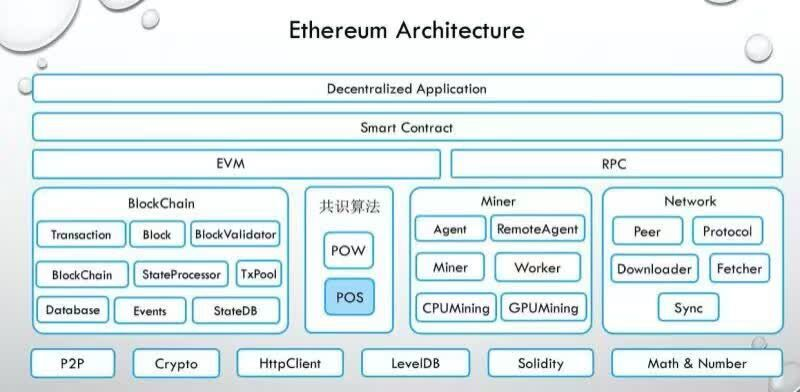

一、区块链

1.区块链到底是什么？

 　　区块链(Blockchain) 是一种分布式数据库，起源自比特币，区块链是一串使用密码学方法相关联产生的数据块，每一个数据块中包含了若干次比特币网络交易的信息，用于验证其信息的有效性（防伪）和生成下一个区块。(摘自wiki)

2.区块链技术的定义：

　　区块链是一个分布式账本，一种通过去中心化、去信任的方式集体维护一个可靠数据库的技术方案。

3.区块链技术的几个特性

（1） 匿名

（2）不可篡改和加密安全性

（3）无须信任系统

（4）分布式去中心化

（5）交易透明

4.以太坊是什么？

　　以太坊是一个开源的有智能合约功能的公共区块链平台，通过其专用加密货币以太币提供去中心化的虚拟机（EVM）来处理点对点合约（wiki）

最简单的说法就是：区块链技术+智能合约。

以太坊在继承了区块链技术的基础上，实现了对智能合约的支持，从而使得区块链技术可以和商业化应用结合，并实现项目的落地。

在以太坊的网络中，智能合约也被看做一个特殊的账户，从而使得用户可以通过和该账户进行交易，实现对该账户中的属性和方法的调用。从而从底层技术上支持了智能合约的实现。

5.智能合约是什么？

　　之前说过区块链技术的五个特性。以太坊继承了上面这所有的区块链技术的基础上，提供了智能合约的支持。从而使区块链技术从原来的账户与账户之间的交易功能，扩展为一个可以实现智能合约的平台。这个智能合约可以是一个众筹合约，也可以是一个数学公式，或者是一个完全的随机数。

　　只要智能合约 被部署到以太坊的网络上去，他就天生带有了区块链技术的5个特征，同时因为他是由类javascript的语言撰写，因此可以实现很多复杂的业务逻辑。

二、智能合约

[browser-solidity]("https://ethereum.github.io/browser-solidity/#version=soljson-v0.4.9+commit.364da425.js")

[browser-solidity-redirector](http://remix.ethereum.org)
[remix-IDE]:

	npm install remix-ide -g
	
	npm install remixd -g:Remixd is a tool which allow Remix IDE to access files located in your local computer. it can also be used to setup a development environment
	
	
	pragma solidity 0.4.9;
	contract DemoTypes {
	    function f(uint a) returns (uint b) {
	    uint result = a * 8;
	    return result;
	    }
	}

1.Trasaction/Execution Cost: 这个代表Create一个合约所消耗的成本，单位为Gas。Gas和Ether币有一个兑换关系，兑换比例由Oracle决定

2.这里可以看到我们的合约名称DemoTypes, 注册在了一个地址上面。这个代表该合约已经被挖矿出来了。

3.第三个就是我们上方的合约代码，f(n) {return 8 * n}

三、Solidity

1.Solidity：以太坊智能合约的编程语言，通过编译&部署智能合约，可以实现智能合约的Create、执行和查看，从而实现某些商业应用

I 实现1+2+3+..+n的求和功能

	pragma solidity 0.4.9;
	contract Demo1 {
	  /*计算从1到N的求和*/
	  function f(uint n) returns (uint sum) {
	    if (n == 0) throw; uint result = 0;
	    for (uint i=0; i<=n; i++) {
	      result +=i;
	    }
	    return result;
	  }
	}

II 实现一个代币功能，并自带挖矿和转移代币的功能。

	pragma solidity ^0.4.0;
	
		contract Coin {
		    // The keyword "public" makes those variables
		    // readable from outside.
		    address public minter;
		    mapping (address => uint) public balances;
	
	    // Events allow light clients to react on
	    // changes efficiently.
	    event Sent(address from, address to, uint amount);
	
	    // This is the constructor whose code is
	    // run only when the contract is created.
	    function Coin() {
	        minter = msg.sender;
	    }
	
	    function mint(address receiver, uint amount) {
	        if (msg.sender != minter) return;
	        balances[receiver] += amount;
	    }
	
	    function send(address receiver, uint amount) {
	        if (balances[msg.sender] < amount) return;
	        balances[msg.sender] -= amount;
	        balances[receiver] += amount;
	        Sent(msg.sender, receiver, amount);
	    }
	}

III 实现一个众筹的智能合约，各个用户可以筹款、筹款成功可以将所得转让给受益人，每个参与众筹者可以获得代币。

	pragma solidity ^0.4.2;
	contract token { function transfer(address receiver, uint amount){  } }
	
	contract Crowdsale4 {
	    address public beneficiary;
	    uint public fundingGoal;
	    uint public amountRaised;
	    uint public deadline;
	    uint public price;
	
	
	    token public tokenReward;
	    mapping(address => uint256) public balanceOf;
	    bool public fundingGoalReached = false;
	    event GoalReached(address beneficiary, uint amountRaised);
	    event FundTransfer(address backer, uint amount, bool isContribution);
	    bool public crowdsaleClosed = false;
	
	    /* data structure to hold information about campaign contributors */
	
	    /*  at initialization, setup the owner */
	    function Crowdsale4 (
	        address ifSuccessfulSendTo,
	        uint fundingGoalInEthers,
	        uint durationInMinutes,
	        uint etherCostOfEachToken,
	        token addressOfTokenUsedAsReward
	    ) {
	        beneficiary = ifSuccessfulSendTo;
	        fundingGoal = fundingGoalInEthers * 1 ether;
	        deadline = now + durationInMinutes * 1 minutes;
	        price = etherCostOfEachToken * 1 ether;
	        tokenReward = token(addressOfTokenUsedAsReward);
	    }
	
	    /* The function without name is the default function that is called whenever anyone sends funds to a contract */
	    function () payable {
	        if (crowdsaleClosed) throw;
	        uint amount = msg.value;
	        balanceOf[msg.sender] += amount;
	        amountRaised += amount;
	        tokenReward.transfer(msg.sender, amount / price);
	        FundTransfer(msg.sender, amount, true);
	    }
	
	    modifier afterDeadline() { if (now >= deadline) _; }
	
	    /* checks if the goal or time limit has been reached and ends the campaign */
	    function checkGoalReached() afterDeadline {
	        if (amountRaised >= fundingGoal){
	            fundingGoalReached = true;
	            GoalReached(beneficiary, amountRaised);
	        }
	        crowdsaleClosed = true;
	    }
	
	
	    function safeWithdrawal() afterDeadline {
	        if (!fundingGoalReached) {
	            uint amount = balanceOf[msg.sender];
	            balanceOf[msg.sender] = 0;
	            if (amount > 0) {
	                if (msg.sender.send(amount)) {
	                    FundTransfer(msg.sender, amount, false);
	                } else {
	                    balanceOf[msg.sender] = amount;
	                }
	            }
	        }
	
	        if (fundingGoalReached && beneficiary == msg.sender) {
	            if (beneficiary.send(amountRaised)) {
	                FundTransfer(beneficiary, amountRaised, false);
	            } else {
	                //If we fail to send the funds to beneficiary, unlock funders balance
	                fundingGoalReached = false;
	            }
	        }
	    }
	}

四、以太坊基本概念

　　以太坊，最简单的说法就是：区块链技术+智能合约。
  
　　以太坊和区块链技术一样，有Transaction，Block，账户与账户之间的关系需要用Transaction来执行，任何Transaction都需要有通过挖矿的block来产生。
  
　　以太坊和原来的比特币技术不同的是
  
  * 实现了基于Solidity语言的智能合约，并将智能合约看做一种特殊的账户，从而使得在智能合约上也可以实现具体的方法
  * 实现了智能合约能落地执行的EVM（以太坊虚拟机），通过以太坊虚拟机，从而将solidity这样的类js的代码变成了可以在去区块链上执行的加密代码。
  * 不同于比特币技术，在以太坊的transaction都需要用到gas，一份合约或者一次交易的gas是固定的（取决于代码大小和复杂度），而gas的价格则由以太坊中的oracle来决定。
  * 以太坊同时还构建了较完整的、开源的生态系统，不仅有底层的geth、编程的solidity、合约在线浏览器browser-solidity、合约钱包Mist/wallet、以太坊的前端开发框架Truffle、各种各样的开源DApp等等，方便大家快速上手，并开发出适合落地的区块链应用。

Geth工具介绍

1.Geth

1). Geth 又名Go Ethereum. 是以太坊协议的三种实现之一，由Go语言开发，完全开源的项目。Geth 可以被安装在很多操作系统上，包括Windows、Linux、Mac的OSX、Android或者IOS系统
	
2). 通过Geth的一些基本命令，可以很方便的创建出一个以太坊的私有链条。

	geth --datadir "./" init genesis.json
	
	geth --datadir "./" --nodiscover console 2>>geth.log

   Geth的命令行中包含了大多数的以太坊的命令，包括账户新建，账户之间的以太币转移，挖矿，获取余额，部署以太坊合约等。
   
   当然Geth的缺点也很明显，Geth还是偏底层的内容，很多操作需要较多较复杂的输入。因此我们将会介绍Browser-solidity
   

2.Browser-solidity

这是以太坊智能合约的浏览器编译器，直接访问网站即可，当然如果觉得速度太慢不稳定，也可以自己搭建。

Browser-solidity 因为运行在内存中，因此速度很快，对于一些简单的功能，例如四则运算等，开发调试变得非常容易。
Browser-solidity 中我们将会向大家重复了一些基本的概念，如transaction，gas，account等。

Browser-solidity的缺点也很明显，那就是因为运行在内存中，所以对于涉及账户的合约开发、调试&测试，相当的无力。因此接下来向大家介绍了Mist这个官方钱包工具

3.Mist

1). Mist是以太坊的官方钱包，他既可以连接生产网络、测试网络，更加可以通过设置参数的方式，连接我们自己的私有网络

2). Mist在通过geth.ipc文件连接后，就和Geth所建立的网络完全契合在一起了，在Mist上部署的合约，实际上也就是部署在了geth网络上。geth网络上新建账号，也可以在Mist这个工具上看到。

3). 通过Mist，我们向大家更详细的讲解了以太坊的核心概念，包括：区块、Transaction、Gas、账户、合约、合约中的构造函数，变量以及方法。

通过Geth、Browser-solidity、Mist 三个工具的介绍，给我们提供了开发、调试和测试我们智能合约的很好的利器。

五、Geth

Geth官网：https://geth.ethereum.org/
Geth的Github地址：https://github.com/ethereum/go-ethereum
Geth能干什么

Geth是以太坊协议的具体落地实现，通过Geth，你可以实现以太坊的各种功能,如账户的新建编辑删除，开启挖矿，ether币的转移，智能合约的部署和执行等等

Geth安装

安装文档：[https://ethereum.github.io/go-ethereum/install/](https://ethereum.github.io/go-ethereum/install/)

这里演示在MacBook上的安装，Linux&Windows系统的人请参照文档。

brew tap ethereum/ethereum

brew install ethereum

输入 geth version，检查是否安装成功

Geth
Version: 1.8.2-stable
Architecture: amd64
Protocol Versions: [63 62]
Network Id: 1
Go Version: go1.10
Operating System: darwin
GOPATH=
GOROOT=/usr/local/opt/go/libexec

六、生产网络/测试网络/私有网络
目前以太坊官方提供了两种网络

   * 生产环境网络
   * 测试网络 TestNet

1.生产环境网络

　　以太坊的生产网络顾名思义，也就是产生真正有价值的 的以太币的网络。 目前生产网络目前已经生成了300万以上的区块，还在持续生成中。挖矿挖出来的每个以台币在10美金以上。 生产环境下的以太坊状态时如此的（截图自2017-02-17）

生产环境网络

优点

    全球化的，部署在Internet环境上的，
    智能合约的代码，执行，区块的调用，都可以清晰的查看到。
    部署在生产环境上的智能合约，全世界任何应用都可以调用

缺点：

    任何合约执行都会消耗真实的以太币，也就是真实的现金。不适合开发、调试和测试，
    所有节点是全球化的，速度较慢
    且对于部分商业应用来说，只需要一部分节点，例如分布式部署的10-20台服务器即可。而不需要遍布全球的网络。

2.以太坊测试网络 TestNet

以太坊的测试网络也是官方提供的，顾名思义就是专供用户来开发、调试和测试的。 上面的合约执行不消耗真实的以太币。也就是不花钱

所以如果开发简单的智能合约的话，用测试网络也就足够了，用户可以把更多的精力集中在智能合约的编写上。

但因为网络是官方提供的，因此对于以太坊技术的底层实现、Geth的各种参数接口、整个以太坊的技术真实性能的理解就会弱很多。所以从开发的角度来说，一个更好的选择是Private Network，可以从技术的底层去深入理解以太坊。

测试环境网络

优点

    合约执行不消耗真实货币
    全球化的，部署在Internet环境上的，
    智能合约的代码，执行，区块的调用，都可以清晰的查看到。
    部署在测试环境上的智能合约，全世界任何应用都可以调用

缺点：

    所有节点是全球化的，速度较慢
    测试网络不可能作为商业应用的实际落地环境

3.以太坊私有网络 PrivateNetwork

以太坊的私有网络，顾名思义就是由用户自己通过Geth创建的私有网络，是一个非常适合开发、调试和测试的网络

私有网络

优点

    方便开发者深入理解以太坊的技术底层
    因为节点相对较少，速度较快
    用户可以随时创建，随时销毁，随时重建一个以太坊网络
    随意的增加节点数目，或者删除节点，
    既可以在服务器上建立，也可以在自己的windows或者Mac机器上建立，
    甚至一台机器可以建立多个节点，在一台机器上实现多节点的私有网络。

缺点

    因为不是全球化的，只有在私有网络内的节点才能查看智能合约的执行、调用等。

七、创建私有网络

1. git clone https://github.com/ethereum/go-ethereum

2. brew install golang

3. make geth

4. ./build/bin/geth 

		 Maximum peer count                       ETH=25 LES=0 total=25
		 Starting peer-to-peer node               instance=Geth/v1.8.3-unstable-fe6cf00f/darwin-amd64/go1.10
		 Allocated cache and file handles         database=/Users/lhp/Library/Ethereum/geth/chaindata cache=768 handles=128
		 Initialised chain configuration          config="{ChainID: 1 Homestead: 1150000 DAO: 1920000 DAOSupport: true EIP150: 2463000 EIP155: 2675000 EIP158: 2675000 Byzantium: 4370000 Constantinople: <nil> Engine: ethash}"
		 Disk storage enabled for ethash caches   dir=/Users/lhp/Library/Ethereum/geth/ethash count=3
		 Disk storage enabled for ethash DAGs     dir=/Users/lhp/.ethash                      count=2
		 Initialising Ethereum protocol           versions="[63 62]" network=1
		 Loaded most recent local header          number=5292965 hash=59b555…8f18ad td=3167608439548810247011
		 Loaded most recent local full block      number=0       hash=d4e567…cb8fa3 td=17179869184
		 Loaded most recent local fast block      number=5292675 hash=b135ee…4b6405 td=3166658036260954431507
		 Loaded local transaction journal         transactions=0 dropped=0
		 Regenerated local transaction journal    transactions=0 accounts=0
		 Starting P2P networking 
		 UDP listener up                          self=enode://3ad1867e1521eeb465cef8c9b7ebaf661b581ea74379abfda262a92bf96be5895d9f568cb1177b99c45a15667c44ec7f007a766be98cc23ca019b53dc210b230@[::]:30303
		 RLPx listener up                         self=enode://3ad1867e1521eeb465cef8c9b7ebaf661b581ea74379abfda262a92bf96be5895d9f568cb1177b99c45a15667c44ec7f007a766be98cc23ca019b53dc210b230@[::]:30303
		 IPC endpoint opened                      url=/Users/lhp/Library/Ethereum/geth.ipc

5.建立目录和genesis.json

		{
		  "config": {
		        "chainId": 15,
		        "homesteadBlock": 0,
		        "eip155Block": 0,
		        "eip158Block": 0
		    },
		   "nonce":"0x0000000000000042",
		   "mixhash":"0x0000000000000000000000000000000000000000000000000000000000000000",
		   "difficulty": "0x00001",
		   "alloc": {"0x0000000000000000000000000000000000000001": {"balance": "111111111"},
		  "0x0000000000000000000000000000000000000002": {"balance": "222222222"}},
		   "coinbase":"0x0000000000000000000000000000000000000000",
		   "timestamp": "0x00",
		   "parentHash":"0x0000000000000000000000000000000000000000000000000000000000000000",
		   "extraData": "",
		   "gasLimit":"0xffffffff"
		}

<table border="1">
<caption>创世快参数</caption >
<tr>
<th>参数</th>
<th>意义</th>
</tr>
<tr>
<td> mixhash </td>
<td>与nonce配合用于挖矿，由上一个区块的一部分生成的hash。注意他和nonce的设置需要满足以太坊的Yellow paper, 4.3.4. Block Header Validity, (44)章节所描述的条件。.</td>
</tr>
<tr>
<td> nonce </td>
<td> nonce就是一个64位随机数，用于挖矿，注意他和mixhash的设置需要满足以太坊的Yellow paper, 4.3.4. Block Header Validity, (44)章节所描述的条件。 </td>
</tr>
<tr>
<td> difficulty </td>
<td> 设置当前区块的难度，如果难度过大，cpu挖矿就很难，这里设置较小难度 </td>
</tr>
<tr>
<td> alloc </td>
<td> 用来预置账号以及账号的以太币数量，因为私有链挖矿比较容易，所以我们不需要预置有币的账号，需要的时候自己创建即可以。 </td>
</tr>
<tr>
<td> coinbase </td>
<td> 矿工的账号，随便填 </td>
</tr>
<tr>
<td> timestamp </td>
<td> 设置创世块的时间戳 </td>
</tr>
<tr>
<td> parentHash </td>
<td> 上一个区块的hash值，因为是创世块，所以这个值是0 </td>
</tr>
<tr>
<td> extraData </td>
<td> 附加信息，随便填，可以填你的个性信息 </td>
</tr>
<tr>
<td> gasLimit </td>
<td> 该值设置对GAS的消耗总量限制，用来限制区块能包含的交易信息总和，因为我们是私有链，所以填最大。 </td>
</tr>
</table>

<table border="1">
<caption>私有链节点参数</caption >
<tr>
<th>参数</th>
<th>意义</th>
</tr>
<tr>
<td> identity </td>
<td> 区块链的标示，随便填写，用于标示目前网络的名字 </td>
</tr>

<tr>
<td> init </td>
<td> 指定创世块文件的位置，并创建初始块 </td>
</tr>

<tr>
<td> datadir </td>
<td> 设置当前区块链网络数据存放的位置 </td>
</tr>

<tr>
<td> port </td>
<td> 网络监听端口 </td>
</tr>

<tr>
<td> rpc </td>
<td> 启动rpc通信，可以进行智能合约的部署和调试 </td>
</tr>

<tr>
<td> rpcapi </td>
<td> 设置允许连接的rpc的客户端，一般为db,eth,net,web3 </td>
</tr>

<tr>
<td> networkid </td>
<td> 设置当前区块链的网络ID，用于区分不同的网络，是一个数字 </td>
</tr>

<tr>
<td> console </td>
<td> 启动命令行模式，可以在Geth中执行命令 </td>
</tr>
</table>

6.创建创世区块

	geth --datadir "./" init genesis.json
	bootnode --genkey=boot.key
	bootnode --nodekey=boot.key
	geth --datadir=/Users/lhp/Documents/BlockChain/data --bootnodes=enode://369842c1abc553caf9f01f7e3b40896d44dab333f921dc71d1af56c76a8ffe88585afdfec1a0ea8297fa34f5dc0d52983bb4968528e0852adc97efc91dbf8079@[127.0.0.1]:30303?discport=0

以IPCS方式连接本地运行节点，进入控制台

	geth attach ipc:/Users/lhp/Documents/BlockChain/data/geth.ipc

7.创建私有链条

	geth --datadir "./" --nodiscover console 2>>geth.log

8.在私有链条上创建用户

	personal.newAccount("xxx")

	eth.accounts  /  personal.listAccounts (查看账户)

9.查看日志

	tail -f geth.log

10.挖矿

	miner.start()
	
	-----------------
	
	1. 挖矿挖到的ether币会默认保在第一个账户中，即eth.acccounts[0]中。
	2. 挖矿是执行智能合约的基础。如果停止挖矿的话，不仅以太币会停止生成，所有智能合约的调用也会不起作用。
	3. 如果真的要停止挖矿，可以执行命令miner.stop()来停止挖矿
	4. 按上面的命令，应该是可以实现以太坊挖矿的。如果不行的话，有可能就是之前有存在的链，此时应该删除之前的数据。在Mac下即删除~/.ethash文件夹和里面的文件即可

11.查看以太币的数量

	acc0 = eth.accounts[0]
	eth.getBalance(acc0)

12.节点信息

	admin.nodeInfo
	{
	  enode: "enode://6e8629773ee9d04bb23676febeec18776a403a84abdcd975446899ae6580af249aafc858508f176c822ee442e53d911673037ef558a5e48ca2de2e642d9b2516@[::]:30303?discport=0",
	  id: "6e8629773ee9d04bb23676febeec18776a403a84abdcd975446899ae6580af249aafc858508f176c822ee442e53d911673037ef558a5e48ca2de2e642d9b2516",
	  ip: "::",
	  listenAddr: "[::]:30303",
	  name: "Geth/v1.8.2-stable/darwin-amd64/go1.10",
	  ports: {
	    discovery: 0,
	    listener: 30303
	  },
	  protocols: {
	    eth: {
	      config: {
	        byzantiumBlock: 4370000,
	        chainId: 1,
	        daoForkBlock: 1920000,
	        daoForkSupport: true,
	        eip150Block: 2463000,
	        eip150Hash: "0x2086799aeebeae135c246c65021c82b4e15a2c451340993aacfd2751886514f0",
	        eip155Block: 2675000,
	        eip158Block: 2675000,
	        ethash: {},
	        homesteadBlock: 1150000
	      },
	      difficulty: 17179869184,
	      genesis: "0xd4e56740f876aef8c010b86a40d5f56745a118d0906a34e69aec8c0db1cb8fa3",
	      head: "0xd4e56740f876aef8c010b86a40d5f56745a118d0906a34e69aec8c0db1cb8fa3",
	      network: 1
	    }
	  }
	}

八.Geth

1.账户：

	  随机数，用于确定每笔交易只能被处理一次的计数器
	  
	  账户目前的以太币余额
	  
	  账户的合约代码，如果有的话
	  
	  账户的存储（默认为空）
  

2.交易

	 acc0 = eth.accounts[0]
	"0xbcf5b841303bc08026ce2d3b8f83498ffe42c12f"
	 acc1 = eth.accounts[1]
	"0xb8b12a801b610176935a15321f77b48dd5c0c448"
	 amount = web3.toWei(0.01)
	"10000000000000000"
	
	eth.sendTransaction({from: acc0, to: acc1, value: amount}) //交易
	
	personal.unlockAccount(acc0) //解锁账户
	
	
	web3.fromWei(10000000000000000,"ether") //格式转换
	web3.toWei(0.01)

九、以太币单位

1.换算

    kwei (1000 Wei)
    mwei (1000 KWei)
    gwei (1000 mwei)
    szabo (1000 gwei)
    finney (1000 szabo)
    ether (1000 finney)

  [以太币转换工具](http://ether.fund/tool/converter)

2.部署合约

　　注意合约部署的时候，以太坊的私有链必须处在挖矿进行的状态，否则合约部署将不会生效
我们在命令行中，首先unlock(eth.accounts[0]),因为部署合约需要消耗gas，也就是以太币。而之前说过由于保护机制，不解锁账户，是不会允许任何以太币流出的。

	var a_demotypesContract = web3.eth.contract([{"constant":false,"inputs":[{"name":"a","type":"uint256"}],"name":"f","outputs":[{"name":"b","type":"uint256"}],"payable":false,"type":"function"}]);
	
	var a_demotypes = a_demotypesContract.new(
	   {
	     from: web3.eth.accounts[0], 
	     data: '0x6060604052341561000c57fe5b5b60ab8061001b6000396000f30060606040526000357c0100000000000000000000000000000000000000000000000000000000900463ffffffff168063b3de648b14603a575bfe5b3415604157fe5b60556004808035906020019091905050606b565b6040518082815260200191505060405180910390f35b600060006008830290508091505b509190505600a165627a7a7230582010decdc0b0a43b565814fe904eae2544665457d6353c7d906fc2c43c81c867e40029', 
	     gas: '4700000'
	   }, function (e, contract){
	    console.log(e, contract);
	    if (typeof contract.address !== 'undefined') {
	         console.log('Contract mined! address: ' + contract.address + ' transactionHash: ' + contract.transactionHash);
	    }
	 })

 等待片刻，会发现合约被部署到挖矿挖出来的区块中了, 按下回车代表成功

 此时输入合约部署的实例a_demotypes, 可以看到a_demotypes的详情。

 也可以调用a_demotypes的方法f
 
	 a_demotypes.f.call(100)
	 800

