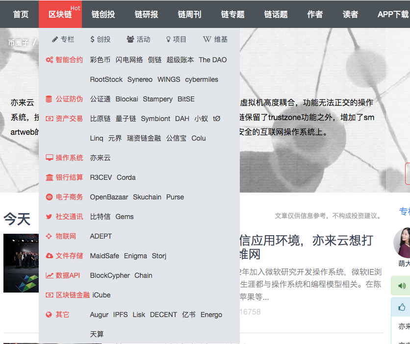

#怎么玩

比特币如何一步步走到生活中的？

1. 比特币发展史

2009年美国时间1月3日，中本聪挖出来第一枚比特币的时候，比特币还没有价格。所以，这个时候第一枚比特币的价格为0元。

2009年10月5日，一个叫 “新自由标准” 的用户，在一个比特币的早期论坛上发布比特币的价格的计算方法。他认为一个比特币的价值计算方法应该这样来算：计算机运行一年所需要的平均电量是1331.5 千瓦/时，乘以上年度美国居民平均用电成本，0.1136 美元，除以 12 个月，除以过去 30 天里生产的比特币数量，最后的结果除以 1美元，得出1 美元 = 1309.03 比特币。这个叫“新自由标准”的用户还提出：人们需要一个可以用真正货币交易比特币的网站。这个建议受到论坛创始人的支持，给了他5050个比特币，他也给了版主在线支付了5.02美元。这是最早的有记录的比特币价格。

[历史上最贵的披萨]()
2010年5月22日，一位名为拉兹罗·翰耶斯的美国佛罗里达州的程序员在论坛上发帖说，我想用10000个比特币来换披萨吃。结果真的有人拿出两张价值25美元的棒约翰披萨券跟他交换。这笔交易诞生了比特币世界第一个公允价格。人们为了纪念这历史性的时刻，于是把5月22日定为比特币披萨日，每逢这天都进行庆祝活动。很多媒体报道对这个程序员表示哀叹，称其为“史上最贵吃货”，肯定“肠子都得悔青了”，因为10000个比特币，当时只换了25美元，但是放到现在，能在北上广深买好几套豪宅了。

[第一个使用GPU挖矿的人]()
但是大部分人不知道的是，这个程序员是第一个使用GPU挖比特币的人。一开始大家都用自己电脑的CPU进行挖矿，他觉得用CPU挖矿不过瘾，算力太低，发现显卡GPU比一般的CPU挖矿要快800倍。在比特币世界里，对于挖矿来说，进行哈希碰撞的速度是唯一决定能否获得记账权的因素。所以他当时就已经拥有了大量的比特币，这10000枚比特币对他来说应该是九牛一毛，哥就是任性，10000枚比特币不算啥。而那个卖出披萨券的杰里米·斯特迪文特，交易时年仅18岁，没人知道他是怎样处理那1万比特币的。但如果他真的持有至今，他已经是亿万富翁了。

2010年11月06日，“电驴之父”杰德·麦凯莱布创建了一家叫MTGox的比特币交易平台——这个交易平台在后来很快成为全球最大的比特币交易平台。MTGox成立之时，比特币的价格是0.5美元。

2013年4月，欧洲一个国家塞浦路斯发生经济危机，塞浦路斯的人们进行经济避险，其中包括买入比特币，这一事件导致比特币短短几天内从30多美元飙涨到265美元，涨了8.8倍。这一事件被媒体报道之后，整个全球的科技圈和经济圈哗然。中国的很多创业者和投资者也是因为这个新闻的影响，而开始关注到比特币。

2013年11月8日，比特币达到了当时历史最高价格，火币网报价1比特币 = 8000人民币。紧接着中国央行联合五部委一起发布了《关于防范比特币风险的通知》，规定比特币在中国定性为虚拟商品，比特币的价格一路下跌。

2014年2月6日，前面提到的全球最大的比特币交易平台MtGox被盗，宣布破产。这一事件打击了人们对比特币安全的信任，比特币价格跌到了4500人民币。之后，比特币开始了漫长的价格低位调整阶段。在4000元到2000元之间波动。在2015年年初，最低价格一度跌到了900元人民币。之后，得益于比特币的应用和各国政策的变化，比特币开始缓慢上涨。

2016年7月9日，比特币进行第二次减半，当天火币网报价 1比特币 = 4351人民币。

2017年1月5日，火币网比特币价格达8895元人民币。这一历史新高价，引来全球媒体的报道。第二日，中国央行发公告，约谈主要交易平台负责人，并于一周后入驻平台。在中国的主流交易平台因为反洗钱系统升级而不能进行提币的几个月里，海外的政策利好刺激了国际上比特币的价格，海外比特币价格一直高于中国的比特币价格，价差一度达到每枚几千元人民币。

2017年9月2日，火币网的比特币价格为32350元人民币，为此前历史最高价格。以后比特币的价格会有怎样的发展，谁都说不好。一方面，比特币的应用在不断发展，各国的法律开始对比特币的使用逐渐利好。但是比特币本身也面临着竞争，面临着算法被攻破等技术上可能的风险。

2017年12月6日， 发稿前Bitfinex上比特币的人民币价格已经飙升至79729元，而且国际市场上美元价格也基本稳定在11000元以上了。未来比特币价格的走势是什么样，我们可以拭目以待。以下数据截止2017年12月5日15:00

2比特币的全球价差

从另外一个角度看比特币的价格，有些朋友可能奇怪，为什么每一家比特币交易平台的价格不完全一样。

比如 Bitfinex 报价为人民币77807元，而 Bithumb 报价为人民币84575元。是因为在这些平台里，报价是由交易者买卖的成交来决定的。每家交易平台的买卖需求不一样，报价当然会不一样。那为什么每家交易平台的价格又相差不是很大呢？

因为有一种交易角色的存在：搬砖用户，或者叫套利用户。这类用户看到A平台价格高，B平台价格低，就会从B平台买入，A平台卖出。因为有这类交易者的存在，使得大多数平台之间的价格差不会太大，如果出现较大价差，就会有利润，这些利润的预期促使搬砖者行动，价差会很快被搬砖者抹平。还有一种价格，是场外价格。就是不由交易平台进行撮合，用户之间进行点对点的交易的价格。这时候价格，由买卖双方进行协商，一般会参考交易平台的价格。

比特币的价格受以下3点的影响：

1，由它本身的价值决定，也就是它现在在全球的应用、接受广泛程度来决定；

2，受政策、竞争币种、技术、重大消息等多方面因素影响，这里大家可以理解成利好或者利空的消息决定；

3，在市场上，人们对它的供求也会不一样，这种供需关系也会影响比特币价格的波动。

2. 网站引流
	* 网易云星球
	* 广告倒流（给比特币）
	* 

1. 虚拟币交易平台:[火币网](https://www.huobi.com/)

4. 阮一峰

	区块链入门教程：[http://www.ruanyifeng.com/blog/2017/12/blockchain-tutorial.html](http://www.ruanyifeng.com/blog/2017/12/blockchain-tutorial.html)
	
	比特币入门教程：[http://www.ruanyifeng.com/blog/2018/01/bitcoin-tutorial.html](http://www.ruanyifeng.com/blog/2018/01/bitcoin-tutorial.html)
	
	虚拟货币：[http://www.ruanyifeng.com/blog/2018/01/cryptocurrency-tutorial.html](http://www.ruanyifeng.com/blog/2018/01/cryptocurrency-tutorial.html)

5. 李笑来

6. 算力

	“天河二号”是由国防科学技术大学研制的超级计算机系统，以峰值计算速度每秒5.49亿亿次、持续计算速度每秒3.39亿亿次双精度浮点运算的优异性能位居榜首，成为全球最快超级计算机。

7. 应用

 

