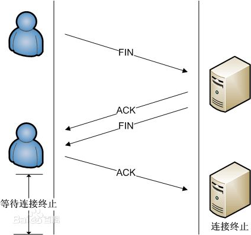
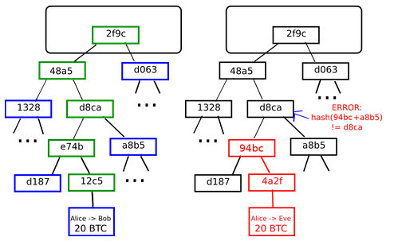

[TOC]
#一、区块链

###背景

比特币如何一步步走到生活中的？

1. 比特币发展史

2009年美国时间1月3日，中本聪挖出来第一枚比特币的时候，比特币还没有价格。所以，这个时候第一枚比特币的价格为0元。

[最初比特币价格的计算]()
2009年10月5日，一个叫 “新自由标准” 的用户，在一个比特币的早期论坛上发布比特币的价格的计算方法。他认为一个比特币的价值计算方法应该这样来算：计算机运行一年所需要的平均电量是1331.5 千瓦/时，乘以上年度美国居民平均用电成本，0.1136 美元，除以 12 个月，除以过去 30 天里生产的比特币数量，最后的结果除以 1美元，得出1 美元 = 1309.03 比特币。这个叫“新自由标准”的用户还提出：人们需要一个可以用真正货币交易比特币的网站。这个建议受到论坛创始人的支持，给了他5050个比特币，他也给了版主在线支付了5.02美元。这是最早的有记录的比特币价格。

[历史上最贵的披萨]()
2010年5月22日，一位名为拉兹罗·翰耶斯的美国佛罗里达州的程序员在论坛上发帖说，我想用10000个比特币来换披萨吃。结果真的有人拿出两张价值25美元的棒约翰披萨券跟他交换。这笔交易诞生了比特币世界第一个公允价格。人们为了纪念这历史性的时刻，于是把5月22日定为比特币披萨日，每逢这天都进行庆祝活动。很多媒体报道对这个程序员表示哀叹，称其为“史上最贵吃货”，肯定“肠子都得悔青了”，因为10000个比特币，当时只换了25美元，但是放到现在，能在北上广深买好几套豪宅了。

[第一个使用GPU挖矿的人]()
但是大部分人不知道的是，这个程序员是第一个使用GPU挖比特币的人。一开始大家都用自己电脑的CPU进行挖矿，他觉得用CPU挖矿不过瘾，算力太低，发现显卡GPU比一般的CPU挖矿要快800倍。在比特币世界里，对于挖矿来说，进行哈希碰撞的速度是唯一决定能否获得记账权的因素。所以他当时就已经拥有了大量的比特币，这10000枚比特币对他来说应该是九牛一毛，哥就是任性，10000枚比特币不算啥。而那个卖出披萨券的杰里米·斯特迪文特，交易时年仅18岁，没人知道他是怎样处理那1万比特币的。但如果他真的持有至今，他已经是亿万富翁了。

[第一个比特币交易平台]()
2010年11月06日，“电驴之父”杰德·麦凯莱布创建了一家叫MTGox的比特币交易平台——这个交易平台在后来很快成为全球最大的比特币交易平台。MTGox成立之时，比特币的价格是0.5美元。

2013年4月，欧洲一个国家塞浦路斯发生经济危机，塞浦路斯的人们进行经济避险，其中包括买入比特币，这一事件导致比特币短短几天内从30多美元飙涨到265美元，涨了8.8倍。这一事件被媒体报道之后，整个全球的科技圈和经济圈哗然。中国的很多创业者和投资者也是因为这个新闻的影响，而开始关注到比特币。

2013年11月8日，比特币达到了当时历史最高价格，火币网报价1比特币 = 8000人民币。紧接着中国央行联合五部委一起发布了《关于防范比特币风险的通知》，规定比特币在中国定性为虚拟商品，比特币的价格一路下跌。

[交易平台悲剧的影响]()
2014年2月6日，前面提到的全球最大的比特币交易平台MtGox被盗，宣布破产。这一事件打击了人们对比特币安全的信任，比特币价格跌到了4500人民币。之后，比特币开始了漫长的价格低位调整阶段。在4000元到2000元之间波动。在2015年年初，最低价格一度跌到了900元人民币。之后，得益于比特币的应用和各国政策的变化，比特币开始缓慢上涨。

2016年7月9日，比特币进行第二次减半，当天火币网报价 1比特币 = 4351人民币。

2017年1月5日，火币网比特币价格达8895元人民币。这一历史新高价，引来全球媒体的报道。第二日，中国央行发公告，约谈主要交易平台负责人，并于一周后入驻平台。在中国的主流交易平台因为反洗钱系统升级而不能进行提币的几个月里，海外的政策利好刺激了国际上比特币的价格，海外比特币价格一直高于中国的比特币价格，价差一度达到每枚几千元人民币。

2017年9月2日，火币网的比特币价格为32350元人民币，为此前历史最高价格。以后比特币的价格会有怎样的发展，谁都说不好。一方面，比特币的应用在不断发展，各国的法律开始对比特币的使用逐渐利好。但是比特币本身也面临着竞争，面临着算法被攻破等技术上可能的风险。

[创新高]()
2017年12月6日， 发稿前Bitfinex上比特币的人民币价格已经飙升至79729元，而且国际市场上美元价格也基本稳定在11000元以上了。未来比特币价格的走势是什么样，我们可以拭目以待。以下数据截止2017年12月5日15:00

2比特币的全球价差

从另外一个角度看比特币的价格，有些朋友可能奇怪，为什么每一家比特币交易平台的价格不完全一样。

比如 Bitfinex 报价为人民币77807元，而 Bithumb 报价为人民币84575元。是因为在这些平台里，报价是由交易者买卖的成交来决定的。每家交易平台的买卖需求不一样，报价当然会不一样。那为什么每家交易平台的价格又相差不是很大呢？

因为有一种交易角色的存在：搬砖用户，或者叫套利用户。这类用户看到A平台价格高，B平台价格低，就会从B平台买入，A平台卖出。因为有这类交易者的存在，使得大多数平台之间的价格差不会太大，如果出现较大价差，就会有利润，这些利润的预期促使搬砖者行动，价差会很快被搬砖者抹平。还有一种价格，是场外价格。就是不由交易平台进行撮合，用户之间进行点对点的交易的价格。这时候价格，由买卖双方进行协商，一般会参考交易平台的价格。

比特币的价格受以下3点的影响：

1，由它本身的价值决定，也就是它现在在全球的应用、接受广泛程度来决定；

2，受政策、竞争币种、技术、重大消息等多方面因素影响，这里大家可以理解成利好或者利空的消息决定；

3，在市场上，人们对它的供求也会不一样，这种供需关系也会影响比特币价格的波动。

###1.网络
(1).比特币网络

　　“比特币网络”是按照比特币P2P协议运行的一系列节点的集合。除了比特币P2P协议之外，比特币网络中也包含其他协议。
　　
　　例如Stratum协议就被应用于挖矿、以及轻量级或移动端比特币钱包之中。网关（gateway）路由服务器提供这些协议，使用比特币P2P协议接入比特币网络，并把网络拓展到运行其他协议的各个节点。  
　　例如，Stratum服务器通过Stratum协议将所有的Stratum挖矿节点连接至比特币主网络、并将Stratum协议桥接（bridge）至比特币P2P协议之上。  
　　我们使用“扩展比特币网络（extended bitcoin network）”指代所有包含比特币P2P协议、矿池挖矿协议、Stratum协议以及其他连接比特币系统组件相关协议的整体网络结构。
　　
　　

(2). 内网穿透

　　可以实现无需路由器端口映射内网与内网或内网于外网直接的通讯。

　　NAT（Network Address Translation，网络地址转换）是1994年提出的。当在专用网内部的一些主机本来已经分配到了本地IP地址（即仅在本专用网内使用的专用地址），但现在又想和因特网上的主机通信（并不需要加密）时，可使用NAT方法。
这种方法需要在专用网连接到因特网的路由器上安装NAT软件。装有NAT软件的路由器叫做NAT路由器，它至少有一个有效的外部全球IP地址。这样，所有使用本地地址的主机在和外界通信时，都要在NAT路由器上将其本地地址转换成全球IP地址，才能和因特网连接。

	
　　知乎上面的一片介绍内网穿透的博客：[https://zhuanlan.zhihu.com/p/30351943](https://zhuanlan.zhihu.com/p/30351943)

(3). P2P
	
　　点对点技术（peer-to-peer， 简称P2P）又称对等互联网络技术，是一种网络新技术，依赖网络中参与者的计算能力和带宽，而不是把依赖都聚集在较少的几台服务器上!

　　1. 网络发现：

　　节点通常采用TCP协议、使用8333端口（该端口号通常是比特币所使用的，除8333端口外也可以指定使用其他端口）与已知的对等节点建立连接。在建立连接时，该节点会通过发送一条包含基本认证内容的version消息开始“握手”通信过程(见图)。
　　  
　　  
　　
　　

　　这一过程包括如下内容：

<table border="1">
<caption>网络发现通讯参数</caption >
<tr>
<th>参数</th>
<th>意义</th>
</tr>
<tr>
<td> PROTOCOL_VERSION </td>
<td>常量，定义了客户端所“说出”的比特币P2P协议所采用的版本（例如：70002）</td>
</tr>
<tr>
<td> nLocalServices </td>
<td>一组该节点支持的本地服务列表，当前仅支持NODE_NETWORK</td>
</tr>
<tr>
<td> nTime </td>
<td>当前时间</td>
</tr>
<tr>
<td> addrYou </td>
<td>当前节点可见的远程节点的IP地址</td>
</tr>
<tr>
<td> addrMe </td>
<td>本地节点所发现的本机IP地址</td>
</tr>
<tr>
<td> subver </td>
<td>指示当前节点运行的软件类型的子版本号（例如：”/Satoshi:0.9.2.1/”）</td>
</tr>
<tr>
<td> BaseHeight </td>
<td>当前节点区块链的区块高度</td>
</tr>
</table>

（version网络消息的具体用例请参见[GitHub](http://bit.ly/1qlsC7w)）

网络中的对等节点通过对verack消息的响应进行确认并建立连接；有时候，如果接收节点需要互换连接并连回起始节点，也会传回该对等节点的version消息。

新节点是如何发现网络中的对等节点的呢？虽然比特币网络中没有特殊节点，但是客户端会维持一个列表，那里列出了那些长期稳定运行的节点。这样的节点被称为“种子节点（seed nodes）”。新节点并不一定需要与种子节点建立连接，但连接到种子节点的好处是可以通过种子节点来快速发现网络中的其他节点。在比特币核心客户端中，是否使用种子节点是通过“-dnsseed”控制的。默认情况下，该选项设为1，即意味着使用种子节点。另一种方式是，起始时将至少一个比特币节点的IP地址提供给正在启动的节点（该节点不包含任何比特币网络的组成信息）。在这之后，启动节点可以通过后续指令建立新的连接。用户可以使用命令行参数“-seednode”把启动节点“引荐”并连接到一个节点，并将该节点用作DNS种子。在初始种子节点被用于形成“引荐”信息之后，客户端会断开与它的连接、并与新发现的对等节点进行通信。

当建立一个或多个连接后，新节点将一条包含自身IP地址的addr消息发送给其相邻节点。相邻节点再将此条addr消息依次转发给它们各自的相邻节点，从而保证新节点信息被多个节点所接收、保证连接更稳定。另外，新接入的节点可以向它的相邻节点发送getaddr消息，要求它们返回其已知对等节点的IP地址列表。通过这种方式，节点可以找到需连接到的对等节点，并向网络发布它的消息以便其他节点查找。

	bitcoin-cli getpeerinfo
	[
	    {
	        "addr" : "85.213.199.39:8333",
	        "services" : "00000001",
	        "lastsend" : 1405634126,
	        "lastrecv" : 1405634127,
	        "bytessent" : 23487651,
	        "bytesrecv" : 138679099,
	        "conntime" : 1405021768,
	        "pingtime" : 0.00000000,
	        "version" : 70002,
	        "subver" : "/Satoshi:0.9.2.1/",
	        "inbound" : false,
	        "startingheight" : 310131,
	        "banscore" : 0,
	        "syncnode" : true
	    },
	    {
	        "addr" : "58.23.244.20:8333",
	        "services" : "00000001",
	        "lastsend" : 1405634127,
	        "lastrecv" : 1405634124,
	        "bytessent" : 4460918,
	        "bytesrecv" : 8903575,
	        "conntime" : 1405559628,
	        "pingtime" : 0.00000000,
	        "version" : 70001,
	        "subver" : "/Satoshi:0.8.6/",
	        "inbound" : false,
	        "startingheight" : 311074,
	        "banscore" : 0,
	        "syncnode" : false
	    }
	]
　　
	
(4). TCP、UDP

（1）.TCP 头部数据结构

<table border="1">
<caption>TCP数据报报头</caption >
<tr>
<th>参数</th>
<th>意义</th>
</tr>
</tr>
<tr>
<td>Source Port</td>
<td>是源端口，16位</td>
</tr>
<tr>
<td>Destination Port</td>
<td>目的端口，16位</td>

<tr>
<td>Sequence Number</td>
<td>发送数据包中的第一个字节的序列号，32位</td>
</tr>
<tr>
<td>Acknowledgment Number</td>
<td>确认序列号，32位</td>
</tr>
<tr>
<td>Data Offset</td>
<td>数据偏移，4位，该字段的值是TCP首部（包括选项）长度除以4</td>
</tr>
<tr>
<td>标志位</td>
<td>6位，URG表示Urgent Pointer字段有意义：
  	ACK表示Acknowledgment Number字段有意义
PSH表示Push功能，RST表示复位TCP连接，
SYN表示SYN报文（在建立TCP连接的时候使用）
FIN表示没有数据需要发送了（在关闭TCP连接的时候使用）
</td>
</tr>
<tr>
<td> Window </td>
<td>接收缓冲区的空闲空间，16位，用来告诉TCP连接对端自己能够接收的最大数据长度</td>
</tr>
<tr>
<td> Checksum </td>
<td>校验和，16位</td>
</tr>
<tr>
<td>Urgent Pointers</td>
<td>紧急指针，16位，只有URG标志位被设置时该字段才有意义，表示紧急数据相对序列号（Sequence Number字段的值）的偏移</td>
</tr>
</table>

连接建立：

	TCP三次握手的过程如下:
    1. 客户端发送SYN（SEQ=x）报文给服务器端，进入SYN_SEND状态。
    2. 服务器端收到SYN报文，回应一个SYN （SEQ=y）ACK(ACK=x+1）报文，进入SYN_RECV状态。
    3. 客户端收到服务器端的SYN报文，回应一个ACK(ACK=y+1）报文，进入Established状态。
	三次握手完成，TCP客户端和服务器端成功地建立连接，可以开始传输数据了。

连接终止:

	(1) 某个应用进程首先调用close，称该端执行“主动关闭”（active close）。该端的TCP于是发送一个FIN分节，表示数据发送完毕。
	(2) 接收到这个FIN的对端执行 “被动关闭”（passive close），这个FIN由TCP确认。
	注意：FIN的接收也作为一个文件结束符（end-of-file）传递给接收端应用进程，放在已排队等候该应用进程接收的任何其他数据之后，因为，FIN的接收意味着接收端应用进程在相应连接上再无额外数据可接收。
	(3) 一段时间后，接收到这个文件结束符的应用进程将调用close关闭它的套接字。这导致它的TCP也发送一个FIN。
	(4) 接收这个最终FIN的原发送端TCP（即执行主动关闭的那一端）确认这个FIN。 [1] 
	既然每个方向都需要一个FIN和一个ACK，因此通常需要4个分节。

连接的建立：

 (2). UDP 头部数据结构
 
 UDP是OSI参考模型中一种无连接的传输层协议，它主要用于不要求分组顺序到达的传输中，分组传输顺序的检查与排序由应用层完成 [2]  ，提供面向事务的简单不可靠信息传送服务。
 

(5). RPC

远程过程调用，它是一种通过网络从远程计算机程序上请求服务，而不需要了解底层网络技术的协议。

运行时,一次客户机对服务器的RPC调用,其内部操作大致有如下十步：

	1.调用客户端句柄；执行传送参数
	
	2.调用本地系统内核发送网络消息
	
	3.消息传送到远程主机
	
	4.服务器句柄得到消息并取得参数
	
	5.执行远程过程
	
	6.执行的过程将结果返回服务器句柄
	
	7.服务器句柄返回结果，调用远程系统内核
	
	8.消息传回本地主机
	
	9.客户句柄由内核接收消息
	
	10.客户接收句柄返回的数据

比特币客户端查看的RPC 信息:

	$ bitcoin-cli getinfo
	{
	"version" : 90000,
	"protocolversion" : 70002,
	"walletversion" : 60000,
	"balance" : 0.00000000,
	"blocks" : 286216,
	"timeoffset" : -72,
	"connections" : 4,
	"proxy" : "",
	"difficulty" : 2621404453.06461525,
	"testnet" : false,
	"keypoololdest" : 1374553827,
	"keypoolsize" : 101,
	"paytxfee" : 0.00000000,
	"errors" : ""
	}

(6). SPV

SPV是“Simplified Payment Verification”（简单支付验证），Merkle树被SPV节点广泛使用。
一些节点保有一份完整的、最新的区块链拷贝，这样的节点被称为“全节点”。全节点能够独立自主地校验所有交易，而不需借由任何外部参照。另外还有一些节点只保留了区块链的一部分，它们通过一种名为“简易支付验证（SPV）”的方式来完成交易验证。这样的节点被称为“SPV节点”，又叫“轻量级节点”。SPV节点不保存所有交易也不会下载整个区块，仅仅保存区块头。它们使用认证路径或者Merkle路径来验证交易存在于区块中，而不必下载区块中所有交易。 

一个SPV节点欲知它钱包中某个比特币地址即将到达的支付，该节点会在节点间的通信链接上建立起bloom过滤器，限制只接受含有目标比特币地址的交易。当节点探测到某交易符合bloom过滤器，它将以Merkleblock消息的形式发送该区块。Merkleblock消息包含区块头和一条连接目标交易与Merkle根的Merkle路径。SPV节点能够使用该路径找到与该交易相关的区块，进而验证对应区块中该交易的有无。SPV节点同时也使用区块头去关联区块和区块链中的区域区块。这两种关联，交易与区块、区块和区块链，证明交易存在于区块链。简而言之，SPV节点会收到少于1KB的有关区块头和Merkle路径的数据，其数据量比一个完整的区块（目前大约有1MB）少了一千倍有余。

[验证]()：一个节点能够通过生成一条仅有4个32字节哈希值长度（总128字节）的Merkle路径，来证明区块中存在一笔交易K。该路径有4个哈希值（在图7-5中由蓝色标注）HL、HIJ、HMNOP和HABCDEFGH。

由这4个哈希值产生的认证路径，再通过计算另外四对哈希值HKL、HIJKL、HIJKLMNOP和Merkle树根（在图中由虚线标注），任何节点都能证明HK（在图中由绿色标注）包含在Merkle根中

(7). 挖矿协议——stratum

stratum协议是目前最常用的矿机和矿池之间的TCP通讯协议。先简要说明挖矿的网络架构。
比特币是一个去中心化的网络架构，通过安装比特币守护程序的节点来转发新交易和新区块。而矿机、矿池也同时形成了另一个网络，我们称之为矿工网络。

矿工网络分成矿机、矿池、钱包等几个主要部分，有时矿池软件与钱包安装在一起，可合称为矿池。

矿机与矿池软件之间的通讯协议是stratum，而矿池软件与钱包之间的通讯是bitcoinrpc接口。

详见：[https://blog.csdn.net/taifei/article/details/73322595](https://blog.csdn.net/taifei/article/details/73322595)

8.矿池协议

主流协议

    GetWork (GWK)
    GetWork Extension
    Stratum (STM)
    GetBlockTemplate (GBT)
    协议间的对比分析
    
流程

   矿工通过基于HTTP协议的JSON-RPC方法从矿池服务器获得一份任务: [数据data，难度target]。其中数据data是以小端模式存储的16进制字符串。

   矿工获得任务，并对任务中的数据每4字节解码成大端模式。 

矿工解析自己工作的部分，其实就是nonce值的位置

[mark]: Tips
***
大端模式，是指数据的高字节保存在内存的低地址中，而数据的低字节保存在内存的高地址中，这样的存储模式有点儿类似于把数据当作字符串顺序处理：地址由小向大增加，而数据从高位往低位放；这和我们的阅读习惯一致。

小端模式，是指数据的高字节保存在内存的高地址中，而数据的低字节保存在内存的低地址中，这种存储模式将地址的高低和数据位权有效地结合起来，高地址部分权值高，低地址部分权值低。
***

###2.安全
(1). 拜占庭容错

拜占庭将军问题（Byzantine Generals Problem）

	拜占庭帝国即中世纪的土耳其，拥有巨大的财富，周围10个邻邦垂诞已久，
	但拜占庭高墙耸立，固若金汤，没有一个单独的邻邦能够成功入侵。
	任何单个邻邦入侵的都会失败，同时也有可能自身被其他9个邻邦入侵。
	拜占庭帝国防御能力如此之强，至少要有十个邻邦中的一半以上同时进攻，才有可能攻破。
	
	然而，如果其中的一个或者几个邻邦本身答应好一起进攻，但实际过程出现背叛，那么入侵者可能都会被歼灭。
	
	于是每一方都小心行事，不敢轻易相信邻国。这就是拜占庭将军问题。

区块链解决方案：拜占庭容错

(2). 女巫攻击（ sybil attack ）

在Sybil攻击中，攻击者通过创建大量的假名标识来破坏对等网络的信誉系统，使用它们获得不成比例的大的影响。

对等网络上的实体是能够访问本地资源的一块软件。 实体通过呈现身份在对等网络上通告自身 。 多于一个标识可以对应于单个实体。
换句话说，身份到实体的映射是多对一的。 对等网络中的实体为了冗余，资源共享，可靠性和完整性而使用多个标识。
在对等网络中，身份用作抽象，使得远程实体可以知道身份而不必知道身份与本地实体的对应关系。
默认情况下，通常假定每个不同的标识对应于不同的本地实体。 实际上，许多身份可以对应于相同的本地实体。
对手可以向对等网络呈现多个身份，以便出现并充当多个不同的节点。 因此，对手可能能够获得对网络的不成比例的控制水平，例如通过影响投票结果。

(3). 重放攻击

重放攻击（Replay Attacks）又称重播攻击、回放攻击或新鲜性攻击（Freshness Attacks），是指攻击者发送一个目的主机已接收过的包，来达到欺骗系统的目的，主要用于身份认证过程，破坏认证的正确性。

它是一种攻击类型，这种攻击会不断恶意或欺诈性地重复一个有效的数据传输，重放攻击可以由发起者，也可以由拦截并重发该数据的敌方进行。攻击者利用网络监听或者其他方式盗取认证凭据，之后再把它重新发给认证服务器。从这个解释上理解，加密可以有效防止会话劫持，但是却防止不了重放攻击。重放攻击任何网络通讯过程中都可能发生。重放攻击是计算机世界黑客常用的攻击方式之一，它的书面定义对不了解密码学的人来说比较抽象。

(4). 双重消费

“双重支付”是指多次花费同一笔比特币。

实物货币很容易解决双重支付问题，因为同一张纸币不可能会同时出现在两个不同的地方。

对于数字货币来说，不能有效利用秘制油墨印刷技术或条形全息图，密码学为用户所主张的合法性价值提供了信任的基础。具体地来说，加密数字签名能够使一个用户签署一项能够提供其资产所有权证明的数字资产或数字交易。采用适当的结构，数字签名也可以用于解决双重支付的问题。

(5). 分叉

比特币的密码学基础是非常安全的，所以攻击者会选择攻击没有被密码学直接保护的部分：交易顺序。攻击者的策略非常简单：

    1. 向卖家发送100BTC购买商品（尤其是无需邮寄的电子商品）。
    2. 等待直至商品发出。
    3. 创建另一笔交易，将相同的100BTC发送给自己的账户。
    4. 使比特币网络相信发送给自己账户的交易是最先发出的。

(6). 幽灵协议

“幽灵“协议（"Greedy Heaviest Observed Subtree" (GHOST) protocol）是由Yonatan Sompolinsky 和 Aviv Zohar在2013年12月引入的创新。幽灵协议提出的动机是当前快速确认的块链因为区块的高作废率而受到低安全性困扰；因为区块需要花一定时间（设为t）扩散至全网，如果矿工A挖出了一个区块然后矿工B碰巧在A的区块扩散至B之前挖出了另外一个区块，矿工B的区块就会作废并且没有对网络安全作出贡献。此外，这里还有中心化问题：如果A是一个拥有全网30%算力的矿池而B拥有10%的算力，A将面临70%的时间都在产生作废区块的风险而B在90%的时间里都在产生作废区块。因此，如果作废率高，A将简单地因为更高的算力份额而更有效率，综合这两个因素，区块产生速度快的块链很可能导致一个矿池拥有实际上能够控制挖矿过程的算力份额。

正如Sompolinsky 和 Zohar所描述的，通过在计算哪条链“最长”的时候把废区块也包含进来，幽灵协议解决了降低网络安全性的第一个问题；这就是说，不仅一个区块的父区块和更早的祖先块，祖先块的作废的后代区块（以太坊术语中称之为“叔区块”）也被加进来以计算哪一个区块拥有支持其的最大工作量证明。我们超越了Sompolinsky 和 Zohar所描述的协议以解决第二个问题 – 中心化倾向，以太坊付给以“叔区块”身份为新块确认作出贡献的废区块87.5%的奖励，把它们纳入计算的“侄子区块”将获得奖励的12.5%，不过，交易费用不奖励给叔区块。 以太坊实施了一个只下探到第五层的简化版本的幽灵协议。其特点是，废区块只能以叔区块的身份被其父母的第二代至第五代后辈区块，而不是更远关系的后辈区块（例如父母区块的第六代后辈区块，或祖父区块的第三代后辈区块）纳入计算。这样做有几个原因。首先，无条件的幽灵协议将给计算给定区块的哪一个叔区块合法带来过多的复杂性。其次，带有以太坊所使用的补偿的无条件的幽灵协议剥夺了矿工在主链而不是一个公开攻击者的链上挖矿的激励。最后，计算表明带有激励的五层幽灵协议即使在出块时间为15s的情况下也实现了了95%以上的效率，而拥有25%算力的矿工从中心化得到的益处小于3%。

(7). 布隆过滤器算法

　　布隆过滤器 (Bloom Filter)是由Burton Howard Bloom于1970年提出，它是一种space efficient的概率型数据结构，用于判断一个元素是否在集合中。在垃圾邮件过滤的黑白名单方法、爬虫(Crawler)的网址判重模块中等等经常被用到。哈希表也能用于判断元素是否在集合中，但是布隆过滤器只需要哈希表的1/8或1/4的空间复杂度就能完成同样的问题。布隆过滤器可以插入元素，但不可以删除已有元素。其中的元素越多，false positive rate(误报率)越大，但是false negative (漏报)是不可能的。

　　用一个哈希算法(Hash函数)将一个集合元素映射到一个二进制位数组（位数组）中的某一位。如果该位已经被置为1，那么表示该元素已经存在。为了减少hash冲突问题,所以引用了多个哈希函数,如果通过其中的一个Hash值得出某元素不在集合中，那么该元素肯定不在集合中。只有在所有的Hash函数告诉我们该元素在集合中时，才能确定该元素存在于集合中。这便是Bloom-Filter的基本思想。

　　
　　
　　
　　详情：[https://www.cnblogs.com/allensun/archive/2011/02/16/1956532.html](https://www.cnblogs.com/allensun/archive/2011/02/16/1956532.html)

(8).SHA-256

HA256是安全散列算法SHA（Secure Hash Algorithm）系列算法之一，其摘要长度为256bits，即32个字节，故称SHA256。SHA系列算法是美国国家安全局 （NSA） 设计，美国国家标准与技术研究院（NIST） 发布的一系列密码散列函数，包括 SHA-1、SHA-224、SHA-256、SHA-384 和 SHA-512 等变体。主要适用于数字签名标准（DigitalSignature Standard DSS）里面定义的数字签名算法（Digital Signature Algorithm DSA）。下面介绍该算法计算消息摘要的原理。

对于任意长度（按bit计算）的消息，SHA256都会产生一个32个字节长度数据，称作消息摘要。当接收到消息的时候，这个消息摘要可以用来验证数据是否发生改变，即验证其完整性。在传输的过程中，数据很可能会发生变化，那么这时候就会产生不同的消息摘要。

SHA算法有如下特性：　

　　1.不可以从消息摘要中复原信息；　　

　　2.两个不同的消息不会产生同样的消息摘要。

SHA256算法描述

　　（一）补位

　　信息必须进行补位，以使其长度在对512取模以后的余数是448。也就是说，（补位后的消息长度）Q2 = 448。即使长度已经满足对512取模后余数是448，补位也必须要进行。

　　补位是这样进行的：先补一个1，然后再补0，直到长度满足对512取模后余数是448。总而言之，补位是至少补一位，最多补512位。以信息“abc”为例显示补位的过程。

　　原始信息：01100001 01100010 01100011

　　补位第一步：0110000101100010 01100011 1

　　首先补一个“1”

　　补位第二步：0110000101100010 01100011 10…..0

　　然后补423个“0”

　　我们可以把最后补位完成后的数据用16进制写成下面的样子

	　　61626380 0000000000000000 00000000
	
	　　00000000 0000000000000000 00000000
	
	　　00000000 0000000000000000 00000000
	
	　　00000000 00000000

　　现在，数据的长度是448了，我们可以进行下一步操作。

　　（二）补长度

　　所谓的补长度是将原始数据的长度补到已经进行了补位操作的消息后面。通常用一个64位的数据来表示原始消息的长度。如果消息长度不大于2^64，那么第一个字就是0。在进行了补长度的操作以后，整个消息就变成下面这样了（16进制格式）

	　　61626380 0000000000000000 00000000
	
	　　00000000 0000000000000000 00000000
	
	　　00000000 0000000000000000 00000000
	
	　　00000000 0000000000000000 00000018

　　如果原始的消息长度超过了512，我们需要将它补成512的倍数。然后我们把整个消息分成一个一个512位的数据块，分别处理每一个数据块，从而得到消息摘要。

　　（三）使用的常量

　　在SHA256算法中，用到64个常量，这些常量是对自然数中前64个质数的立方根的小数部分取前32bit而来。这64个常量如下：

	　 428a2f98 71374491 b5c0fbcf e9b5dba5 
	    3956c25b 59f111f1 923f82a4 ab1c5ed5 
	    d807aa98 12835b01 243185be 550c7dc3 
	    72be5d74 80deb1fe 9bdc06a7 c19bf174 
	    e49b69c1 efbe4786 0fc19dc6 240ca1cc 
	    2de92c6f 4a7484aa 5cb0a9dc 76f988da 
	    983e5152 a831c66d b00327c8 bf597fc7 
	    c6e00bf3 d5a79147 06ca6351 14292967 
	    27b70a85 2e1b2138 4d2c6dfc 53380d13 
	    650a7354 766a0abb 81c2c92e 92722c85 
	    a2bfe8a1 a81a664b c24b8b70 c76c51a3 
	    d192e819 d6990624 f40e3585 106aa070 
	    19a4c116 1e376c08 2748774c 34b0bcb5  
	    391c0cb3 4ed8aa4a 5b9cca4f 682e6ff3 
	    748f82ee 78a5636f 84c87814 8cc70208 
	    90befffa a4506ceb bef9a3f7 c67178f2
 
　　（四）需要使用的函数

	　　  CH（x, y, z) = (x AND y) XOR ( (NOT x) AND z)  
	        MAJ( x, y, z) = (x AND y) XOR (x AND z) XOR (y AND z)  
	        BSIG0(x) = ROTR^2(x) XOR ROTR^13(x) XOR ROTR^22(x)  
	        BSIG1(x) = ROTR^6(x) XOR ROTR^11(x) XOR ROTR^25(x)  
	        SSIG0(x) = ROTR^7(x) XOR ROTR^18(x) XOR SHR^3(x)  
	        SSIG1(x) = ROTR^17(x) XOR ROTR^19(x) XOR SHR^10(x) 
	        其中x、y、z皆为32bit的字。
	        ROTR^2(x)是对x进行循环右移2位。

 

　　（五）计算消息摘要

        基本思想：就是将消息分成N个512bit的数据块，哈希初值H(0)经过第一个数据块得到H（1），H（1）经过第二个数据块得到H（2），......，依次处理，最后得到H（N），然后将H（N）的8个32bit连接成256bit消息摘要

        I、哈希初值H（0）

        SHA256算法中用到的哈希初值H（0）如下
        H(0)0 = 6a09e667 
        H(0)1 = bb67ae85  
        H(0)2 = 3c6ef372 
        H(0)3 = a54ff53a 
        H(0)4 = 510e527f 
        H(0)5 = 9b05688c 
        H(0)6 = 1f83d9ab 
        H(0)7 = 5be0cd19
	注：这些初值是对自然数中前8个质数3、5、7、11等的平方根的小数部分取前32bit而来。

        II、 计算过程中用到的三种中间值
        1、64个32bit字的message schedule标记为w0、w1、…、w63。
        2、8个32bit字的工作变量标记为a、b、c、d、e、f、g。
        3、包括8个32bit字的哈希值标记为H(i)0、…、H(i)7。
       

        III、 工作流程
        原始消息分为N个512bit的消息块。每个消息块分成16个32bit的字标记为M(i)0、M(i)1、M(i)2、…、M(i)15然后对这N个消息块依次进行如下处理
        For i=1 to N
     	1）   For t = 0 to 15 
                     Wt = M(i)t 
                 For t = 16 to 63 
                     Wt = SSIG1(W(t-2)) + W(t-7) + SSIG0(t-15) + W(t-16) 
         2）  a = H(i-1)0 
                b = H(i-1)1 
                c = H(i-1)2 
                d = H(i-1)3 
                e = H(i-1)4 
                f = H(i-1)5 
                g = H(i-1)6 
                h = H(i-1)7
         3）For t = 0 to 63 
                    T1 = h + BSIG1(e) + CH(e,f,g) + Kt + Wt 
                    T2 = BSIG0(a) + MAJ(a,b,c) 
                    h = g
                    g = f 
                    f = e 
                    e = d + T1 
                    d = c 
                    c = b 
                    b = a 
                    a = T1 + T2
           4）H(i)0 = a + H(i-1)0 
                 H(i)1 = b + H(i-1)1 
                 H(i)2 = c + H(i-1)2 
                 H(i)3 = d + H(i-1)3 
                 H(i)4 = e + H(i-1)4 
                 H(i)5 = f + H(i-1)5  
                 H(i)6 = g + H(i-1)6 
                 H(i)7 = h + H(i-1)7
对N个消息块依次进行以上四步操作后将最后得到的H(N)0、H(N)1、H(N)2、…、H(N)7串联起来即可得到最后的256bit消息摘要。
 
 
 
 

###3.密码学
(1). 椭圆曲线签名认证

　　椭圆曲线加密算法，即：Elliptic Curve Cryptography，简称ECC，是基于椭圆曲线数学理论实现的一种非对称加密算法。相比RSA，ECC优势是可以使用更短的密钥，来实现与RSA相当或更高的安全。据研究，160位ECC加密安全性相当于1024位RSA加密，210位ECC加密安全性相当于2048位RSA加密。
 
椭圆曲线在密码学中的使用，是1985年由Neal Koblitz和Victor Miller分别独立提出的。

椭圆曲线加解密算法原理
 
　　建立基于椭圆曲线的加密机制，需要找到类似RSA质因子分解或其他求离散对数这样的难题。而椭圆曲线上的已知G和xG求x，是非常困难的，此即为椭圆曲线上的的离散对数问题。此处x即为私钥，xG即为公钥。
 
 
Ａ．椭圆曲线加密算法原理如下：
 
设私钥、公钥分别为k、K，即K = kG，其中G为G点。

公钥加密：

　　选择随机数r，将消息M生成密文C，该密文是一个点对，

　　即：C = {rG, M+rK}，其中K为公钥
 
　　私钥解密：

　　M + rK - k(rG) = M + r(kG) - k(rG) = M
　　其中k、K分别为私钥、公钥。
 
Ｂ．椭圆曲线签名算法原理

椭圆曲线签名算法，即ECDSA。

　　设私钥、公钥分别为k、K，即K = kG，其中G为G点。

　　私钥签名：

　　1、选择随机数r，计算点rG(x, y)。

　　2、根据随机数r、消息M的哈希h、私钥k，计算s = (h + kx)/r。

　　3、将消息M、和签名{rG, s}发给接收方。

　　公钥验证签名：

　　1、接收方收到消息M、以及签名{rG=(x,y), s}。

　　2、根据消息求哈希h。

　　3、使用发送方公钥K计算：hG/s + xK/s，并与rG比较，如相等即验签成功。
 
　　原理如下：

　　hG/s + xK/s = hG/s + x(kG)/s = (h+xk)G/s

　　= r(h+xk)G / (h+kx) = rG

　　算法原理：[http://blog.51cto.com/11821908/2057726](http://blog.51cto.com/11821908/2057726)

(2). 数字签名

数字签名（又称公钥数字签名、电子签章）是一种类似写在纸上的普通的物理签名，但是使用了公钥加密领域的技术实现，用于鉴别数字信息的方法。一套数字签名通常定义两种互补的运算，一个用于签名，另一个用于验证。只有信息的发送者才能产生的别人无法伪造的一段数字串，这段数字串同时也是对信息的发送者发送信息真实性的一个有效证明。

数字签名是非对称密钥加密技术与数字摘要技术的应用。

数字摘要：将任意长度的消息变成固定长度的短消息，它类似于一个自变量是消息的函数，也就是Hash函数。数字摘要就是采用单向Hash函数将需要加密的明文“摘要”成一串固定长度（128位）的密文这一串密文又称为数字指纹，它有固定的长度，而且不同的明文摘要成密文，其结果总是不同的，而同样的明文其摘要必定一致

(3). 加密技术

两种密钥加密技术是：私用密钥（对称加密）和公共密钥（非对称加密）。

sha256、椭圆曲线、hash、SCIP/zk-SNARK、Lamport、Moon-math cryptography

(4). hash（散列）

哈希表就是一种以 键-值(key-indexed) 存储数据的结构，我们只要输入待查找的值即key，即可查找到其对应的值。

哈希的思路很简单，如果所有的键都是整数，那么就可以使用一个简单的无序数组来实现：将键作为索引，值即为其对应的值，这样就可以快速访问任意键的值。这是对于简单的键的情况，我们将其扩展到可以处理更加复杂的类型的键。

使用哈希查找有两个步骤:

1. 使用哈希函数将被查找的键转换为数组的索引。在理想的情况下，不同的键会被转换为不同的索引值，但是在有些情况下我们需要处理多个键被哈希到同一个索引值的情况。所以哈希查找的第二个步骤就是处理冲突

2. 处理哈希碰撞冲突。有很多处理哈希碰撞冲突的方法，本文后面会介绍拉链法和线性探测法。

哈希表是一个在时间和空间上做出权衡的经典例子。如果没有内存限制，那么可以直接将键作为数组的索引。那么所有的查找时间复杂度为O(1)；如果没有时间限制，那么我们可以使用无序数组并进行顺序查找，这样只需要很少的内存。哈希表使用了适度的时间和空间来在这两个极端之间找到了平衡。只需要调整哈希函数算法即可在时间和空间上做出取舍。

　　hash 算法原理介绍：[https://blog.csdn.net/tanggao1314/article/details/51457585](https://blog.csdn.net/tanggao1314/article/details/51457585)

(5). POW、POS、POC

POW：工作量证明

矿工用一些交易构建一个候选区块。接下来，这个矿工计算这个区块头信息的哈希值，看其是否小于当前目标值。如果这个哈希值不小于目标值，矿工就会修改这个nonce（通常将之加1）然后再试一次。按当前比特币系统的难度，矿工得试10^15次（10的15次方）才能找到一个合适的nonce使区块头信息哈希值足够小。

这个目标值会根据每个块计算出来的时间来变化，使每个块计算出来的时间尽量控制在10分钟上下！

为什么是10分钟？
出块时间太短会导致较多孤块出现，网络拥堵，受其他因素影响较大，也不够安全；
出块时间太长会导致交易难以确认，等时过长。

网络拥堵如何解决：
扩大区块的数据量（32M），目前大约是每个块是1M，后面产生了分叉，出现了MBTC

POS：权益证明

POC：概念证明

###4.数据结构
(1). 区块链

(2). 默克尔树

(3). 数据集

a.交易数据：

	$ bitcoin-cli listtransactions
	[
	  {
	      "account" : "",
	      "address":"1hvzSofGwT8cjb8JU7nBsCSfEVQX5u9CL",
	      "category" : "receive",
	      "amount" : 0.05000000,
	      "confirmations" : 0,
	      "txid" : "9ca8f969bd3ef5ec2a8685660fdbf7a8bd365524c2e1fc66c309acbae2c14ae3",
	      "time" : 1392660908,
	      "timereceived" : 1392660908
	  }
	]

	$ bitcoin-cli gettransaction
	9ca8f969bd3ef5ec2a8685660fdbf7a8bd365524c2e1fc66c309acbae2c14ae3
	{
	     "amount" : 0.05000000,
	     "confirmations" : 0,
	     "txid":"9ca8f969bd3ef5ec2a8685660fdbf7a8bd365524c2e1fc66c309acbae2c14ae3",
	     "time" : 1392660908,
	     "timereceived" : 1392660908,
	     "details" : [
	    {
	     "account" : "",
	     "address":"1hvzSofGwT8cjb8JU7nBsCSfEVQX5u9CL",
	     "category" : "receive",
	     "amount" : 0.05000000
	    }
	  ]
	}

b.用户账户数据：
	
	$ bitcoin-cli listunspent
	[
	    { 
	        "txid" : "9ca8f969bd3ef5ec2a8685660fdbf7a8bd365524c2e1fc66c309acbae2c14ae3",
	        "vout" : 0,
	        "address" : "1hvzSofGwT8cjb8JU7nBsCSfEVQX5u9CL",
	        "account" : "",
	        "scriptPubKey" : "76a91407bdb518fa2e6089fd810235cf1100c9c13d1fd288ac",
	        "amount" : 0.05000000,
	        "confirmations" : 7
	    } 
	]

c.区块数据（创世币）：

	$ bitcoin-cli getblock 000000000019d6689c085ae165831e934ff763ae46a2a6c172b3f1b60a8ce26f
	{
	    "hash" : "000000000019d6689c085ae165831e934ff763ae46a2a6c172b3f1b60a8ce26f",
	    "confirmations" : 286388,
	    "size" : 285,
	    "height" : 0,
	    "version" : 1,
	    "merkleroot" : "4a5e1e4baab89f3a32518a88c31bc87f618f76673e2cc77ab2127b7afdeda33b",
	    "tx" : [
	        "4a5e1e4baab89f3a32518a88c31bc87f618f76673e2cc77ab2127b7afdeda33b"
	    ],
	    "time" : 1231006505,
	    "nonce" : 2083236893,
	    "bits" : "1d00ffff",
	    "difficulty" : 1.00000000,
	    "chainwork" : "0000000000000000000000000000000000000000000000000000000100010001",
	    "nextblockhash" : "00000000839a8e6886ab5951d76f411475428afc90947ee320161bbf18eb6048"
	  }

###5.协议
(1). BIP协议

a.标准协议（Standard BIP）
描述任何影响大多或全部比特币应用的变化，比如网络协议、交易有效性规则的变化，或者任何影响使用比特币交互操作性的变化或补充。

b.信息补充协议（Informational BIP）
描述比特币的设计事项而不是为其提供新特性，或者为比特币社区提供一般性的指南或信息。信息补充型协议 不一定需要比特币社区达成共识或推荐，因此用户和开发人员可以选择忽略或者接受信息补充型协议的建议。

c.开发指导协议（Process BIP）
描述比特币进程，或者提议更改进程或事项。Process BIP与Standard BIP 相似，但是也可以应用于除比特币协议以外的领域。在普遍达成共识的情况下，它可以向比特币以外的代码库提出改进建议。与Informational BIP不同，Process BIP 是强制性的，用户必须遵守。例如针对决策进程的过程、指南、改变，在比特币开发过程中使用的工具、环境的改变。任何meta-BIP也应被认为是Process BIP。 比特币改进协议在 GitHub 中更新版本。

<table>
<thead>
<tr>
<th>BIP#</th>
<th>链接</th>
<th>标题</th>
<th>作者</th>
<th>类型</th>
<th>状态</th>
</tr>
</thead>
<tbody>
<tr>
<td>1</td>
<td><a href="https://github.com/bitcoin/bips/blob/ master/bip-0001.mediawiki" target="_blank">https://github.com/bitcoin/bips/blob/ master/bip-0001.mediawiki</a></td>
<td>BIP Purpose and Guidelines</td>
<td>Amir Taaki</td>
<td>Standard</td>
<td>Active</td>
</tr>
<tr>
<td>10</td>
<td><a href="https://github.com/bitcoin/bips/blob/ master/bip-0010.mediawiki" target="_blank">https://github.com/bitcoin/bips/blob/ master/bip-0010.mediawiki</a></td>
<td>Multi-Sig Transaction Distribution</td>
<td>Alan Reiner</td>
<td>Informational</td>
<td>Draft</td>
</tr>
<tr>
<td>11</td>
<td><a href="https://github.com/bitcoin/bips/blob/ master/bip-0011.mediawiki" target="_blank">https://github.com/bitcoin/bips/blob/ master/bip-0011.mediawiki</a></td>
<td>M-of-N Standard Transactions</td>
<td>Gavin Andresen</td>
<td>Standard</td>
<td>Accepted</td>
</tr>
<tr>
<td>12</td>
<td><a href="https://github.com/bitcoin/bips/blob/ master/bip-0012.mediawiki" target="_blank">https://github.com/bitcoin/bips/blob/ master/bip-0012.mediawiki</a></td>
<td>OP_EVAL</td>
<td>Gavin Andresen</td>
<td>Standard</td>
<td>Withdrawn</td>
</tr>
<tr>
<td>13</td>
<td><a href="https://github.com/bitcoin/bips/blob/ master/bip-0013.mediawiki" target="_blank">https://github.com/bitcoin/bips/blob/ master/bip-0013.mediawiki</a></td>
<td>Address Format for pay-to- script-hash</td>
<td>Gavin Andresen</td>
<td>Standard</td>
<td>Final</td>
</tr>
<tr>
<td>14</td>
<td><a href="https://github.com/bitcoin/bips/blob/ master/bip-0014.mediawiki" target="_blank">https://github.com/bitcoin/bips/blob/ master/bip-0014.mediawiki</a></td>
<td>Protocol Version and User Agent</td>
<td>Amir Taaki, Patrick</td>
<td>Standard</td>
<td>Accepted</td>
</tr>
<tr>
<td>15</td>
<td><a href="https://github.com/bitcoin/bips/blob/ master/bip-0015.mediawiki" target="_blank">https://github.com/bitcoin/bips/blob/ master/bip-0015.mediawiki</a></td>
<td>Aliases</td>
<td>Amir Taaki</td>
<td>Standard</td>
<td>Withdrawn</td>
</tr>
<tr>
<td>16</td>
<td><a href="https://github.com/bitcoin/bips/blob/ master/bip-0016.mediawiki" target="_blank">https://github.com/bitcoin/bips/blob/ master/bip-0016.mediawiki</a></td>
<td>Pay To Script Hash</td>
<td>Gavin Andresen</td>
<td>Standard</td>
<td>Accepted</td>
</tr>
<tr>
<td>17</td>
<td><a href="https://github.com/bitcoin/bips/blob/ master/bip-0017.mediawiki" target="_blank">https://github.com/bitcoin/bips/blob/ master/bip-0017.mediawiki</a></td>
<td>OP_CHECKHASHVERIFY (CHV)</td>
<td>Luke Dashjr</td>
<td>Withdrawn</td>
<td>Draft</td>
</tr>
<tr>
<td>18</td>
<td><a href="https://github.com/bitcoin/bips/blob/ master/bip-0018.mediawikilink:" target="_blank">https://github.com/bitcoin/bips/blob/ master/bip-0018.mediawikilink:</a></td>
<td>hashScriptCheck</td>
<td>Luke Dashjr</td>
<td>Standard</td>
<td>Draft</td>
</tr>
<tr>
<td>19</td>
<td><a href="https://github.com/bitcoin/bips/blob/ master/bip-0019.mediawiki" target="_blank">https://github.com/bitcoin/bips/blob/ master/bip-0019.mediawiki</a></td>
<td>M-of-N Standard Transactions (Low SigOp)</td>
<td>Luke Dashjr</td>
<td>Standard</td>
<td>Draft</td>
</tr>
<tr>
<td>20</td>
<td><a href="https://github.com/bitcoin/bips/blob/ master/bip-0020.mediawiki" target="_blank">https://github.com/bitcoin/bips/blob/ master/bip-0020.mediawiki</a></td>
<td>URI Scheme</td>
<td>Luke Dashjr</td>
<td>Standard</td>
<td>Replaced</td>
</tr>
<tr>
<td>21</td>
<td><a href="https://github.com/bitcoin/bips/blob/ master/bip-0021.mediawiki" target="_blank">https://github.com/bitcoin/bips/blob/ master/bip-0021.mediawiki</a></td>
<td>URI Scheme</td>
<td>Nils Schneider, Matt Corallo</td>
<td>Standard</td>
<td>Accepted</td>
</tr>
<tr>
<td>22</td>
<td><a href="https://github.com/bitcoin/bips/blob/ master/bip-0022.mediawiki" target="_blank">https://github.com/bitcoin/bips/blob/ master/bip-0022.mediawiki</a></td>
<td>getblocktemplate - Fundamentals</td>
<td>Luke Dashjr</td>
<td>Standard</td>
<td>Accepted</td>
</tr>
<tr>
<td>23</td>
<td><a href="https://github.com/bitcoin/bips/blob/ master/bip-0023.mediawiki" target="_blank">https://github.com/bitcoin/bips/blob/ master/bip-0023.mediawiki</a></td>
<td>getblocktemplate - Pooled Mining</td>
<td>Luke Dashjr</td>
<td>Standard</td>
<td>Accepted</td>
</tr>
<tr>
<td>30</td>
<td><a href="https://github.com/bitcoin/bips/blob/ master/bip-0030.mediawiki" target="_blank">https://github.com/bitcoin/bips/blob/ master/bip-0030.mediawiki</a></td>
<td>Duplicate transactions</td>
<td>Pieter Wuille</td>
<td>Standard</td>
<td>Accepted</td>
</tr>
<tr>
<td>31</td>
<td><a href="https://github.com/bitcoin/bips/blob/ master/bip-0031.mediawiki" target="_blank">https://github.com/bitcoin/bips/blob/ master/bip-0031.mediawiki</a></td>
<td>Pong message</td>
<td>Mike Hearn</td>
<td>Standard</td>
<td>Accepted</td>
</tr>
<tr>
<td>32</td>
<td><a href="https://github.com/bitcoin/bips/blob/ master/bip-0032.mediawiki" target="_blank">https://github.com/bitcoin/bips/blob/ master/bip-0032.mediawiki</a></td>
<td>Hierarchical Deterministic Wallets</td>
<td>Pieter Wuille</td>
<td>Informational</td>
<td>Accepted</td>
</tr>
<tr>
<td>33</td>
<td><a href="https://github.com/bitcoin/bips/blob/ master/bip-0033.mediawiki" target="_blank">https://github.com/bitcoin/bips/blob/ master/bip-0033.mediawiki</a></td>
<td>Stratized Nodes</td>
<td>Amir Taaki</td>
<td>Standard</td>
<td>Draft</td>
</tr>
<tr>
<td>34</td>
<td><a href="https://github.com/bitcoin/bips/blob/ master/bip-0034.mediawiki" target="_blank">https://github.com/bitcoin/bips/blob/ master/bip-0034.mediawiki</a></td>
<td>Block v2, Height in coinbase</td>
<td>Gavin Andresen</td>
<td>Standard</td>
<td>Accepted</td>
</tr>
<tr>
<td>35</td>
<td><a href="https://github.com/bitcoin/bips/blob/ master/bip-0035.mediawiki" target="_blank">https://github.com/bitcoin/bips/blob/ master/bip-0035.mediawiki</a></td>
<td>mempool message</td>
<td>Jeff Garzik</td>
<td>Standard</td>
<td>Accepted</td>
</tr>
<tr>
<td>36</td>
<td><a href="https://github.com/bitcoin/bips/blob/ master/bip-0036.mediawiki" target="_blank">https://github.com/bitcoin/bips/blob/ master/bip-0036.mediawiki</a></td>
<td>Custom Services</td>
<td>Stefan Thomas</td>
<td>Standard</td>
<td>Draft</td>
</tr>
<tr>
<td>37</td>
<td><a href="https://github.com/bitcoin/bips/blob/ master/bip-0037.mediawiki" target="_blank">https://github.com/bitcoin/bips/blob/ master/bip-0037.mediawiki</a></td>
<td>Bloom filtering</td>
<td>Mike Hearn and Matt Corallo</td>
<td>Standard</td>
<td>Accepted</td>
</tr>
<tr>
<td>38</td>
<td><a href="https://github.com/bitcoin/bips/blob/ master/bip-0038.mediawiki" target="_blank">https://github.com/bitcoin/bips/blob/ master/bip-0038.mediawiki</a></td>
<td>Passphrase-protected private key</td>
<td>Mike Caldwell</td>
<td>Standard</td>
<td>Draft</td>
</tr>
<tr>
<td>39</td>
<td><a href="https://github.com/bitcoin/bips/blob/ master/bip-0039.mediawiki" target="_blank">https://github.com/bitcoin/bips/blob/ master/bip-0039.mediawiki</a></td>
<td>Mnemonic code for generating deterministic keys</td>
<td>Slush</td>
<td>Standard</td>
<td>Draft</td>
</tr>
<tr>
<td>40</td>
<td>-</td>
<td>Stratum wire protocol</td>
<td>Slush</td>
<td>Standard</td>
<td>BIP number allocated</td>
</tr>
<tr>
<td>41</td>
<td>-</td>
<td>Stratum mining protocol</td>
<td>Slush</td>
<td>Standard</td>
<td>BIP number allocated</td>
</tr>
<tr>
<td>42</td>
<td><a href="https://github.com/bitcoin/bips/blob/ master/bip-0042.mediawiki" target="_blank">https://github.com/bitcoin/bips/blob/ master/bip-0042.mediawiki</a></td>
<td>A finite monetary supply for bitcoin</td>
<td>Pieter Wuille</td>
<td>Standard</td>
<td>Draft</td>
</tr>
<tr>
<td>43</td>
<td><a href="https://github.com/bitcoin/bips/blob/ master/bip-0043.mediawiki" target="_blank">https://github.com/bitcoin/bips/blob/ master/bip-0043.mediawiki</a></td>
<td>Purpose Field for Deterministic Wallets</td>
<td>Slush</td>
<td>Standard</td>
<td>Draft</td>
</tr>
<tr>
<td>44</td>
<td><a href="https://github.com/bitcoin/bips/blob/ master/bip-0044.mediawiki" target="_blank">https://github.com/bitcoin/bips/blob/ master/bip-0044.mediawiki</a></td>
<td>Multi-Account Hierarchy for Deterministic Wallets</td>
<td>Slush</td>
<td>Standard</td>
<td>Draft</td>
</tr>
<tr>
<td>50</td>
<td><a href="https://github.com/bitcoin/bips/blob/ master/bip-0050.mediawiki" target="_blank">https://github.com/bitcoin/bips/blob/ master/bip-0050.mediawiki</a></td>
<td>March 2013 Chain Fork Post- Mortem</td>
<td>Gavin Andresen</td>
<td>Informational</td>
<td>Draft</td>
</tr>
<tr>
<td>60</td>
<td><a href="https://github.com/bitcoin/bips/blob/ master/bip-0060.mediawiki" target="_blank">https://github.com/bitcoin/bips/blob/ master/bip-0060.mediawiki</a></td>
<td>Fixed Length “version” Message (Relay-Transactions Field)</td>
<td>Amir Taaki</td>
<td>Standard</td>
<td>Draft</td>
</tr>
<tr>
<td>61</td>
<td><a href="https://github.com/bitcoin/bips/blob/ master/bip-0061.mediawiki" target="_blank">https://github.com/bitcoin/bips/blob/ master/bip-0061.mediawiki</a></td>
<td>“reject” P2P message</td>
<td>Gavin Andresen</td>
<td>Standard</td>
<td>Draft</td>
</tr>
<tr>
<td>62</td>
<td><a href="https://github.com/bitcoin/bips/blob/ master/bip-0062.mediawiki" target="_blank">https://github.com/bitcoin/bips/blob/ master/bip-0062.mediawiki</a></td>
<td>Dealing with malleability</td>
<td>Pieter Wuille</td>
<td>Standard</td>
<td>Draft</td>
</tr>
<tr>
<td>63</td>
<td>-</td>
<td>Stealth Addresses</td>
<td>Peter Todd</td>
<td>Standard</td>
<td>BIP number allocated</td>
</tr>
<tr>
<td>64</td>
<td><a href="https://github.com/bitcoin/bips/blob/ master/bip-0064.mediawiki" target="_blank">https://github.com/bitcoin/bips/blob/master/bip-0064.mediawiki</a></td>
<td>getutxos message</td>
<td>Mike Hearn</td>
<td>Standard</td>
<td>Draft</td>
</tr>
<tr>
<td>70</td>
<td><a href="https://github.com/bitcoin/bips/blob/ master/bip-0070.mediawiki" target="_blank">https://github.com/bitcoin/bips/blob/ master/bip-0070.mediawiki</a></td>
<td>Payment protocol</td>
<td>Gavin Andresen</td>
<td>Standard</td>
<td>Draft</td>
</tr>
<tr>
<td>71</td>
<td><a href="https://github.com/bitcoin/bips/blob/ master/bip-0071.mediawiki" target="_blank">https://github.com/bitcoin/bips/blob/ master/bip-0071.mediawiki</a></td>
<td>Payment protocol MIME types</td>
<td>Gavin Andresen</td>
<td>Standard</td>
<td>Draft</td>
</tr>
<tr>
<td>72</td>
<td><a href="https://github.com/bitcoin/bips/blob/ master/bip-0072.mediawiki" target="_blank">https://github.com/bitcoin/bips/blob/ master/bip-0072.mediawiki</a></td>
<td>Payment protocol URIs</td>
<td>Gavin Andresen</td>
<td>Standard</td>
<td>Draft</td>
</tr>
<tr>
<td>73</td>
<td><a href="https://github.com/bitcoin/bips/blob/ master/bip-0073.mediawiki" target="_blank">https://github.com/bitcoin/bips/blob/ master/bip-0073.mediawiki</a></td>
<td>Use “Accept” header with Payment Request URLs</td>
<td>Stephen Pair</td>
<td>Standard</td>
<td>Draft</td>
</tr>
</tbody>
</table>

###6.应用
(1). BitCoins

(2). Ethereum

###7.有用的网站
(1). 常见的区块链数据查询网站包括：

* [Blockchain info](https://blockchain.info/)

* [Bitcoin Block Explorer](https://blockexplorer.com/)

* [insight](https://insight.bitpay.com/)

* [blockr Block Reader](https://www.coinbase.com/) 

(2). 虚拟币交易网站：

* [Bitstamp](https://www.bitstamp.net/)

* [Coinbase](https://www.coinbase.com/)

* [bitcoin charts](https://bitcoincharts.com/markets/)

* [火币网](https://www.baidu.com/link?url=1KVGWMBOVi0gHVbBE0BlE3S53aTZkiydUeU5C1bZOVO&wd=&eqid=be9dbfb400027fca000000065aba2109)

(3).区块链学习

* [以太坊爱好者](https://ethfans.org/wikis/Home)

###8.挖矿

挖矿演进阶段：电脑（CPU）——> 电脑（GPU）——> 矿机 ——> 矿池 ——> 矿场

“挖矿”这个词有一定的误导性。它容易引起对贵重金属采矿的的联想，从而使我们的注意力都集中在每个新区块产生的奖励上。
挖矿是一种将结算所去中心化的过程，每个结算所对处理的交易进行验证和结算。挖矿保护了比特币系统的安全，并且实现了在没有中心机构的情况下，也能使整个比特币网络达成共识。 

2009年1月每个区块奖励50个比特币，然后到2012年11月减半为每个区块奖励25个比特币。之后将在2016年的某个时刻再次减半为每个新区块奖励12.5个比特币。基于这个公式，比特币挖矿奖励以指数方式递减，直到2140年。届时所有的比特币（20,999,999.98）全部发行完毕。换句话说在2140年之后，不会再有新的比特币产生。 

在2140年之后，所有的矿工收益都将由交易费构成。

1）.交易的处理过程

比特币节点需要为内存池中的每笔交易分配一个优先级，并选择较高优先级的交易记录来构建候选区块。交易的优先级是由交易输入所花费的UTXO的“块龄”决定，交易输入值高、“块龄”大的交易比那些新的、输入值小的交易拥有更高的优先级。如果区块中有足够的空间，高优先级的交易行为将不需要矿工费。

交易的优先级是通过输入值和输入的“块龄”乘积之和除以交易的总长度得到的：
	
	Priority = Sum (Value of input * Input Age) / Transaction Size

区块中用来存储交易的前50K字节是保留给较高优先级交易的。Jing的节点在填充这50K字节的时候，会优先考虑这些最高优先级的交易，不管它们是否包含了矿工费。这种机制使得高优先级交易即便是零矿工费，也可以优先被处理。

然后，Jing的挖矿节点会选出那些包含最小矿工费的交易，并按照“每千字节矿工费”进行排序，优先选择矿工费高的交易来填充剩下的区块，区块大小上限为MAX_BLOCK_SIZE。

如区块中仍有剩余空间，Jing的挖矿节点可以选择那些不含矿工费的交易。有些矿工会竭尽全力将那些不含矿工费的交易整合到区块中，而其他矿工也许会选择忽略这些交易。

2）.难度设置，目标值计算：

在例8-3中，我们在区块中看到难度目标，其被标为"难度位"或简称"bits"。在区块277,316中，它的值为 0x1903a30c。这个标记的值被存为系数/指数格式，前两位十六进制数字为幂，接下来得六位为系数。在这个区块里，0x19为幂，而0x03a30c为系数。

计算难度目标的公式为：

	 target = coefficient * 2^(8 * (exponent – 3))

由此公式及难度位的值 0x1903a30c，可得：

	target = 0x03a30c * 2^(0x08 * (0x19 - 0x03))
	
	=> target = 0x03a30c * 2^(0x08 * 0x16)
	
	=> target = 0x03a30c * 2^0xB0

按十进制计算为：

	=> target = 238,348 * 2^176
	=> target =
	22,829,202,948,393,929,850,749,706,076,701,368,331,072,452,018,388,575,715,328

转化为十六进制后为：

	=> target =0x0000000000000003A30C00000000000000000000000000000000000000000000

也就是说高度为277,316的有效区块的头信息哈希值是小于这个目标值的。这个数字的二进制表示中前60位都是0。在这个难度上，一个每秒可以处理1万亿个（算力）哈希计算的矿工（1 tera-hash per second 或 1 TH/sec）平均每8,496个区块才能找到一个正确结果，换句话说，平均每59天，才能为某一个区块找到正确的哈希值。

3). 区块校验

* 区块的数据结构语法上有效
* 区块头的哈希值小于目标难度（确认包含足够的工作量证明）
* 区块时间戳早于验证时刻未来两个小时（允许时间错误）
* 区块大小在长度限制之内
* 第一个交易（且只有第一个）是coinbase交易
* 使用检查清单验证区块内的交易并确保它们的有效性
* “交易的独立校验”一节已经讨论过这个清单。

###9.愿景

[历史与愿景](https://ethfans.org/wikis/%E4%BB%A5%E5%A4%AA%E5%9D%8A%E5%BC%80%E5%8F%91%E8%AE%A1%E5%88%92)

细语(Whisper)与蜂群(Swarm)协议

细语(Whisper)是ĐΞV目前正在开发的一个处于概念阶段的协议，计划成为一个通用的点到点（P2P）通信协议。在以太坊的每个节点可以为自己生成一个基于公钥的地址。细语可让客户端将消息发送给某个特定的接收者，或者通过附加到信息里的描述性标签或“主题“，将消息广播给多个接收者。 节点会聪明的利用尽可能多的有效信息，在彼此之间的路由消息。信息包括已知的有趣的话题（节点可以自由的用广播过滤他们对之感兴趣的话题），以及消息的生存时间（短的消息往往有更高的优先级）。所有的信息都含有生存时间，这样即使接收者处于离线状态，消息可最终通过。

细语可能需要1-2周的时间来研究适当的协议规范，然后一个专门的团队在2-4周的时间来实现最初的原型（可能与其他开发并行进行）。我们会持续的把原型改进成一个成熟的实现。

蜂群（Swarm）

蜂群目前是一个处于概念阶段的文件存储和传输协议，专门针对静态网页内容的托管。在峰群里的每一块内容将被存储在P2P网络并通过其哈希值寻址。这样做的目的为了让细语，蜂群和以太坊协议一起被实现，并且可从以太浏览器上访问的，最终成为几乎所有的理论上可以分散的应用程序的的骨干。例如，一个分散的消息系统，它使用户能够即时和异步发送140个文字的消息给其客户，将使用以太坊的名称登记，映射人类可读的帐户的用户名到系统识别的基于公钥的身份认证，因为你肯定不喜欢发送decentralized-blast@ cd2a3d9f938e13cd947ec05abc7fe734df8dd826。这种类型的分散式消息服务将采用细语来发送消息，并用蜂群来存储包括HTML／JS／CSS网页的静态内容。

······

###10.Tips
新用户有以下四种方法来获取比特币：

* 找个有比特币的朋友，直接向他购买一些。很多比特币用户都是这样开始的。
* 利用[localbitcoins.com](https://localbitcoins.com/)这样的分类服务网站来寻找你所在地区的卖家，使用现金进行面对面的线下交易。
* 出售某种产品或服务来换取比特币。如果你是个程序员，可以出售你的编程技能。
* 使用你所在地区的比特币ATM机。利用CoinDesk里的在线地图来找到你附近的比特币取款机。

