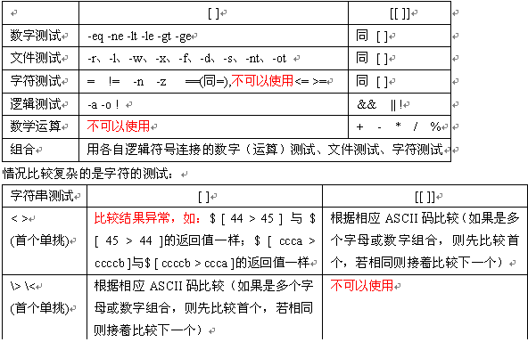

###一、[[ ]]、[ ]、(( ))
**1、[]和test**

两者是一样的，在命令行里test expr和[ expr ]的效果相同。

test的三个基本作用是判断文件、判断字符串、判断整数。支持使用 ”与或非“ 将表达式连接起来。

test中可用的比较运算符只有==和!=，两者都是用于字符串比较的，不可用于整数比较，整数比较只能使用-eq, -gt这种形式。

无论是字符串比较还是整数比较都千万不要使用大于号小于号。当然，如果你实在想用也是可以的，对于字符串比较可以使用尖括号的转义形式， 如果比较"ab"和"bc"：[ ab \< bc ]，结果为真，也就是返回状态为0.


**2、[[ ]]**

这是内置在shell中的一个命令，它就比刚才说的test强大的多了。支持字符串的模式匹配（使用=~操作符时甚至支持shell的正则表达 式）。逻辑组合可以不使用test的-a,-o而使用&& ||。
字符串比较时可以把右边的作为一个模式（这是右边的字符串不加双引号的情况下。如果右边的字符串加了双引号，则认为是一个文本字符串。），而不仅仅是一个字符串，比如[[ hello == hell? ]]，结果为真。

　　注意：使用[]和[[]]的时候不要吝啬空格，每一项两边都要有空格，[[ 1 == 2 ]]的结果为“假”，但[[ 1==2 ]]的结果为“真”！

**3、let和(())**

两者也是一样的(或者说基本上是一样的，双括号比let稍弱一些)。主要进行算术运算(上面的两个都不行)，也比较适合进 行整数比较，可以直接使用熟悉的<,>等比较运算符。可以直接使用变量名如var而不需要$var这样的形式。支持分号隔开的多个表达式

-----------

1. 首先，尽管很相似，但是从概念上讲，二者是不同层次的东西。
"[["，是关键字，许多shell(如ash bsh)并不支持这种方式。ksh, bash(据说从2.02起引入对[[的支持)等支持。
"["是一条命令， 与test等价，大多数shell都支持。在现代的大多数sh实现中，"["与"test"是内部(builtin)命令，换句话说执行"test"/"["时不会调用/some/path/to/test这样的外部命令(如果有这样的命令的话)。


2.[[]]结构比Bash版本的[]更通用。在[[和]]之间的所有的字符都不会被文件扩展或是标记分割，但是会有参数引用和命令替换。

用[[ ... ]]测试结构比用[ ... ]更能防止脚本里的许多逻辑错误。比如说，&&,||,<和>操作符能在一个[[]]测试里通过，但在[]结构会发生错误。

3.(( ))结构扩展并计算一个算术表达式的值。如果表达式值为0，会返回1或假作为退出状态码。一个非零值的表达式返回一个0或真作为退出状态码。这个结构和先前test命令及[]结构的讨论刚好相反。

4.[ ... ]为shell命令，所以在其中的表达式应是它的命令行参数，所以串比较操作符">" 与"<"必须转义，否则就变成IO改向操作符了(请参看上面2中的例子)。在[[中"<"与">"不需转义；
由于"[["是关键字，不会做命令行扩展，因而相对的语法就稍严格些。例如
在[ ... ]中可以用引号括起操作符，因为在做命令行扩展时会去掉这些引号，而在[[ ... ]]则不允许这样做。

5.[[ ... ]]进行算术扩展，而[ ... ]不做

6.[[ ... && ... && ...  ]] 和 [ ... -a ... -a ...] 不一样，[[ ]] 是逻辑短路操作，而 [ ] 不会进行逻辑短路

-----------

1）在ksh中的test
* 数字的运算可使用let、(( )) ，其中运算时不需要变量`$`符号，
 运算符为 `+、-、*、/、%` ，不建议使用expr数字的比较使用 (( )) ，其运算符 `>、>=、<、<=、==、!=`
* 可以使用算术扩展，如：(( 99+1 <= 101 ))
* 字符表达式的比较使用 [[ ]] ，其运算符 `=、!=、-n、-z`
* 文件表达式的测试使用 [[ ]] ，其运算符 `-r、-l、-w、-x、-f、-d、-s、-nt、-ot`
* 逻辑表达式的测试使用 [[ ]] ，其运算符` !、&&、||`
* 数字比较、字符比较、逻辑测试可以组合，如`$ [[ "a" != "b" && 4 -gt 3 ]]`
* 支持bash中的通配符扩展，如：`[[ hest = h??t ]] 、[ hest = h*t ]]`
* 使用 (( )) 时，不需要空格分隔各值和运算符，使用 [[ ]] 时需要用空格分隔各值和运算符。

2）bash与ksh中的 [[ ]] 不同
在redhat9的bash中也可以使用 [[ ]] 符号。但是建议严格按照上面的原则使用。
在bash中，数字的比较最好使用 (( ))，虽说可以使用 [[ ]]，但若在其内使用运算符` >、>=、<、<=、==、!=` 时，其结果经常是错误的，不过若在 [[ ]] 中使用 [ ] 中的运算符`-eq、-ne、-le、-lt、-gt、-ge`等，还尚未发现有错。因此诸如`$ [[ " a" != “b” && 4 > 3 ]]` 这类组合（见上）也不可以在bash中使用，其出错率很高。
例：`[[ "a" != "b" && 10 > 2 ]]` 判断结果就不正常。
诸如 `[ 2 \< 10 ]、[[ 2 < 10 ]]` 都是不要使用。使用算术扩展最好用 `(( 99+1 == 100 ))` ，而不要使用`[[ 99+1 -eq 100 ]]` 。




文件比较运算符

| 运算符 | 描述 | 示例 |
| --- | --- | --- |
| -e | filename	如果 filename 存在，则为真  |  [ -e /var/log/syslog ] |
| -d | filename	如果 filename 为目录，则为真  |  [ -d /tmp/mydir ] |
|-f filename	|如果 filename 为常规文件，则为真|	[ -f /usr/bin/grep ]|
|-L filename	|如果 filename 为符号链接，则为真|	[ -L /usr/bin/grep ]|
|-r filename	|如果 filename 可读，则为真|	[ -r /var/log/syslog ]|
|-w filename	|如果 filename 可写，则为真|	[ -w /var/mytmp.txt ]|
|-x filename	|如果 filename 可执行，则为真|	[ -L /usr/bin/grep ]|
|filename1 -nt filename2	|如果 filename1 比 filename2 新，则为真|	[ /tmp/install/etc/services -nt /etc/services ]|
|filename1 -ot filename2	|如果 filename1 比 filename2 旧，则为真|	[ /boot/bzImage -ot arch/i386/boot/bzImage ]|


字符串比较运算符 （请注意引号的使用，这是防止空格扰乱代码的好方法）

| 运算符 | 描述 | 示例 |
| --- | --- | --- |
|-z string	|如果 string 长度为零，则为真|	[ -z "$myvar" ]|
|-n string	|如果 string 长度非零，则为真|	[ -n "$myvar" ]|
|string1 = string2	|如果 string1 与 string2 相同，则为真|	[ "$myvar" = "one two three" ]|
|string1 != string2	|如果 string1 与 string2 不同，则为真|	[ "$myvar" != "one two three" ]|


算术比较运算符

| 运算符 | 描述 | 示例 |
| --- | --- | --- |
|num1 -eq num2|	等于|	[ 3 -eq $mynum ]|
|num1 -ne num2	|不等于|	[ 3 -ne $mynum ]|
|num1 -lt num2	|小于|	[ 3 -lt $mynum ]|
|num1 -le num2	|小于或等于|	[ 3 -le $mynum ]|
|num1 -gt num2	|大于|	[ 3 -gt $mynum ]|
|num1 -ge num2|	大于或等于|	[ 3 -ge $mynum ]|


测试命令

　　test命令用于检查某个条件是否成立，它可以进行数值、字符和文件3个方面的测试，其测试符和相应的功能分别如下。

　　（1）数值测试：

    　　-eq 等于则为真。

    　　-ne 不等于则为真。

    　　-gt 大于则为真。

    　　-ge 大于等于则为真。

    　　-lt 小于则为真。

    　　-le 小于等于则为真。

　　（2）字串测试：

    　　= 等于则为真。

    　　!= 不相等则为真。

    　　-z字串 字串长度伪则为真。

    　　-n字串 字串长度不伪则为真。

　　（3）文件测试：

    　　-e文件名 如果文件存在则为真。

    　　-r文件名 如果文件存在且可读则为真。

    　　-w文件名 如果文件存在且可写则为真。

    　　-x文件名 如果文件存在且可执行则为真。

    　　-s文件名 如果文件存在且至少有一个字符则为真。

    　　-d文件名 如果文件存在且为目录则为真。

    　　-f文件名 如果文件存在且为普通文件则为真。

    　　-c文件名 如果文件存在且为字符型特殊文件则为真。

    　　-b文件名 如果文件存在且为块特殊文件则为真


条件变量替换:
   Bash Shell可以进行变量的条件替换,既只有某种条件发生时才进行替换,替换条件放在{}中.

(1) 当变量未定义或者值为空时,返回值为word的内容,否则返回变量的值.

    ${value:-word}    

(2) 与前者类似,只是若变量未定义或者值为空时,在返回word的值的同时将word赋值给value

    ${value:=word}     

(3) 若变量以赋值的话,正常替换.否则将消息message送到标准错误输出(若此替换出现在Shell程序中,那么该程序将终止运行)

    ${value:?message}     

(4) 若变量以赋值的话,其值才用word替换,否则不进行任何替换

    ${value:+word}     

(5) 从变量中提取子串,这里offset和length可以是算术表达式.

    ${value:offset}
    ${value:offset:length}

(6) 变量的字符个数

    ${#value}

(7) 去掉value中与pattern相匹配的部分,条件是value的开头与pattern相匹配

    ${value#pattern}
    ${value##pattern}

* *#与##的区别在于一个是最短匹配模式,一个是最长匹配模式.*

(8) 于(7)类似,只是是从value的尾部于pattern相匹配,%与%%的区别与#与##一样

    ${value%pattern}
    ${value%%pattern}

(9) 进行变量内容的替换,把与pattern匹配的部分替换为string的内容,/与//的区别与上同

    ${value/pattern/string}
    ${value//pattern/string}

注意: 上述条件变量替换中,除(2)外,其余均不影响变量本身的值


```#!/bin/bash
var1="1"
var2="2"
```

下面是并且的运算符-a，另外注意，用一个test命令就可以了，还有if条件后面的分号

```
if test $var1 = "1"-a $var2 = "2" ; then
   echo "equal"
fi
```

下面是或运算符 -o，有一个为真就可以
```
if test $var1 != "1" -o $var2 != "3" ; then
   echo "not equal"
fi
```
下面是非运算符 ！
if条件是为真的时候执行，如果使用！运算符，那么原表达式必须为false
```
if ! test $var1 != "1"; then
   echo "not 1"
fi
```

以上三个if都为真，所以三个echo都会打印

在一个文档把这几个运算法说的一塌糊涂，于是自己动手实验了一下


***shell字符串比较、判断是否为数字***

二元比较操作符,比较变量或者比较数字.注意数字与字符串的区别.

整数比较
```
-eq       等于,如:if [ "$a" -eq "$b" ]
-ne       不等于,如:if [ "$a" -ne "$b" ]
-gt       大于,如:if [ "$a" -gt "$b" ]
-ge       大于等于,如:if [ "$a" -ge "$b" ]
-lt       小于,如:if [ "$a" -lt "$b" ]
-le       小于等于,如:if [ "$a" -le "$b" ]
<       小于(需要双括号),如:(("$a" < "$b"))
<=       小于等于(需要双括号),如:(("$a" <= "$b"))
>       大于(需要双括号),如:(("$a" > "$b"))
>=       大于等于(需要双括号),如:(("$a" >= "$b"))
```

字符串比较
```
=       等于,如:if [ "$a" = "$b" ]
==       等于,如:if [ "$a" == "$b" ],与=等价
       注意:==的功能在[[]]和[]中的行为是不同的,如下:
       1 [[ $a == z* ]]    # 如果$a以"z"开头(模式匹配)那么将为true
       2 [[ $a == "z*" ]] # 如果$a等于z*(字符匹配),那么结果为true
       3
       4 [ $a == z* ]      # File globbing 和word splitting将会发生
       5 [ "$a" == "z*" ] # 如果$a等于z*(字符匹配),那么结果为true
       一点解释,关于File globbing是一种关于文件的速记法,比如"*.c"就是,再如~也是.
       但是file globbing并不是严格的正则表达式,虽然绝大多数情况下结构比较像.
!=       不等于,如:if [ "$a" != "$b" ]
       这个操作符将在[[]]结构中使用模式匹配.
<       小于,在ASCII字母顺序下.如:
       if [[ "$a" < "$b" ]]
       if [ "$a" \< "$b" ]
       注意:在[]结构中"<"需要被转义.
>       大于,在ASCII字母顺序下.如:
       if [[ "$a" > "$b" ]]
       if [ "$a" \> "$b" ]
       注意:在[]结构中">"需要被转义.
       具体参考Example 26-11来查看这个操作符应用的例子.
-z       字符串为"null".就是长度为0.
-n       字符串不为"null"
```
       注意:
       使用-n在[]结构中测试必须要用""把变量引起来.使用一个未被""的字符串来使用! -z
       或者就是未用""引用的字符串本身,放到[]结构中。虽然一般情况下可
       以工作,但这是不安全的.习惯于使用""来测试字符串是一种好习惯.

文章出处：http://www.cnblogs.com/aaron-agu/ 只有毅力和决心才能使人真正具有价值！

###二、#*,##*,##*,%*,%%*的含义及用法

介绍下Shell中的${}、##和%%使用范例，本文给出了不同情况下得到的结果。
假设定义了一个变量为：
代码如下:
file=/dir1/dir2/dir3/my.file.txt
可以用${ }分别替换得到不同的值：
${file#*/}：删掉第一个 / 及其左边的字符串：dir1/dir2/dir3/my.file.txt
${file##*/}：删掉最后一个 /  及其左边的字符串：my.file.txt
${file#*.}：删掉第一个 .  及其左边的字符串：file.txt
${file##*.}：删掉最后一个 .  及其左边的字符串：txt
${file%/*}：删掉最后一个  /  及其右边的字符串：/dir1/dir2/dir3
${file%%/*}：删掉第一个 /  及其右边的字符串：(空值)
${file%.*}：删掉最后一个  .  及其右边的字符串：/dir1/dir2/dir3/my.file
${file%%.*}：删掉第一个  .   及其右边的字符串：/dir1/dir2/dir3/my
记忆的方法为：
# 是 去掉左边（键盘上#在 $ 的左边）
%是去掉右边（键盘上% 在$ 的右边）
单一符号是最小匹配；两个符号是最大匹配
${file:0:5}：提取最左边的 5 个字节：/dir1
${file:5:5}：提取第 5 个字节右边的连续5个字节：/dir2
也可以对变量值里的字符串作替换：
${file/dir/path}：将第一个dir 替换为path：/path1/dir2/dir3/my.file.txt
${file//dir/path}：将全部dir 替换为 path：/path1/path2/path3/my.file.txt
