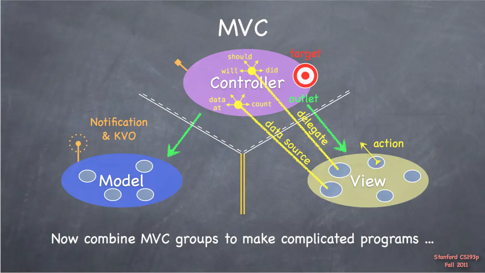

## 1. 架构设计模式[^1]

### 1.1 [软件架构入门](http://www.ruanyifeng.com/blog/2016/09/software-architecture.html)

### 1.2 分层架构

```txt
1. 表现层（presentation）：用户界面，负责视觉和用户互动
2. 业务层（business）：实现业务逻辑
3. 服务层 (service): 不同业务逻辑的通用接口
4. 持久层（persistence）：提供数据，SQL 语句就放在这一层
5. 数据库（database） ：保存数据
```

### 1.3 事件驱动架构

```txt
1. 事件队列（event queue）：接收事件的入口
2. 分发器（event mediator）：将不同的事件分发到不同的业务逻辑单元
3. 事件通道（event channel）：分发器与处理器之间的联系渠道
4. 事件处理器（event processor）：实现业务逻辑，处理完成后会发出事件，触发下一步操作
```

### 1.4 微核架构

微核架构（microkernel architecture）又称为"插件架构"（plug-in architecture），指的是软件的内核相对较小，主要功能和业务逻辑都通过插件实现。

### 1.5 微服务架构

微服务架构分成三种实现模式:

```txt
1. RESTful API 模式：服务通过 API 提供，云服务就属于这一类
2. RESTful 应用模式：服务通过传统的网络协议或者应用协议提供，背后通常是一个多功能的应用程序，常见于企业内部
3. 集中消息模式：采用消息代理（message broker），可以实现消息队列、负载均衡、统一日志和异常处理，缺点是会出现单点失败，消息代理可能要做成集群
```

### 1.6 云架构

```txt
1. 处理单元：实现业务逻辑
2. 虚拟中间件：负责通信、保持sessions、数据复制、分布式处理、处理单元的部署。
```

## 2. [浅谈 MVC、MVP 和 MVVM 架构模式](https://draveness.me/mvx/)

### 2.1 MVC

#### 2.1.1 [苹果的 MVC](https://developer.apple.com/library/archive/documentation/General/Conceptual/DevPedia-CocoaCore/MVC.html)


#### 2.1.2 斯坦福白胡子老头的 MVC



这个图的理解，做一个说明，图中有几条线把这三部分划分开，有黄线，虚线，和白色的实线。我们把它们想象成路标。

* 在 M 和 V 之间有两条黄线，这表示什么呢？它意味着你不能穿越这黄线，任何一个方向都不行。
* 白色的虚线，它意味着你可以自由的穿越它，只要是安全的。
* 白色的实线，它代表你可以穿越，但你必须要买票，或者交点过路费，target-action，Delegate，DataSource。
* 图中绿色的箭头表示直接引用，直接引用直观来说，就是说需要包含引用类的申明头文件和类的实例变量。可以看到，只有 Controller 中，有对 Model 和 View 的直接引用。其中对 View 的直接引用体现为 IBOutlet。
* Model 在图上有一个信号塔类似的图形，旁边写着 Notification & KVO。这表明 Model 主要是通过 Notification 和 KVO 来和 Controller 通讯的。

#### 2.1.3 [Model-View-Controller (MVC) in iOS – A Modern Approach](https://www.kodeco.com/1000705-model-view-controller-mvc-in-ios-a-modern-approach)

### 2.2 MVP

[对iOS MVP架构的一点理解](https://juejin.cn/post/6844903857022058509)

### 2.3 MVVM

## 3. RxSwift 常用架构

## 3.1. RxFeedback

## 3.2 ReactorKit

## 4. [iOS应用架构谈](https://casatwy.com/iosying-yong-jia-gou-tan-kai-pian.html)

### 4.1 [框架、架构、设计模式](https://blog.csdn.net/CillyB/article/details/79464339?utm_source=blogxgwz7&utm_medium=distribute.pc_relevant.none-task-blog-baidujs_title-0&spm=1001.2101.3001.4242)

设计模式（Design pattern：是一套被反复使用、多数人知道的、经过分类编目的、代码设计经验的总结。从定义上看，它涉及到了代码级别，侧重于解决实际的现实的问题。比如我们应该如何为不同的商品设计折扣的方式，采用策略模式呗。

框架（Framework）：是整个或部分系统的可重用设计，表现为一组抽象构件及构件实例间交互的方法;另一种定义认为，框架是可被应用开发者定制的应用骨架。前者是从应用方面而后者是从目的方面给出的定义。从定义看，它涉及到了一堆构件，以及这些构件之间的依赖关系、责任分配和流程控制等，说白了就是一堆类而已。这些类以及之间的关系构成了框架。比如想要让用户通过Servlet来访问页面，怎么办？用Struts呗。

架构模式（架构风格）：一个架构模式描述软件系统里的基本的结构组织或纲要。架构模式提供一些呈先定义好的子系统，指定它们的责任，并给出把它们组织在一起的法则和指南。从定义上来看，它是在指导我们如何组织代码，是一种具有指导意义的思想，比如要解决系统的数据与显示分离的问题，那就使用MVC模式呗。

软件架构（software architecture）：是一系列相关的抽象模式，用于指导大型软件系统各个方面的设计。 软件架构是一个系统的草图。软件架构描述的对象是直接构成系统的抽象组件。各个组件之间的连接则明确和相对细致地描述组件之间的通讯。在实现阶段，这些抽象组件被细化为实际的组件，比如具体某个类或者对象。比如，我们要开发一个在线测评系统，使用什么架构呢？轻量级的SSH还是重量级的EJB？自己决定吧。

```txt
软件架构：架构图

架构模式：MVC、MVP、MVVM...

项目框架：系统的重用设计

设计模式：solid 原则、23种设计模式
```

### 4.2 [SwiftHub](https://github.com/khoren93/SwiftHub)

### 4.3 [今日头条：iOS 架构设计杂谈](https://juejin.cn/post/6844903623252525064)

### 4.4 TCA

#### 4.4.1. [TCA - SwiftUI 的救星？(一)](https://juejin.cn/post/7046951315565445157)

#### 4.4.2. [TCA - SwiftUI 的救星？(二)](https://onevcat.com/2021/12/tca-2/)

#### 4.4.3. [TCA - SwiftUI 的救星？(三)](https://onevcat.com/2022/03/tca-3/)

### 4.4 [swift-composable-architecture](https://github.com/pointfreeco/swift-composable-architecture?utm_source=gold_browser_extension)

### 4.5 [awesome iOS architecture](https://github.com/onmyway133/awesome-ios-architecture#data-source)

## 5. [iOS APP 架构设计](https://juejin.cn/post/6981699887549120548#heading-3)

### 5.1 MVC/MVP/MVVM(-C)

#### 5.1 MVC

#### 5.2 MVP

[对iOS MVP架构的一点理解](https://juejin.cn/post/6844903857022058509)

### 5.2 MVC-VS(View State)

### 5.3 MAVB(ModelAdapter-ViewBuilder)

专注于声明式 UI 架构

### 5.4 Elm(TEA) The Elm Architecture

Reducer(State/Property)

#### 5.4.1 [CombineFeedback](https://github.com/sergdort/CombineFeedback)
