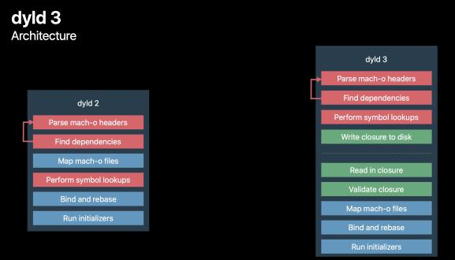
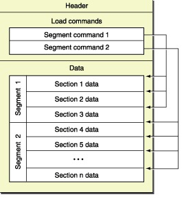

## 1. 并发编程

### 1.1 [进程&线程](https://www.jianshu.com/p/9218692cb209)

#### 1.1.1 [进程通信](https://www.jianshu.com/p/c1015f5ffa74)

1. 管道/匿名管道(pipe)
2. 有名管道(FIFO)
3. 信号(Signal)
4. 消息(Message)队列
5. 共享内存(share memory)
6. 信号量(semaphore)
7. 套接字(socket)

#### 1.1.2 线程通信

##### 1.1.2.1 线程通讯方式

1. 临界区
2. 互斥量
3. 信号量
4. 事件
5. 锁
6. 信号
7. violate全局变量-共享内存

##### 1.1.2.2 [iOS 中线程同步的锁](https://juejin.cn/post/6844903716265394184)

##### 1.1.2.3 [线程、队列、任务](https://zhuanlan.zhihu.com/p/68705170)

### 1.1.2.4 [runloop](https://blog.ibireme.com/2015/05/18/runloop/)

### 1.2 [线程池](https://wangpengcheng.github.io/2019/05/17/cplusplus_theadpool/)

### 1.3 协程

### 1.4 GCD、NSThread、NSOperation

#### 1.4.1 GCD

不用管理线程的生命周期
充分利用系统的多核处理
不依赖 runloop
基于 Pthread 实现的

实现原理：dispatchQueue --> pthread_workqueue --> workQueue

#### 1.4.2 NSThread

轻量级
手动管理线程启动，停止，线程同步，睡眠，唤醒，保活

#### 1.4.3 NSOperation

基于 GCD 的面向对象的实现，
可以添加线程依赖，
指定最大并发任务数
支持设置优先级
支持取消操作
利用 kvo 监听线程状态

### 1.3 大量数据处理

纯读：分页、预加载、缓存

大量数据读写（互斥）：读并发，写等待

### 1.4 并发编程--苹果文档

* [Concurrency Programming Guide](https://developer.apple.com/library/archive/documentation/General/Conceptual/ConcurrencyProgrammingGuide/)
* [Threading Programming Guide](https://developer.apple.com/library/archive/documentation/Cocoa/Conceptual/Multithreading/Introduction/Introduction.html#//apple_ref/doc/uid/10000057i-CH1-SW1)
* [GCD Internals](http://newosxbook.com/articles/GCD.html)

## 2. 性能优化

### 2.1 启动优化

冷启动优化（dyld、Mac-O）

dyld 环境变量

dyld2、dyld3

可执行文件格式：Mac-O

### 2.2 瘦身

Apple Slicing

资源优化：去掉没用的资源，图片资源压缩，webp

代码优化：去掉没用的代码（Linked map）

编译优化：Strip Link Product，符号文件，异常支持等

* [iOS微信安装包瘦身](https://mp.weixin.qq.com/s?__biz=MzAwNDY1ODY2OQ==&mid=207986417&idx=1&sn=77ea7d8e4f8ab7b59111e78c86ccfe66&scene=24&srcid=0921TTAXHGHWKqckEHTvGzoA#rd)
* [今日头条 iOS 安装包大小优化—— 新阶段、新实践](https://www.infoq.cn/article/iowjwhbirqeobzf5m2o8)

### 2.6 Instrument

内存泄漏，僵死代码等

## 3. 大前端

### 3.1 WebViewJavaScriptBridge

### 3.2 JSPacth

### 3.3 Flutter

### 3.4 ReactNative

### 3.5 Dcloud

### 3.6 Capacitor

## 4. 内存管理

### 4.1 修饰符

#### 4.1.1 权限修饰符

#### 4.1.2 属性修饰符

### 4.2 Autorelease Pool

### 4.3 OC 默认规则

生成持有规则
方法命名规则

### 4.4 循环引用

Weak
NSTimer
Block

JavaScriptCore：JSManagedValue

### 4.5 [alloc 方法](https://www.jianshu.com/p/e612f4fa3cd3)

## 5. [Block](https://limeng99.club/learning/2020/05/25/iOS-Block底层实现原理.html)

### 5.1 类型

### 5.2 结构

### 5.3 block 内存管理

## 6. [Runtime](https://halfrost.com/objc_runtime_isa_class/)

Category、关联属性

方法交换

消息转发

KVO/KVC

isa

## 7. 日志

崩溃、用户行为

实时、非实时

日志格式： ASL & ULS

操作统计

类型：info，warn，error

日志系统设计

## 8. 埋点

无侵入式

可视化

全埋点

[无埋点](https://www.jianshu.com/p/69ce01e15042)

## 9. 异常

### 9.1 跟踪

### 9.2 分析

### 9.3 处理

* 线上 bug[崩溃]等

## 10. CI

Shell

Jenkins

Fastlane

XcodeServer

* Firm/蒲公英，钉钉

## 11. 组件化

Pod

CTMediator

Behive

* 功能
* 业务

## 14. OS

文件（Mac-O、可执行、多媒体、plist 等）

APP（结构，安装认证流程），APP 共享

持久化：
plist、NSUserDefault、归档、keychain、数据库、文件

## 15. UI

绘制/渲染（流程）

布局

动画交互

事件响应者链

UIView与Layer

### 15.1 

透明度：alpha，translucent，opaque 等

## 18. 附加项

### 18.3 IM

### 18.4 音视频

### 18.5 Android

### 18.6 后端

### 18.7 C/C++

## 19. 补充

方法调用 与 函数调用

逆向

汇编

编译器

解释器

问题方案提供角色

## 20 工作成就

### 20.1 HyBrid

### 20.2 蓝牙

### 20.3 SDK

### 20.4 自动化

### 20.5 性能优化

#### 20.5.1 网络

### 20.6 杂项

#### 20.6.1 苹果登录

#### 20.6.2 暗黑主题

#### 20.6.3 Swift 5 升级

#### 20.6.4 弹框

#### 20.6.5 universal link
