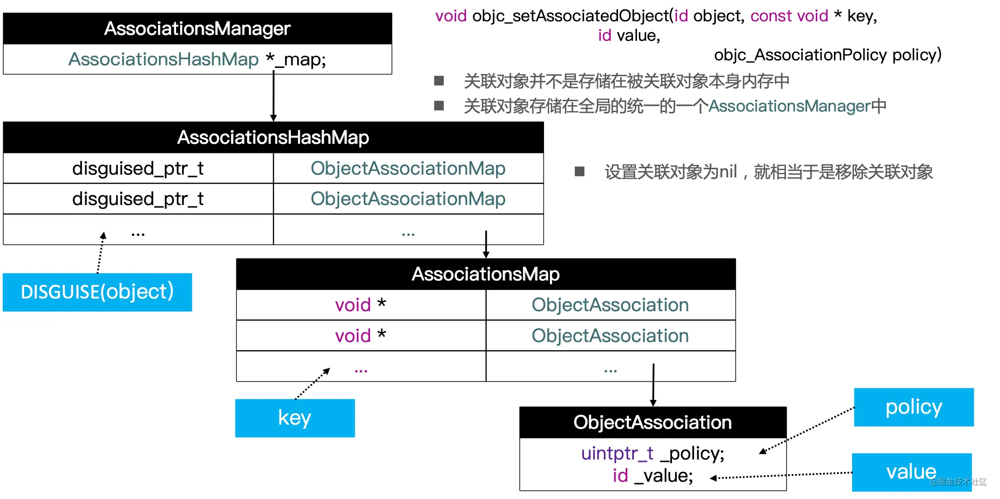

## 1. [深入理解Objective-C：Category](https://tech.meituan.com/2015/03/03/diveintocategory.html)

category 加载过程，从objc-os.mm文件的_objc_init函数开始

```objc
_objc_init:
dyld_register_image_state_change_handler(dyld_image_state_bound,1, &map_images);
dyld_register_image_state_change_handler(dyld_image_state_dependents_initialized, 0/*not batch*/, &load_images);

-->map_2_images-->map_images_nolock-->
_read_images-->remethodizeClass-->attachCategories-->
attachLists-->realloc、memmove、 memcpy。
```

## 2. [iOS中Category的底层实现原理](https://juejin.cn/post/6844904039671398407)

### 2.1 Category 结构体

```Objective-C
struct objc_category {
    char * _Nonnull category_name                            OBJC2_UNAVAILABLE;
    char * _Nonnull class_name                               OBJC2_UNAVAILABLE;
    struct objc_method_list * _Nullable instance_methods     OBJC2_UNAVAILABLE;
    struct objc_method_list * _Nullable class_methods        OBJC2_UNAVAILABLE;
    struct objc_protocol_list * _Nullable protocols          OBJC2_UNAVAILABLE;
} 

/// An opaque type that represents a category.
typedef struct objc_category *Category;
```

### 2.2 关联对象

```objc
// 设置
void objc_setAssociatedObject(id object, 
                              const void * key,
                              id value, 
                              objc_AssociationPolicy policy);

// 获取
id objc_getAssociatedObject(id object, const void * key);

// 移除
void objc_removeAssociatedObjects(id object);
```

|      objc_AssociationPolicy       |   对应的修饰符    |
| :-------------------------------: | :---------------: |
|      OBJC_ASSOCIATION_ASSIGN      |      assign       |
| OBJC_ASSOCIATION_RETAIN_NONATOMIC | strong, nonatomic |
|  OBJC_ASSOCIATION_COPY_NONATOMIC  |  copy, nonatomic  |
|      OBJC_ASSOCIATION_RETAIN      |  strong, atomic   |
|       OBJC_ASSOCIATION_COPY       |   copy, atomic    |

### 2.3 关联对象存储结构

* `ObjcAssociation`：这个对象里面有2个成员`uintptr_t _policy`和`id _value`，这两个很显然就是我们设置关联对象传入的参数`policy`和`value`。
* `ObjectAssociationMap`：这是一个HashMap(以键值对方式存储，可以理解为是一个字典)，以设置关联对象时传入的`key`值作为`HashMap`的键，以`ObjcAssociation`对象作为`HashMap`的值。比如一个分类添加了3个属性，那一个实例对象给这3个属性都赋值了，那么这个`HashMap`中就有3个元素，如果给这个实例对象的其中一个属性赋值为`nil`，那这个`HashMap`就会把这个属性对应的键值对给移除，然后`HashMap中`就还剩2个元素。
* `AssociationsHashMap`：这也是一个`HashMap`，以设置关联属性时传入的参数`object`作为键(实际是对`object`对象通过某个算法计算出一个值作为键)。以`ObjectAssociationMap`作为值。所以当某个类(前提是这个类的分类中有设置关联对象)每实例化一个对象，这个`HashMap`就会新增一个元素，当某个实例化对象被释放时，其对应的键值对也会被这个`HashMap`给移除。注意整个程序运行期间，`AssociationsHashMap`只会有一个，也就是说所有的类的关联对象信息都是存储在这个`HashMap`中。
* `AssociationsManager`：从名字就可以看出它是一个管理者，注意整个程序运行期间它也只有一个，他就只包含一个`AssociationsHashMap`。


