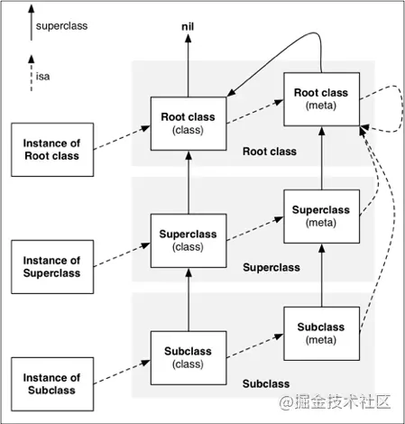
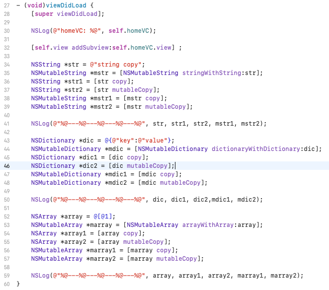
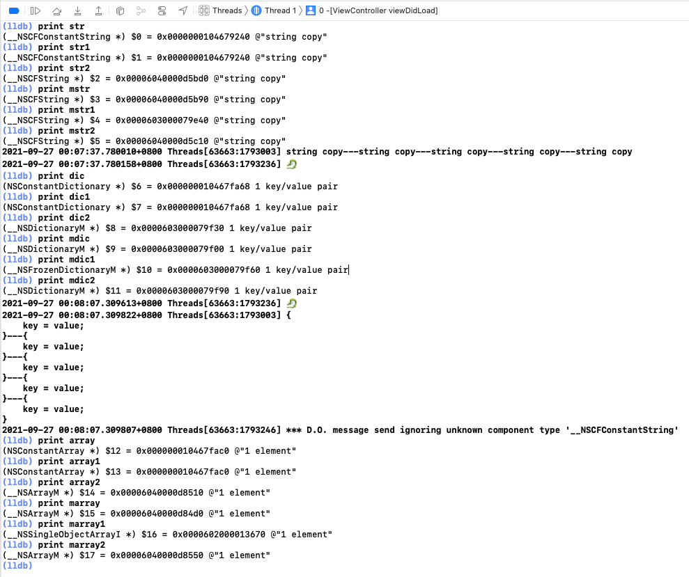
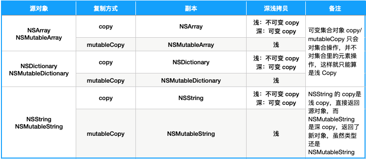

## 1. 基础

objc4 源码 与 [基本类型](./Types.md)

## 2 对象初始化

```objective-c
Car *car = [[Car alloc] init];
// or
Car *car = [Car new];
```

* `alloc`: 计算/分配内存、关联 `isa`
* `init` 返回 `self`
* `new` 相当于 先调用 `alloc` 在调用 `init`

## 3 内存模型

```Objective-C
struct objc_class {
    Class _Nonnull isa  OBJC_ISA_AVAILABILITY;

#if !__OBJC2__
    Class _Nullable super_class                              OBJC2_UNAVAILABLE;
    const char * _Nonnull name                               OBJC2_UNAVAILABLE;
    long version                                             OBJC2_UNAVAILABLE;
    long info                                                OBJC2_UNAVAILABLE;
    long instance_size                                       OBJC2_UNAVAILABLE;
    struct objc_ivar_list * _Nullable ivars                  OBJC2_UNAVAILABLE;
    struct objc_method_list * _Nullable * _Nullable methodLists                    OBJC2_UNAVAILABLE;
    struct objc_cache * _Nonnull cache                       OBJC2_UNAVAILABLE;
    struct objc_protocol_list * _Nullable protocols          OBJC2_UNAVAILABLE;
#endif

} OBJC2_UNAVAILABLE;
/* Use `Class` instead of `struct objc_class *` */

/// An opaque type that represents an Objective-C class.
typedef struct objc_class *Class;
```

```Objective-C
@interface NSObject <NSObject> {
    Class isa  OBJC_ISA_AVAILABILITY;
}
```

对象获取类 isa

```Objective-C
- (Class)class {
    return object_getClass(self);
}

Class object_getClass(id obj)
{
    if (obj) return obj->getIsa();
    else return Nil;
}

inline Class 
objc_object::getIsa() 
{
    if (isTaggedPointer()) {
        uintptr_t slot = ((uintptr_t)this >> TAG_SLOT_SHIFT) & TAG_SLOT_MASK;
        return objc_tag_classes[slot];
    }
    return ISA();
}

inline Class 
objc_object::ISA() 
{
    assert(!isTaggedPointer()); 
    return (Class)(isa.bits & ISA_MASK);
}
```

OC 有一个类似的方法，不过这个方法是通过名字获取相应的类

```Objective-C
static Class getClass(const char *name)
{
    runtimeLock.assertLocked();

    // Try name as-is
    Class result = getClass_impl(name);
    if (result) return result;

    // Try Swift-mangled equivalent of the given name.
    if (char *swName = copySwiftV1MangledName(name)) {
        result = getClass_impl(swName);
        free(swName);
        return result;
    }

    return nil;
}
```

* [iOS底层原理总结 - 探寻OC对象的本质](https://juejin.cn/post/6844903588150378509)



## 4 内存管理

### 4.1 内存管理原则

* 自己生成的对象，自己持有
* 非自己生成的对象，自己也能持有
* 不再需要自己持有的对象，要释放
* 非自己持有的对象，无法释放

| 对象操作         | OC 方法                           |
| :--------------- | :-------------------------------- |
| 生成并持有的对象 | alloc/new/copy/mutableCopy 等方法 |
| 持有对象         | retain                            |
| 释放对象         | release                           |
| 废弃对象         | dealloc                           |

### 4.2 内存管理方式

iOS 的内存管理有两种方式，MRC 与 ARC。

MRC 年代比较久远，这里就不做讨论了。有兴趣的同学可以自己去网上了解。

ARC 自动引用计数，内存管理机制里有个引用计数表，用来统计对象的引用计数的。对象每被引用一次，对象的引用计数就会增加 1；使用完了就释放一次，对象的引用计数就会减 1，当对象的引用计数为 0 的时候，对象的内存资源会被释放。

#### 4.2.1 Autorelease Pool

ARC 里面还有个机制来管理内存 -- Autorelease Pool，那些非自己生成并持有的对象，会通过 Autorelease Pool 进行内存管理，如 `[NSArray array]`，所有在 Autorelease Pool 里的对象，在 Autorelease Pool 释放的时候，都会被释放掉。
在局部内存资源使用比较多的时候，可以通过这种机制有效的管理内存资源。

非自己生成并持有的对象，如`[NSArray array]`，内存管理方式经过了优化，不会直接注册 Autorelease Pool 中，而是直接返回

`Object_autoreleaseReturenValue && Object_retainAutoreleasedReturnValue`

#### 4.2.2 内存所有权修饰符

##### 1. __strong

```objc
id obj  => id __strong obj
```

##### 2. __weak

```objc
id __weak obj1 = obj;
NSLog("%@", obj1);
```

会被编译成

```objc
id obj1;
objc_initWeak(&obj1, obj);
id temp = objc_loadWeakRetaind(&obj);
objc_autorelease(&temp);
NSLog("%@", obj1);
objc_destroyWeak(&obj1);
```

其中

`objc_loadWeakRetaind`： 取出附有 __weak 修饰符修饰的变量的引用，并 retain；
`objc_autorelease`： 将对象注册到 autorelease pool 中；

这种情况增加了 weak 变量注册到 autorelease pool 中的操作。所以为了避免这种情况，可以在局部作用域中加上`__strong`。

##### 3. __unsafe_unretain

加了这个修饰符的对象，不属于编译器的内存管理对象。需要手动赋值`nil`，释放内存资源。
并且，在赋值给`__strong`修饰的变量时，要确保`__unsafe_unretain`修饰的对象存在；

##### 4. __autorelease

```objc
id *obj  => id __autorelease *obj
```

#### 4.2.3 引用与释放

Core Fundation、Foundation 与 C 语言对象的内存资源管理

| 框架                        | 引用            | 释放              |
| --------------------------- | --------------- | ----------------- |
| Foundation                  | retain          | release           |
| Core Foundation             | CFRetain        | CFRelease         |
| C 语言桥接 Toll-Free Bridge | __bridge_retain | __bridge_transfer |

C 语言类型与 OC 类型转换

| 操作符   | C 语言类型 | OC 类型 |
| -------- | ---------- | ------- |
| __bridge | void *     | id      |

#### 4.2.4 属性权限修饰符

assign： 可以修饰引用对象，不过要手动释放内存

copy
测试代码



测试结果



总结



strong

weak

automatic

## 5. 内存问题

### 5.1 内存泄漏

#### 5.1.1 循环引用

循环引用，是指两个对象或者多个对象相互引用，引用关系形成了闭环，导致内存资源无法释放。循环引用也是内存泄漏的一种情况。

一般在使用 NSTimer、Block、GCD、Delegate 的时候，比较容易发生。

[iOS 常见内存泄漏场景与解决方案](https://juejin.cn/post/6844904070344343565#heading-10)

#### 5.1.2 [weak 实现原理](https://www.jianshu.com/p/13c4fb1cedea)

#### 5.1.3 内存泄漏检测

检测的方式通常有两种：静态检查与动态检查。

##### 5.1.3.1 静态检查

静态检查通过 Xcode 来操作，操作路径：`Product -> Analyze`

##### 5.1.3.2 动态检查

静态检查通过 Xcode 的 Instruments 工具来操作，操作路径：`Product -> Profile -> Leaks`。

具体使用方法：

点击左上角的红色圆点，这时项目开始启动了，由于Leaks是动态监测，所以手动进行一系列操作，可检查项目中是否存在内存泄漏问题。如果右侧矩形框中显示红色，则表示出现内存泄漏。

选中Leaks Checks,在Details所在栏中选择CallTree,并且在右下角勾选Invert Call Tree 和Hide System Libraries，会发现显示若干行代码，双击即可跳转到出现内存泄漏的地方

### 5.2 僵尸对象

[iOS Zombie Objects(僵尸对象)原理探索](https://www.jianshu.com/p/493f581d336b)

### 5.3 指针问题

先区分两个概念：野指针 与 悬垂指针。

* 野指针：访问一个已销毁或者访问受限的内存区域的指针，野指针不能通过判断是否为NULL来区分。
* 悬垂指针：指针正常初始化，曾指向一个对象，该对象被销毁了，但是指针未置空，那么就成了悬空[悬垂]指针。

#### 5.3.1 野指针问题定位与处理

1. [iOS 野指针定位:野指针嗅探器](https://www.jianshu.com/p/9fd4dc046046?utm_source=oschina-app)

2. [如何定位Obj-C野指针随机Crash(一)：先提高野指针Crash率](https://blog.csdn.net/tencent_bugly/article/details/46277055)
3. [如何定位Obj-C野指针随机Crash(二)：让非必现Crash变成必现](https://blog.csdn.net/Tencent_Bugly/article/details/46374401?utm_medium=distribute.pc_relevant_t0.none-task-blog-2%7Edefault%7ECTRLIST%7Edefault-1.no_search_link&depth_1-utm_source=distribute.pc_relevant_t0.none-task-blog-2%7Edefault%7ECTRLIST%7Edefault-1.no_search_link)
4. [如何定位Obj-C野指针随机Crash(三)：加点黑科技让Crash自报家门](https://blog.csdn.net/tangaowen/article/details/46830049?utm_medium=distribute.pc_relevant.none-task-blog-2~default~baidujs_title~default-1.no_search_link&spm=1001.2101.3001.4242)
