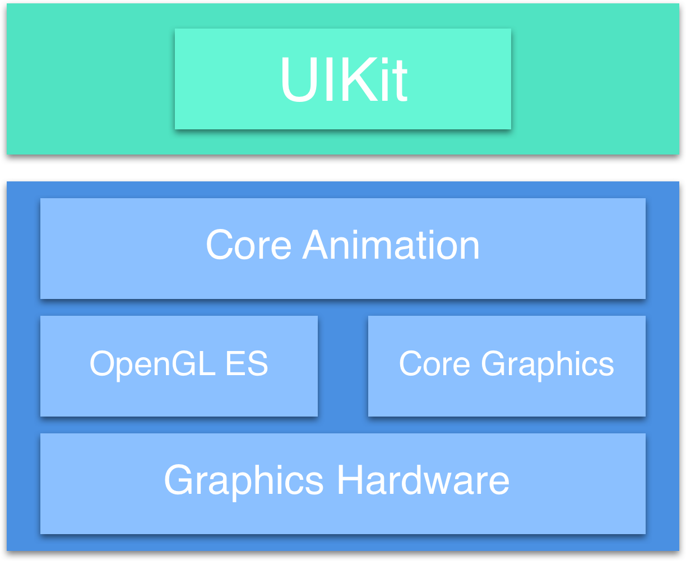
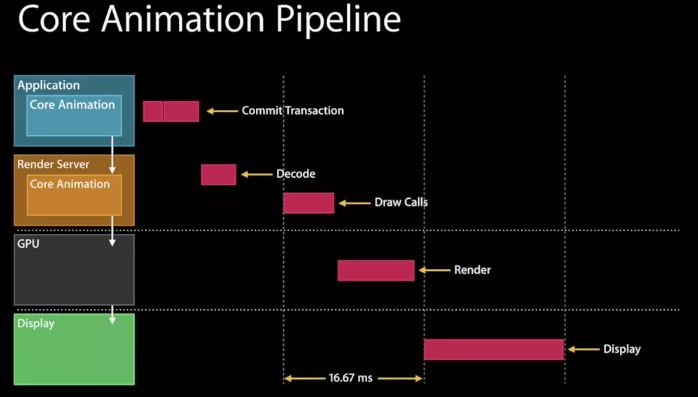
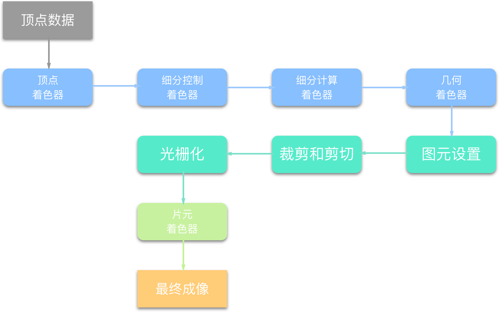
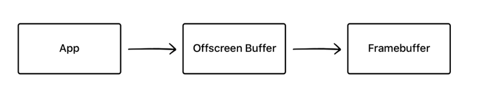
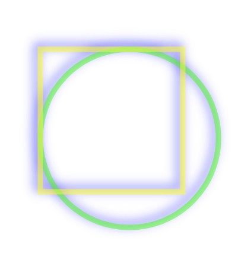
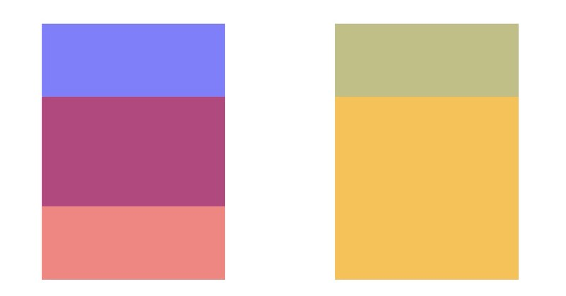
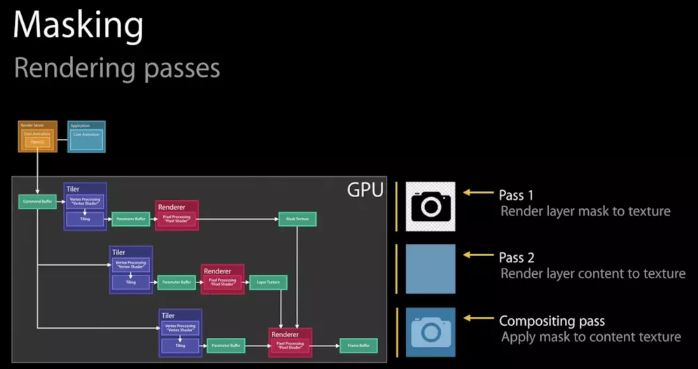
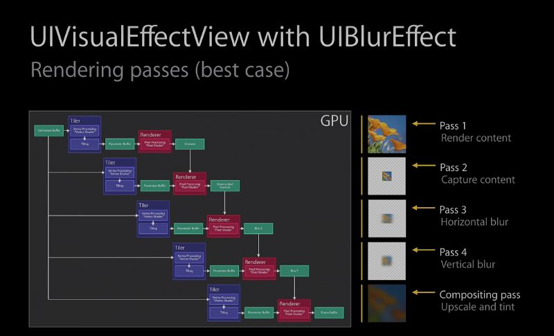

iOS 的性能优化，是一个比较大的专题。可细分为： App体积瘦身、电量优化、启动优化、网络、卡顿、异常、日志、CI、安全·逆向。

预备知识

* 并发编程：Runloop
* 内存管理
* Runloop
* 运维
* 网络
* Mac-O 可执行文件
* 逆向
* 加解密
* WebView

## 1. App体积瘦身

安装包的组成：主要是资源文件与可执行文件。

Apple 已经使用了 App Slice 技术按照 CPU 架构、设备类型区分了不同的安装包，使下载大小比普通安装包小了很多，主要还是按照不同的设备类型，重新配置了 App 的图片等资源。

### 1.1 资源优化

#### 1.1.1 图片资源

图片资源的主要优化方式是：资源清理与资源压缩。

##### 1.1.1.1 资源清理

工具 LSUnusedResource 可以帮我们找到没有使用到的图片资源，然后清理。

##### 1.1.1.2 资源压缩

###### 1.1.1.2.1 无损压缩

一般 iOS 的图片资源都是 PNG 格式，而 PNG 格式是矢量图片，无损压缩后放到项目里，重新打包对体积优化没有效果，因为构建 Asset Catalog 的工具 actool 会首先对 Asset Catalog 中的 png 图片进行解码，得到 Bitmap 数据，然后再运用 actool 的编码压缩算法进行编码压缩处理。无损压缩通过变换图片的编码压缩算法减少大小，但是不会改变 Bitmap 数据。对于 actool 来说，它接收的输入没有改变，所以无损压缩无法优化 Assets.car 的大小。

###### 1.1.1.2.2 有损压缩

头条的处理方式是使用 RGB with palette 压缩图片。而他的原理是 RGB with palette 编码的得到的字节流首先维护了一个颜色数组。颜色数组每个成员用 RGBA 四个分量维护一个颜色。图像中的每个像素点则存储颜色数组的下标代表该点的颜色。颜色数组维护的颜色种类和数量由图片决定，同时可以人为的限制颜色数组维护颜色的种类的上限，默认为最大值 256 种。

App 中大部分图片虽然使用了很多种类的颜色，但这些颜色中大多数都非常接近，从视觉上很难分辨，比如大量扁平风格的 icon。这种类型的图片非常适合用 palette 编码且减少颜色数组大小的方式来进行有损压缩，既能减少颜色数量实现有损压缩，也能保证保留的颜色贴近原始图片，使得经过有损压缩后的也看起来质量无损。

#### 1.1.2 代码文件

代码文件清理，主要包括找出未使用的类、方法，然后清理掉，与资源文件比如 JSON 等配置文件的压缩。

#### 1.1.2.1 未使用的类

通过 `otool` 命令逆向 `__DATA.__objc_classlist`段和`__DATA.__objc_classrefs`段来获取当前所有`oc`类和被引用的`oc`类，两个集合的差集就是无用`oc`类。

#### 1.1.2.2 未使用的方法

结合LinkMap文件的`__TEXT.__text`，通过正则表达式(`[+|-][.+\s(.+)]`)，我们可以提取当前可执行文件里所有objc类方法和实例方法（SelectorsAll）。再使用otool命令`otool -v -s __DATA __objc_selrefs`逆向_`_DATA.__objc_selrefs`段，提取可执行文件里引用到的方法名（UsedSelectorsAll），通过差集，我们可以大致分析出SelectorsAll里哪些方法是没有被引用的方法（SelectorsAll-UsedSelectorsAll）。注意，系统API的`Protocol`可能被列入无用方法名单里，如`UITableViewDelegate`的方法，我们只需要对这些Protocol里的方法加入白名单过滤即可。

另外第三方库的无用selector也可以这样扫出来的。

#### 1.1.2.3 文件压缩

除了占比最大的图片资源，安装包内还有不少文本资源文件，如 JSON 文件、HTML 文件等。这些文本文件的压缩也能带来包大小优化效果。

文本文件压缩方案由三部分组成：

1. 压缩阶段：在 Build Phase 中添加脚本，构建期间对白名单内的文本文件做 zip 压缩；

2. 解压阶段：在 App 启动阶段，在异步线程中进行解压操作，将解压产物存放到沙盒中；

3. 读取阶段：在 App 运行时，hook 读取这些文件的方法，将读取路径从 Bundle 改为沙盒中的对应路径；

这一方案能在业务入侵较少的前提下完成压缩优化。

### 1.2 编译优化

### 1.2.1 使用 -Oz 编译参数

Oz 是 Xcode 11 新增的编译优化选项。Oz 的核心原理是对重复的连续机器指令外联成函数进行复用，和“内联函数”的原理正好相反。因此，开启 Oz，能减小二进制的大小，但同时理论上会带来执行效率的额外消耗。对性能（CPU）敏感的代码使用需要评估。苹果给的参考数据是 4.5% 的包体积收益。

### 1.2.2 使用链接时优化 LTO

Link-Time Optimization 链接时优化，是 Xcode 自带的一个编译/链接参数。LTO 对包大小和运行效率都有正向影响。

### 1.2.3 去掉异常支持

`Enable C++ Exceptions`和`Enable Objective-C Exceptions`设为NO，并且Other C Flags添加`-fno-exceptions`。可以对某些文件单独支持异常，编译选项加上-fexceptions即可。但有个问题，假如ABC三个文件，AC文件支持了异常，B不支持，如果C抛了异常，在模拟器下A还是能捕获异常不至于Crash，但真机下捕获不了（有知道原因可以在下面留言：）。去掉异常后，Appstore后续几个版本Crash率没有明显上升。个人认为关键路径支持异常处理就好，像启动时NSCoder读取setting配置文件得要支持捕获异常，等等。

### 1.2.4 资源处理

Asset catlog Compiler 资源处理方式选择 space。

### 1.2.5 其他

`Strip Link Product` 与 `Make Strings Read-Only` 这两个据说也可以达到优化效果，但是我在我们的项目里没看到这两个选项。可能是比较早点的 Xcode 配置项了。具体参见[iOS微信安装包瘦身](https://mp.weixin.qq.com/s?__biz=MzAwNDY1ODY2OQ==&mid=207986417&idx=1&sn=77ea7d8e4f8ab7b59111e78c86ccfe66&scene=24&srcid=0921TTAXHGHWKqckEHTvGzoA#rd)。

### 1.3 链接优化

#### 1.3.1 二进制段迁移

#### 1.3.2 二进制段压缩

Mach-O 文件占据了 Install Size 中很大一部分比例，但并不是文件中的每个段/节在程序启动的第一时间都要被用到。可以在构建过程中将 Mach-O 文件中的这部分段/节压缩，然后只要在这些段被使用到之前将其解压到内存中，就能达到了减少包大小的效果，同时也能保证程序正常运行。由于苹果的一些限制，我们目前只压缩了 `__TEXT,__gcc_except_tab` 与 `__TEXT,__objc_methtype`两个节，然后在 `_dyld_register_func_for_add_image` 的回调中对它进行解压。

### 1.4 参考

* [今日头条 iOS 安装包大小优化—— 新阶段、新实践](https://www.infoq.cn/article/iowjwhbirqeobzf5m2o8)
* [今日头条优化实践： iOS 包大小二进制优化，一行代码减少 60 MB 下载大小](https://www.infoq.cn/article/XUJL32hTDKYqAKz0hkMM)
* [iOS微信安装包瘦身](https://mp.weixin.qq.com/s?__biz=MzAwNDY1ODY2OQ==&mid=207986417&idx=1&sn=77ea7d8e4f8ab7b59111e78c86ccfe66&scene=24&srcid=0921TTAXHGHWKqckEHTvGzoA#rd)

## 2. 电量优化

## 3. 启动优化

## 4. 网络优化

## 5. 页面卡顿

页面卡顿的意思，是设备由于资源计算或者处理不过来，导致掉帧严重，肉眼看起来能感觉到。正常情况下，设备是每秒 60 帧的帧率。

要处理页面卡顿，需要理解页面卡顿的原因，才能对症下药。不过同时，要找出页面卡顿的原因，我决定首先讲一下 iOS 的界面渲染原理，可以对移动设备的界面渲染有一个基本的认识，然后建立一个系统性的认识，以后出现问题就能提出建设性的意见。

### 5.1 渲染原理

iOS App 框架如下

App 的渲染流程如下

### 5.2 卡顿与处理

常见影响卡顿的因素：CPU、GPU，内存。

### 5.2.1 CPU

CPU 计算过多，导致计算能力跟不上。

CPU 计算量大的常见情况，一般有

1. 文字处理，尺寸计算，绘制；
2. 图片编解码；

处理方式

1. 尺寸计算放在后台线程，计算好的尺寸用 NSCache 缓存起来复用；
2. 图片编解码优化，参考[图像渲染优化技巧](https://swift.gg/2019/11/01/image-resizing/#more)。

### 5.2.2 GPU

计算资源过多，负荷严重。

GPU 的渲染过程中，其中离屏渲染的计算量比较多，这部分也是能够从一定程度上人为的避免的。

为什么离屏渲染会导致卡顿，这里先介绍一下 GPU 的渲染过程以及原理。

从 GPU 的角度上看，渲染流程如下

在上面的渲染流程示意图中我们可以看到，主要的渲染操作都是由`CoreAnimation`的Render Server模块，通过调用显卡驱动所提供的`OpenGL/Metal`接口来执行的。通常对于每一层`layer`，Render Server会遵循“画家算法”，按次序输出到frame buffer，后一层覆盖前一层，就能得到最终的显示结果（值得一提的是，与一般桌面架构不同，在iOS中，设备主存和GPU的显存共享物理内存，这样可以省去一些数据传输开销）。

然而有些场景并没有那么简单。作为“画家”的GPU虽然可以一层一层往画布上进行输出，但是无法在某一层渲染完成之后，再回过头来擦除/改变其中的某个部分——因为在这一层之前的若干层layer像素数据，已经在渲染中被永久覆盖了。这就意味着，**对于每一层layer，要么能找到一种通过单次遍历就能完成渲染的算法，要么就不得不另开一块内存，借助这个临时中转区域来完成一些更复杂的、多次的修改/剪裁操作。这就是GPU的离屏渲染。**

#### 5.2.2.1 常见离屏渲染场景

* cornerRadius+clipsToBounds

如果要绘制一个带有圆角并剪切圆角以外内容的容器，就会触发离屏渲染。我的猜想是（如果读者中有图形学专家希望能指正）：

1. 将一个layer的内容裁剪成圆角，可能不存在一次遍历就能完成的方法
2. 容器的子layer因为父容器有圆角，那么也会需要被裁剪，而这时它们还在渲染队列中排队，尚未被组合到一块画布上，自然也无法统一裁剪

此时我们就不得不开辟一块独立于frame buffer的空白内存，先把容器以及其所有子layer依次画好，然后把四个角“剪”成圆形，再把结果画到frame buffer中。关于剪切圆角的性能优化，根据场景不同有几个方案可供选择，非常推荐阅读[AsyncDisplayKit](https://texturegroup.org/docs/corner-rounding.html)中的一篇文档。

* shadow

其原因在于，虽然layer本身是一块矩形区域，但是阴影默认是作用在其中”非透明区域“的，而且需要显示在所有layer内容的下方，因此根据画家算法必须被渲染在先。但矛盾在于此时阴影的本体（layer和其子layer）都还没有被组合到一起，怎么可能在第一步就画出只有完成最后一步之后才能知道的形状呢？这样一来又只能另外申请一块内存，把本体内容都先画好，再根据渲染结果的形状，添加阴影到frame buffer，最后把内容画上去（这只是我的猜测，实际情况可能更复杂）。不过如果我们能够预先告诉CoreAnimation（通过shadowPath属性）阴影的几何形状，那么阴影当然可以先被独立渲染出来，不需要依赖layer本体，也就不再需要离屏渲染了。

同样的两个view，右边打开group opacity（默认行为）的被标记为Offscreen rendering

* group opacity

alpha并不是分别应用在每一层之上，而是只有到整个layer树画完之后，再统一加上alpha，最后和底下其他layer的像素进行组合。显然也无法通过一次遍历就得到最终结果。

* mask

我们知道mask是应用在layer和其所有子layer的组合之上的，而且可能带有透明度，那么其实和group opacity的原理类似，不得不在离屏渲染中完成。

* UIBlurEffect

同样无法通过一次遍历完成，其原理在WWDC中提到：

* 其他还有一些，类似allowsEdgeAntialiasing等等也可能会触发离屏渲染，原理也都是类似：如果你无法仅仅使用frame buffer来画出最终结果，那就只能另开一块内存空间来储存中间结果。这些原理并不神秘。

#### 5.2.2.2 离屏渲染的使用

尽管离屏渲染开销很大，但是当我们无法避免它的时候，可以想办法把性能影响降到最低。优化思路也很简单：既然已经花了不少精力把图片裁出了圆角，如果我能把结果缓存下来，那么下一帧渲染就可以复用这个成果，不需要再重新画一遍了。

CALayer为这个方案提供了对应的解法：shouldRasterize。一旦被设置为true，Render Server就会强制把layer的渲染结果（包括其子layer，以及圆角、阴影、group opacity等等）保存在一块内存中，这样一来在下一帧仍然可以被复用，而不会再次触发离屏渲染。有几个需要注意的点：

* shouldRasterize的主旨在于降低性能损失，但总是至少会触发一次离屏渲染。如果你的layer本来并不复杂，也没有圆角阴影等等，打开这个开关反而会增加一次不必要的离屏渲染
* 离屏渲染缓存有空间上限，最多不超过屏幕总像素的2.5倍大小
* 一旦缓存超过100ms没有被使用，会自动被丢弃
* layer的内容（包括子layer）必须是静态的，因为一旦发生变化（如resize，动画），之前辛苦处理得到的缓存就失效了。如果这件事频繁发生，我们就又回到了“每一帧都需要离屏渲染”的情景，而这正是开发者需要极力避免的。针对这种情况，Xcode提供了“Color Hits Green and Misses Red”的选项，帮助我们查看缓存的使用是否符合预期
* 其实除了解决多次离屏渲染的开销，shouldRasterize在另一个场景中也可以使用：如果layer的子结构非常复杂，渲染一次所需时间较长，同样可以打开这个开关，把layer绘制到一块缓存，然后在接下来复用这个结果，这样就不需要每次都重新绘制整个layer树了

本节内容参考即刻技术团队的[关于iOS离屏渲染的深入研究](https://zhuanlan.zhihu.com/p/72653360)。

### 5.2.3 内存

内存消耗严重，内存资源不够，影响内存调度

### 5.2.4 界面卡顿优化示例 -- TableView 卡顿优化

TableView 本身使用了复用机制，确保内存占用较小，但是如果 TableView Cell 里的内容过于复杂，则会影响页面的流畅度。这个要结合手机的渲染原理来说明。

其中， GPU离屏渲染、TableView Cell 高度计算，图片数据解码等都是影响比较大的因素。

### 5.3 卡顿监控与治理

在了解了界面渲染原理，常见的卡顿原因之后，就可以从一个长远性的问题处理方式提出一套合理的、可行的方案。

首先，要能找到问题，就是监控问题的发生，自动的还是手动的；

然后，找到问题之后，分析问题；

最后，分析出问题的原因后，就要处理问题，自动的还是手动的；

流畅性优化参考：

* [facebookarchive/AsyncDisplayKit](https://github.com/facebookarchive/AsyncDisplayKit)
* [TextureGroup/Texture](https://github.com/TextureGroup/Texture)
* [iOS tableView 优化](https://juejin.cn/post/6850418118850789390#heading-7)
* [iOS性能优化总结](https://juejin.im/post/5ace078cf265da23994ee493)

## 6. 异常处理

异常处理，主要是指影响程序正常运行的行为处理，包括内存泄漏，野指针，僵死对象，死锁等。

## 7. 日志埋点

### 7.1 埋点

### 7.2 日志

### 7.3 数据库

## 8. CI 持续集成

## 9. 安全·逆向

## 10. 工具

工具：instrument -> Time Profiler

方法耗时--戴铭

## 11. Web 优化

webView 加载优化：

参考：

* [Tencent/VasSonic](https://github.com/Tencent/VasSonic)

参考：

[^iOS-Performance-Optimization](https://github.com/skyming/iOS-Performance-Optimization)

[iOS性能优化](http://www.mengyueping.com/2018/08/19/iOS_optimization_all/)

[^WeRead团队博客](https://wereadteam.github.io/archives/)

[Energy Efficiency Guide for iOS Apps](https://developer.apple.com/library/archive/documentation/Performance/Conceptual/EnergyGuide-iOS/index.html#//apple_ref/doc/uid/TP40015243-CH3-SW1)
