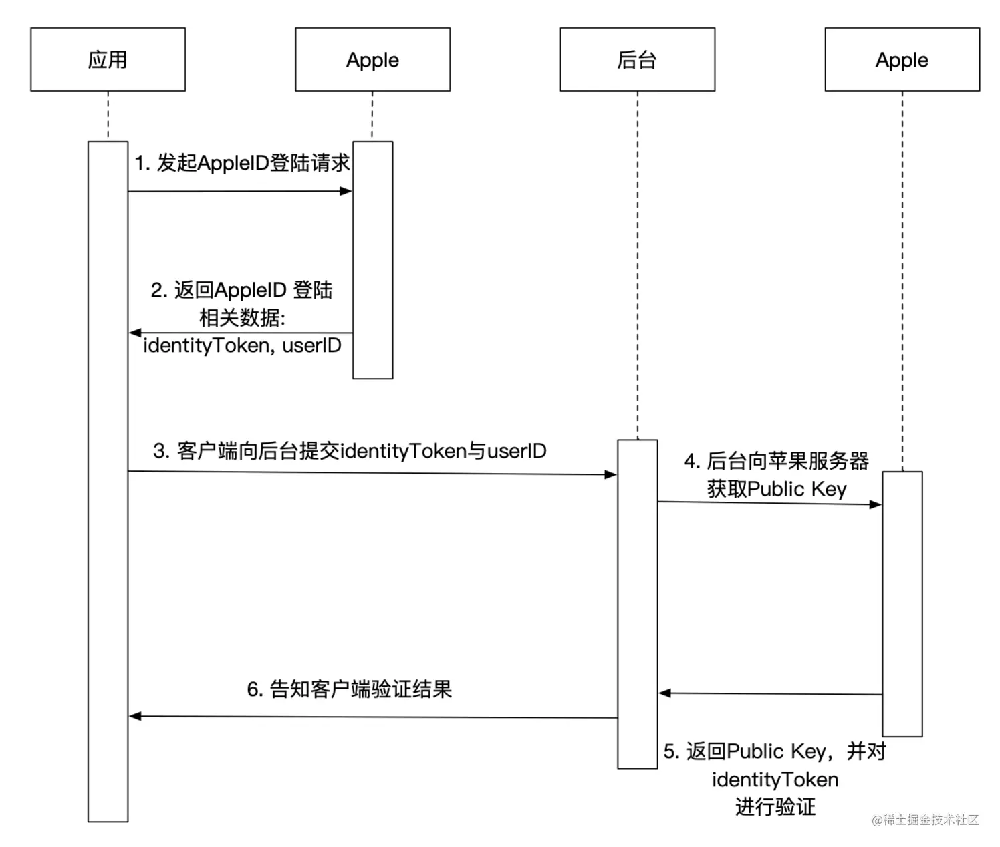

## 1. SignIn With Apple

### 流程图[^iOS-13-苹果账号登陆与后台验证相关]



## 2. 相关业务

### 2.1 App Store 后台配置

在 App Store 后台配置 `Sign in with Apple`

### 2.2 Xcode 配置

在 capability 里添加 `Sign in with Apple`.

### 2.3 代码

 这里首先介绍一下相关场景，`Sign in with Apple` 登录具体是与 Apple 账号关联，App 通过 `Sign in with Apple`登录后关联关系可以在 iCloud 里的`密码与安全性`查看，不想继续使用 `Sign in with Apple` 的话可以在 iCloud 里解除关联。所以 iCloud 的登录与否直接影响到`Sign in with Apple`功能的使用。

`Sign in with Apple`登录有三种方式： 生物识别登录 && 账号密码登录 && 设备密码登录。

#### 2.3.1 配置登录方式

一般配置两种方式就够了：AppleID 登录，password 登录。在第一次 AppleID 登录成功后，把相关用户信息存起来，后续可以用 password 的方式登录。

还有一些其他的登录方式，比如：单点登录(SSO)等，可以查看苹果的[官方文档](https://developer.apple.com/sign-in-with-apple/)。

配置登录的方式的时候，涉及到界面处理。对于界面，苹果有一套约束，遵照约束就好。还有对于一些有国际化的应用，如果涉及到文案的话，还需要处理国际化的事情。

#### 2.3.2 请求登录并处理相关结果

获取到用户信息：首次用户信息与后续用户信息。

用户信息处理：本地化编码(Codable)存储(KeyChain)，还有 token（access token、codedata、JWT tokendata） 处理，包括 token **认证机制**，解析，刷新。

[JWT token](https://en.wikipedia.org/wiki/JSON_Web_Token)相关信息：

```sh
header: 包括了key id 与加密算法

payload:
  iss: 签发机构，苹果
  aud: 接收者，目标app
  exp: 过期时间
  iat: 签发时间
  sub: 用户id
  c_hash: 一个哈希数列，作用未知
  auth_time: 签名时间

signature: 用于验证JWT的签名
```

异常处理：Apple 登录失败后，相关异常处理。

#### 2.3.3 App后台

拿到苹果账号的相关信息后，去 App 后台登录，处理 Apple 账号与 App 账号的绑定关系：绑定与解绑。

#### 2.3.4 监听 iCloud 授权状态

iCloud 里可能变更 App 的 `Sign in with Apple`的状态，所以要监听授权状态。

1. 取消授权后如何处理？

## 参考

[^iOS-13-Sign-In-with-Apple]: [^iOS 13-Sign In with Apple](https://www.jianshu.com/p/e1284bd8c72a)

[^苹果登录集成-Sign-in-with-Apple]: [^苹果登录集成 Sign in with Apple](https://www.jianshu.com/p/15cf5c39e9d4)

[^iOS-13-苹果账号登陆与后台验证相关]: [iOS 13 苹果账号登陆与后台验证相关](https://juejin.cn/post/6844903914051993607)

[^Sign-in-with-Apple登录详解]: [Sign in with Apple 登录详解](https://www.jianshu.com/p/8190f25eaa14)
