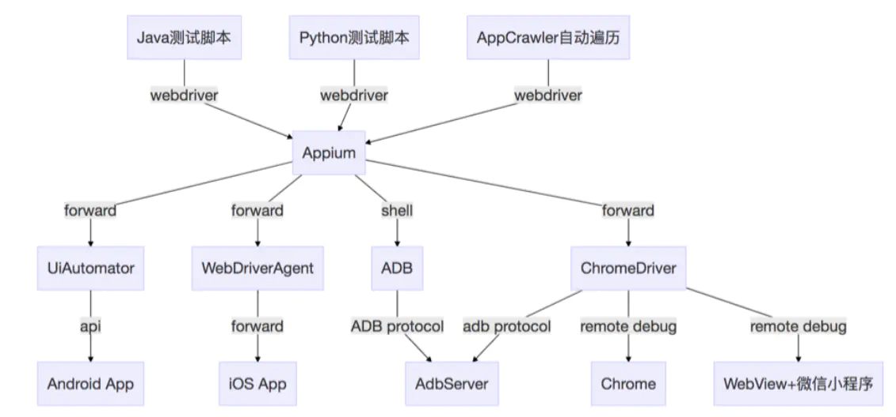
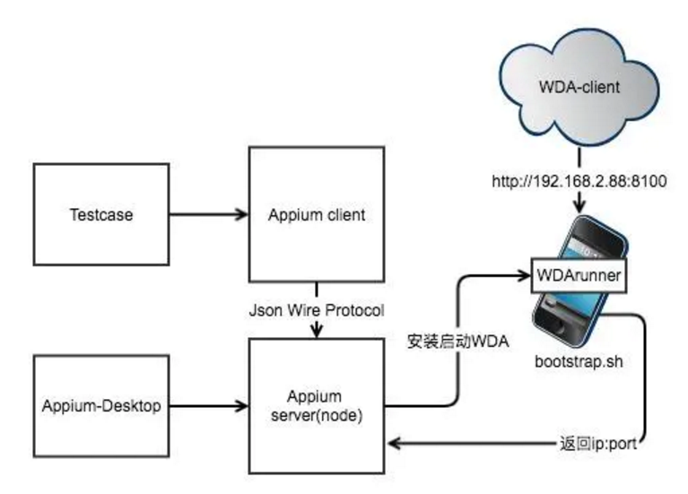
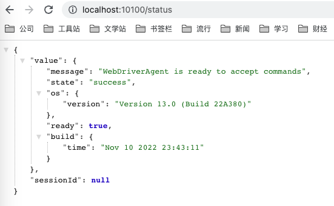
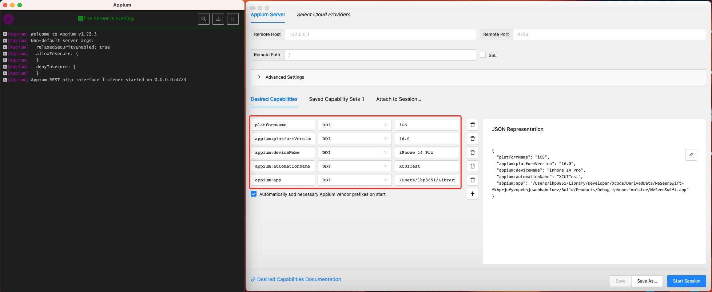

## 1. [Appium](https://appium.io/)

Appium 是一个开源的 UI 自动化测试工具，用于自动化测试 iOS、 Android 和 Windows 上的原生、移动 Web 和 Hybrid 应用。

### 1.1 Appium 的设计理念

Appium 旨在满足移动端自动化需求的理念，概述为以下四个原则：

#### 1.1.1 你不应该为了自动化而重新编译你的应用或以任何方式修改它

因此 Appium 使用了系统自带的自动化框架。

#### 1.1.2 你不应该被限制在特定的语言或框架上来编写运行测试

* iOS 9.3 及以上: 苹果的 XCUITest
* iOS 9.3 及以下: 苹果的 UIAutomation
* Android 4.3+: 谷歌的 UiAutomator / UiAutomator2
* Android 2.3+: 谷歌的 Instrumentation. (通过绑定独立的项目—— Selendroid 提供对 Instrumentation 的支持)
* Windows: 微软的 WinAppDriver

Appium 把这些系统本身提供的框架包装进一套 API —— WebDriver API 中，WebDriver（也叫```Selenium WebDriver```）规定了一个客户端-服务器协议（称为 [JSON Wire Protocol](https://w3c.github.io/webdriver/)），按照这种客户端-服务器架构，可以使用任何语言编写的客户端向服务器发送适当的 HTTP 请求。

#### 1.1.3 移动端自动化框架不应该在自动化接口方面重造轮子

WebDriver 已经成为 Web 浏览器自动化事实上的标准，并且是一个 [W3C 工作草案](https://w3c.github.io/webdriver/)。Appium 通过附加额外的 API 方法 [扩展协议](https://github.com/SeleniumHQ/mobile-spec/blob/master/spec-draft.md)，来在移动端做完全不同的尝试。

#### 1.1.4 移动端自动化框架应该开源，在精神、实践以及名义上都该如此

所以 [Appium](https://github.com/appium/appium) 是开源的。

### 1.2 概念



#### 1.2.1 客户端

Appium 客户端是指支持 Appium 对 WebDriver 协议扩展一些程序库。比如 iOS 的 XCUITest Driver、Android 的 UiAutomator2 Driver。

Appium 提供了多个语言版本的[客户端程序库](https://appium.io/docs/en/about-appium/appium-clients/index.html)：Python、Ruby、Java、JavaScript、C#等。可以从[这里](https://appium.io/downloads)下载。

Driver 也支持通过插件机制 [Plugin](https://github.com/appium/appium#plugins) 对 Driver 进行功能拓展。比如[image](https://github.com/appium/appium/tree/master/packages/images-plugin)插件是用来做基于图片的一些功能的测试，比如压缩，可视化测试等。

```sh
appium plugin install images
appium --use-plugins=images
```

#### 1.2.2 服务器

Appium 是一个用 Node.js 写的服务器。

#### 1.2.3 Session

自动化过程始终在一个会话的上下文中执行，这些客户端程序库以各自的方式发起与服务器的会话，但最终都会发给服务器一个 POST /session 请求，请求中包含一个被称作「预期能力（Desired Capabilities）」的 JSON 对象。这时服务器就会开启这个自动化会话，并返回一个用于发送后续命令的会话 ID。

#### 1.2.4 Desired Capabilities

预期能力（Desired Capabilities）是一些发送给 Appium 服务器的键值对集合（比如 map 或 hash），它告诉服务器我们想要启动什么类型的自动化会话。也有许多能力（Capabilities）可以修改服务器在自动化过程中行为。例如，我们可以将 platformName 能力设置为 iOS，以告诉 Appium 我们想要 iOS 会话，而不是 Android 或者 Windows 会话。或者我们也可以设置 safariAllowPopups 能力为 true ，确保我们在 Safari 自动化会话期间可以使用 JavaScript 打开新窗口。有关 Appium 能力的完整列表，请参阅 [能力文档](https://appium.io/docs/en/writing-running-appium/caps/index.html) 。

#### 1.2.5 Appium Desktop

Appium Server 的 GUI程序、其中还包含了一个你可以查看应用程序的层级结构的 [inspector](https://github.com/appium/appium-inspector)。
可以从这里下载 [Appium Desktop](https://appium.io/downloads)。初级阶段接触这个比较多。

#### 1.2.6 工作原理



## 2. Appium 环境配置

### 2.1 开发环境

Homebrew

Node

Python3(pip3)/Selenium/setuptools(disutils)/python-client

### 2.2 真机工具

ideviceinstaller & libimobiledevice
Carthage/ios-deploy
ios_webkit_debug_proxy
authroize-ios

### 2.3 Appium

Appium：npm 安装 Appium Server
Appium-Doctor：检查环境
Appium-Desktop: 包含了 Appium Server
Appium-inspector：UI 操作可视化工具

WebDriverAgent 配置 WebDriverAgentRunner，可以通过 ```http://localhost:10100/status```检查



### 2.4 可选工具

FFMpeg

### 2.5 Appium Desktop 的使用



[Appium Desired Capabilities](https://appium.io/docs/en/writing-running-appium/caps/)

## 3. 实战示例

### 3.1 iOS

#### 3.1.1 定位元素的方式

##### 1.  ios_predicate

iOS 的 UI 自动化中，使用原生支持的Predicate定位方式是最好，可支持元素的单个属性和多个属性定位，强烈推荐使用

```py
driver.find_element_by_ios_predicate(“value == ‘ClearEmail’”)

driver.find_element_by_ios_predicate(“type == ‘’ AND value == ‘’)
```

##### 2. accessibility_id

替代以前的name定位方式，在 iOS 上，主要使用元素的label或name（两个属性的值都一样）属性进行定位，如该属性为空，也是不能使用该属性。

```py


driver.find_element_by_accessibility_id(‘ClearEmail’)
```

##### 3. xpath

由于 iOS 10开始使用的 XCUITest 框架原生不支持，定位速度很慢，所以官方现在不推荐大家使用，也有其他替代的定位方式可使用。

```py
#使用绝对路径定位

driver.find_element_by_xpath(’/XCUIElementTypeApplication/XCUIElementTypeButton’)
#使用相对路径定位：
driver.find_element_by_xpath(’//XCUIElementTypeButton’)
通过元素的索引定位
driver.find_element_by_xpath(’//XCUIElementTypeButton[index]’)

#通过元素的属性定位
driver.find_element_by_xpath("//className[@value=‘ClearEmail’]")
```

##### 4. iOSNsPredicateString

仅支持 iOS 10或以上，可支持元素的单个属性和多个属性定位，推荐使用。

```py
#一种属性：
MobileBy.iOSNsPredicateString(“type == ‘XCUIElementTypeButton’”)
#两种属性：
MobileBy.iOSNsPredicateString(“type == ‘XCUIElementTypeButton’ AND label== ‘更多信息’”)
```

### 3.2 Web

### 3.3 Flutter

参考：

1. [Appium教程](https://blog.csdn.net/qq_32502511/article/details/106082084)
2. [IOS + Appium自动化教程](https://www.jianshu.com/p/da1e00777273)
3. [基于Appium的ios自动化教程](https://zhuanlan.zhihu.com/p/474181483)

4. [Webdriver.IO](https://webdriver.io/docs/what-is-webdriverio)
5. [WebDriver](?)
6. [WebDriver](https://www.w3.org/TR/webdriver/)
7. [iOS Unit Testing and UI Testing Tutorial](https://www.kodeco.com/21020457-ios-unit-testing-and-ui-testing-tutorial#toc-anchor-015)
8. [Setting up iOS Real Devices Tests with XCUITest](https://github.com/appium/appium-xcuitest-driver/blob/master/docs/real-device-config.md)
9. [Webdriver.IO](https://webdriver.io/docs/what-is-webdriverio)
10. [ios-uicatalog](https://github.com/appium/ios-uicatalog)
