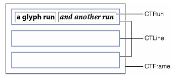
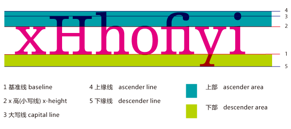
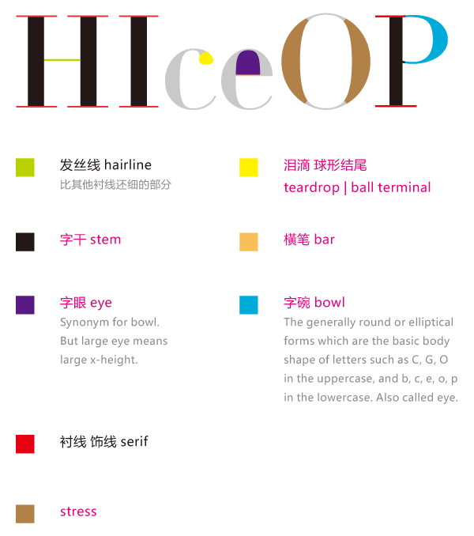

**1、概念：**在操作之前，先了解一下 CoreText 概念，以便理解。

1.1、[CoreText](https://developer.apple.com/documentation/coretext) 框架中最常用的几个类：

```objective-c
CTFont
CTFontCollection
CTFontDescriptor
CTFrame
CTFramesetter
CTGlyphInfo
CTLine
CTParagraphStyle
CTRun
CTTextTab
CTTypesett
```

下面是该框架的结构图

CTFrame 作为一个整体的画布(Canvas)，其中由行(CTLine)组成，而每行可以分为一个或多个小方块（CTRun）。
注意：你不需要自己创建CTRun，Core Text将根据NSAttributedString的属性来自动创建CTRun。每个CTRun对象对应不同的属性，正因此，你可以自由的控制字体、颜色、字间距等等信息。
通常处理步聚：
1.使用core text就是先有一个要显示的string，然后定义这个string每个部分的样式－>attributedString －> 生成 CTFramesetter -> 得到CTFrame -> 绘制（CTFrameDraw）
其中可以更详细的设置换行方式，对齐方式，绘制区域的大小等。

2.绘制只是显示，点击事件就需要一个判断了。
CTFrame 包含了多个CTLine,并且可以得到各个line的其实位置与大小。判断点击处在不在某个line上。CTLine 又可以判断这个点(相对于ctline的坐标)处的文字范围。然后遍历这个string的所有NSTextCheckingResult，根据result的rang判断点击处在不在这个rang上，从而得到点击的链接与位置。

**1.2 字体的基本知识**

**字体(Font):**是一系列字号、样式和磅值相同的字符(例如:10磅黑体Palatino)。现多被视为字样的同义词

**字面(Face):**是所有字号的磅值和格式的综合

**字体集(Font family):**是一组相关字体(例如:Franklin family包括Franklin Gothic、Fran-klinHeavy和Franklin Compressed)

**磅值(Weight):**用于描述字体粗度。典型的磅值,从最粗到最细,有极细、细、book、中等、半粗、粗、较粗、极粗

**样式(Style):**字形有三种形式:Roman type是直体;oblique type是斜体;utakuc type是斜体兼曲线(比Roman type更像书法体)。

**x高度(X height):**指小写字母的平均高度(以x为基准)。磅值相同的两字母,x高度越大的字母看起来比x高度小的字母要大

**Cap高度(Cap height):**与x高度相似。指大写字母的平均高度(以C为基准)

**下行字母(Descender):**例如在字母q中,基线以下的字母部分叫下伸部分

**上行字母(Ascender):**x高度以上的部分(比如字母b)叫做上伸部分

**基线(Baseline):**通常在x、v、b、m下的那条线

**描边(Stroke):**组成字符的线或曲线。可以加粗或改变字符形状

**衬线(Serif):**用来使字符更可视的一条水平线。如字母左上角和下部的水平线。

**无衬线(Sans Serif):**可以让排字员不使用衬线装饰。

**方形字(Block):**这种字体的笔画使字符看起来比无衬线字更显眼,但还不到常见的衬线字的程度。例如Lubalin Graph就是方形字,这种字看起来好像是木头块刻的一样

**手写体脚本(Calligraphic script):**是一种仿效手写体的字体。例如Murray Hill或者Fraktur字体

**艺术字(Decorative):**像绘画般的字体

**Pi符号(Pisymbol):**非标准的字母数字字符的特殊符号。例如Wingdings和Mathematical Pi

**连写(Ligature):**是一系列连写字母如fi、fl、ffi或ffl。由于字些字母形状的原因经常被连写,故排字员已习惯将它们连写。

读完了上面这些概念，可以参考一下下面的图片，看看具体的位置




* **引用原文：**[CoreText 基础概念](https://www.jianshu.com/p/9553fcbbaab1)

**2、操作：**这里有两篇文章对于操作讲解的还是比较详细的

1、[基于 CoreText 的排版引擎：基础](http://blog.devtang.com/2015/06/27/using-coretext-1/)

2、[基于 CoreText 的排版引擎：进阶](基于 CoreText 的排版引擎：进阶)
