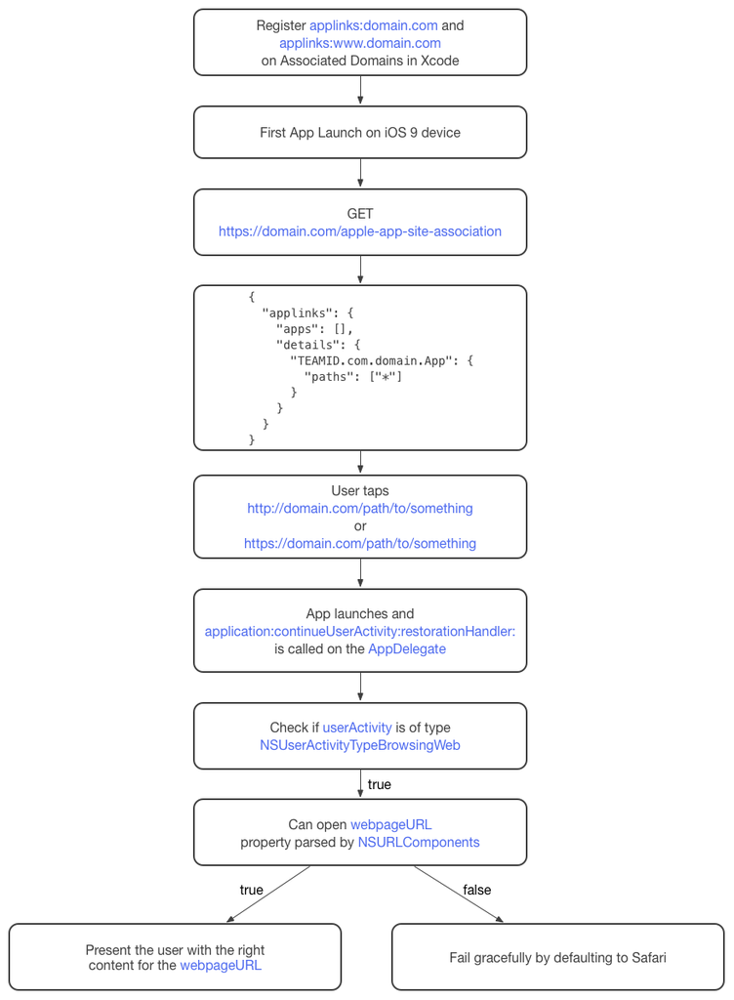

APNS

KeyChain

[UniversalLink](https://www.cnblogs.com/fshmjl/p/5859781.html)

    有一个注册的域名
    通过 SSL 访问域名
    支持上传一个 JSON 文件到你的域名

1.添加域名到 Capabilities
2.上传 apple-app-site-association 文件

``` json
{
  "applinks": {
    "apps": [],
    "details": {
      "TBEJCS6FFP.com.domain.App": {
        "paths":[ "*" ]
      }
    }
  }
}
```

3.在 APP 里处理通用链接



Extension

    iMessage
    Sticker
    3D Touch
    生物识别
