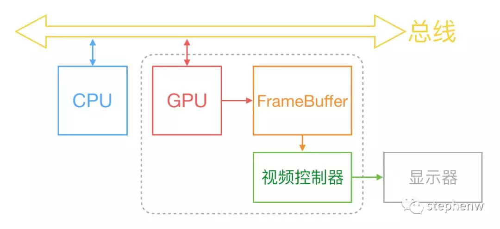
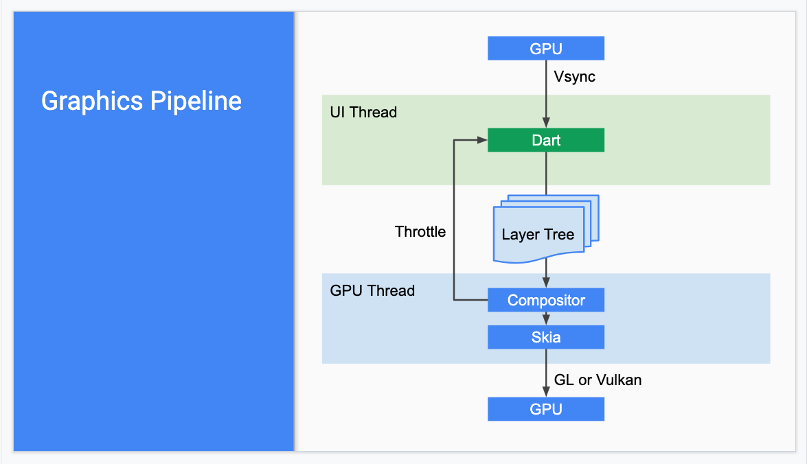
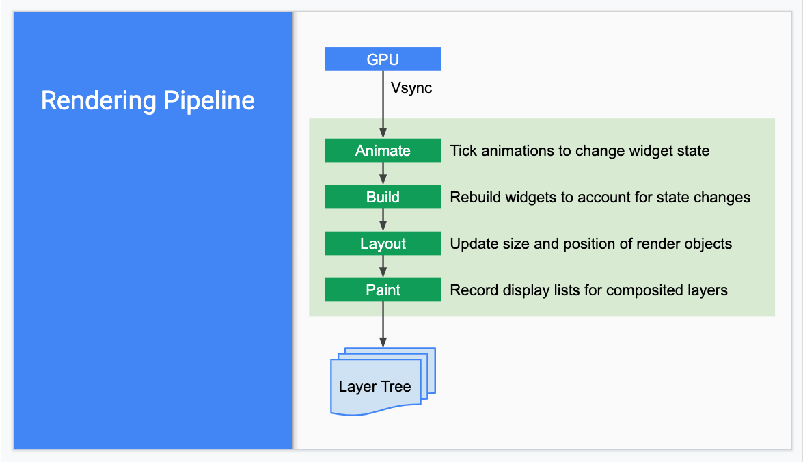

# Flutter

## 1、入门

### 1.1 语言

1.1.1 Dart：[学习路线](https://dart.dev/tools/sdk)


1.1.2 Dart [概述](http://dart.goodev.org/guides/language)

1.1.3 Dart [库预览](http://dart.goodev.org/guides/libraries)

### 1.2 工具集

2.1 通用工具

2.1.1 [DartPad](https://dartpad.dartlang.org/)

    DartPad is a great, no-download-required way to learn Dart syntax and to experiment with Dart language features. It supports Dart’s core libraries, except for VM libraries such as dart:io.

2.1.2 IDEs 与 编辑器

2.1.2.1 IDE： [Android Studio](https://dart.dev/tools/jetbrains-plugin)、[IntelliJ IDEA](https://dart.dev/tools/jetbrains-plugin)、[Visual Studio Code](https://code.visualstudio.com/)

2.1.2.2 IDEDart 社区维护的编辑器：[Emacs](https://github.com/bradyt/dart-mode)、[Atom](https://github.com/dart-atom/dart)、[Vim](https://github.com/dart-lang/dart-vim-plugin)

2.1.3 命令行工具

    dartanalyzer
        A static analyzer that evaluates and reports any errors or warnings in your code. The Dart plugin for your IDE should make use of Dart’s analysis engine, but you can also run the analyzer from the command line.

    dartdoc
        Generates API reference documentation.

    dartfmt
        Formats your code, following the recommendations of the Dart style guide. IDEs that support Dart generally allow you to format the code within the IDE. Or you can run the formatter from the command line.

    pub
        Manages Dart packages, making it easy for you to install, use, and share Dart libraries, command-line tools, and other assets. Some Dart technologies, such as Flutter, may not support all of the pub commands. IDEs that support Dart generally have special support for pub, but you can also use it from the command line.

        Some additional tools are available in packages. To install these tools, use the pub command, as described in each tool’s installation instructions. Here are the general-purpose tools you might want to install:

    build_runner
        A code generator.

    dartfix
        A tool for migrating Dart source code and fixing common issues.

2.2 Web工具集

    webdev
        A command line interface (CLI) for Dart web app development, including building and serving web apps.

    dart2js
        The original Dart-to-JavaScript compiler, with tree shaking. IDEs and the webdev CLI use dart2js when building web apps for deployment.

    dartdevc
        The Dart dev compiler, a modular Dart-to-JavaScript compiler. IDEs and the webdev CLI use dartdevc when running a development server.

    build_runner
        A build package that’s used by the webdev CLI. You can use it directly for testing or if you need more configurability than webdev provides.

2.3 命令行工具集与服务器工具集

    Standalone Dart VM: dart
        Executes Dart code. IDEs that support Dart, and some of the pub commands, use this command behind-the-scenes to execute Dart scripts. Note that you must configure your IDE with the location of the dart binary.

    AOT compiler and runtime: dart2aot, dartaotruntime
        Support ahead-of-time compilation of Dart code to native x64 machine code.

    Pub package manager: pub
        Simplifies downloading and running scripts, with commands such as pub get, pub global activate, pub global run, and pub run.

## 2、Flutter

### 2.1 Flutter是什么

    Flutter是一款移动应用程序SDK，一份代码可以同时生成iOS和Android两个高性能、高保真的应用程序。

    Flutter 有自己的一套UI界面方式，通过Dart UI 构建界面，跟原生界面组件没有关系。
    Dart API，底层通过OpenGL这种跨平台的绘制库（内部会调用操作系统API）实现了一套代码跨多端。由于Dart API也是调用操作系统API，所以它的性能接近原生。

    Flutter目标是使开发人员能够交付在不同平台上都感觉自然流畅的高性能应用程序。我们兼容滚动行为、排版、图标等方面的差异。

### 2.2 核心原则

Flutter包括一个现代的响应式框架、一个2D渲染引擎、现成的widget和开发工具。这些组件可以帮助您快速地设计、构建、测试和调试应用程序。

一切皆为widget，Widget是Flutter应用程序用户界面的基本构建块。每个Widget都是用户界面一部分的不可变声明。 与其他将视图、控制器、布局和其他属性分离的框架不同，Flutter具有一致的统一对象模型：widget。


### 2.3 Widget如何工作

* Widget实际上就是Element的配置数据，Widget树实际上是一个配置树，而真正的UI渲染树是由Element构成；不过，由于Element是通过Widget生成，所以它们之间有对应关系，所以在大多数场景，我们可以宽泛地认为Widget树就是指UI控件树或UI渲染树。
<br/>
* 一个Widget对象可以对应多个Element对象。这很好理解，根据同一份配置（Widget），可以创建多个实例（Element）。    <br/>
  
* 最终的UI树其实是由一个个独立的Element节点构成。组件最终的Layout、渲染都是通过RenderObject来完成的，从创建到渲染的大体流程是：根据Widget生成Element，然后创建相应的RenderObject并关联到Element.renderObject属性上，最后再通过RenderObject来完成布局排列和绘制。 <br/>
Element就是Widget在UI树具体位置的一个实例化对象，大多数Element只有唯一的renderObject，但还有一些Element会有多个子节点，如继承自RenderObjectElement的一些类，比如MultiChildRenderObjectElement。最终所有Element的RenderObject构成一棵树，我们称之为渲染树，即render tree。
<br/>
* Element的生命周期如下：

    1. Framework 调用Widget.createElement 创建一个Element实例，记为element。
    2. Framework 调用 element.mount(parentElement,newSlot) ，mount方法中首先调用elment所对应Widget的createRenderObject方法创建与element相关联的RenderObject对象，然后调用element.attachRenderObject方法将element.renderObject添加到渲染树中插槽指定的位置（这一步不是必须的，一般发生在Element树结构发生变化时才需要重新attach）。插入到渲染树后的element就处于“active”状态，处于“active”状态后就可以显示在屏幕上了（可以隐藏）。
    3. 当element父Widget的配置数据改变时，为了进行Element复用，Framework在决定重新创建Element前会先尝试复用相同位置旧的element：调用Element对应Widget的canUpdate()方法，如果返回true，则复用旧Element，旧的Element会使用新的Widget配置数据更新，反之则会创建一个新的Element，不会复用。Widget.canUpdate()主要是判断newWidget与oldWidget的runtimeType和key是否同时相等，如果同时相等就返回true，否则就会返回false。根据这个原理，当我们需要强制更新一个Widget时，可以通过指定不同的Key来禁止复用。
    4. 当有父Widget的配置数据改变时，同时其State.build返回的Widget结构与之前不同，此时就需要重新构建对应的Element树。为了进行Element复用，在Element重新构建前会先尝试是否可以复用旧树上相同位置的element，element节点在更新前都会调用其对应Widget的canUpdate方法，如果返回true，则复用旧Element，旧的Element会使用新Widget配置数据更新，反之则会创建一个新的Element。Widget.canUpdate主要是判断newWidget与oldWidget的runtimeType和key是否同时相等，如果同时相等就返回true，否则就会返回false。根据这个原理，当我们需要强制更新一个Widget时，可以通过指定不同的Key来避免复用。
    5. 当有祖先Element决定要移除element 时（如Widget树结构发生了变化，导致element对应的Widget被移除），这时该祖先Element就会调用deactivateChild 方法来移除它，移除后element.renderObject也会被从渲染树中移除，然后Framework会调用element.deactivate 方法，这时element状态变为“inactive”状态。
    6. “inactive”态的element将不会再显示到屏幕。为了避免在一次动画执行过程中反复创建、移除某个特定element，“inactive”态的element在当前动画最后一帧结束前都会保留，如果在动画执行结束后它还未能重新变成”active“状态，Framework就会调用其unmount方法将其彻底移除，这时element的状态为defunct,它将永远不会再被插入到树中。
    7. 如果element要重新插入到Element树的其它位置，如element或element的祖先拥有一个GlobalKey（用于全局复用元素），那么Framework会先将element从现有位置移除，然后再调用其activate方法，并将其renderObject重新attach到渲染树。

### 2.4 框架


**Flutter Framework:** 这是一个纯 Dart实现的 SDK。它实现了一套基础库， 用于处理动画、绘图和手势。并且基于绘图封装了一套 UI组件库，然后根据 Material 和Cupertino两种视觉风格区分开来。这个纯 Dart实现的 SDK被封装为了一个叫作 dart:ui的 Dart库。我们在使用 Flutter写 App的时候，直接导入这个库即可使用组件等功能。

**Flutter Engine:** 这是一个纯 C++实现的 SDK，其中囊括了 Skia引擎、Dart运行时、文字排版引擎等。不过说白了，它就是 Dart的一个运行时，它可以以 JIT、JIT Snapshot 或者 AOT的模式运行 Dart代码。在代码调用 dart:ui库时，提供 dart:ui库中 Native Binding 实现。 不过别忘了，这个运行时还控制着 VSync信号的传递、GPU数据的填充等，并且还负责把客户端的事件传递到运行时中的代码。

### 2.5 界面渲染

2.5.1 Flutter 如何渲染界面

在介绍Flutter渲染流程之前，看下原生（iOS）的渲染流程：



CPU、GPU和显示器以一种特定的方式协作：

> CPU将计算好的显示内容提交给 GPU，GPU渲染后放入帧缓冲区，然后视频控制器按照 VSync信号从帧缓冲区取帧数据传递给显示器显示。



> GPU的 VSync信号同步到 UI线程，UI线程使用 Dart来构建抽象的视图结构，这份数据结构在 GPU线程进行图层合成，视图数据提供给 Skia引擎渲染为 GPU数据，这些数据通过 OpenGL或者 Vulkan提供给 GPU。

* Skia是一个 2D的绘图引擎库，其前身是一个向量绘图软件，Chrome和 Android均采用 Skia作为绘图引擎。Skia提供了非常友好的 API，并且在图形转换、文字渲染、位图渲染方面都提供了友好、高效的表现。Skia是跨平台的，所以可以被嵌入到 Flutter的 iOS SDK中，而不用去研究 iOS闭源的 Core Graphics / Core Animation。

* Android自带了 Skia，所以 Flutter Android SDK要比 iOS SDK小很多。

渲染树生成：



2.5.2、Flutter 如何更新界面（Diff）

当widget的状态发生变化时，widget会重新构建UI，Flutter会对比前后变化的不同， 以确定底层渲染树从一个状态转换到下一个状态所需的最小更改。


> 当element父Widget的配置数据改变时，为了进行Element复用，Framework在决定重新创建Element前会先尝试复用相同位置旧的element：调用Element对应Widget的canUpdate()方法，如果返回true，则复用旧Element，旧的Element会使用新的Widget配置数据更新，反之则会创建一个新的Element，不会复用。
>
> Widget.canUpdate()主要是判断newWidget与oldWidget的runtimeType和key是否同时相等，如果同时相等就返回true，否则就会返回false。根据这个原理，当我们需要强制更新一个Widget时，可以通过指定不同的Key来禁止复用。

### 2.6 跨平台、与原生平台通讯


Flutter平台特定的API支持不依赖于代码生成，而是依赖于灵活的消息传递的方式：

* 应用的Flutter部分通过平台通道（platform channel）将消息发送到其应用程序的所在的宿主（iOS或Android）。

* 宿主监听的平台通道，并接收该消息。然后它会调用特定于该平台的API（使用原生编程语言） - 并将响应发送回客户端，即应用程序的Flutter部分。

* 硬件交互、推送等服务
  
* e.g：获取iOS电量
  
2.6.1 Flutter跨端——iOS

> Flutter 的代码并不直接在平台之下运行，相反，Dart 代码构建的 Flutter 应用在设备上以原生的方式运行，却“侧步躲开了”平台提供的 SDK。这意味着，例如，你在 Dart 中发起一个网络请求，它就直接在 Dart 的上下文中运行。你并不会用上平常在 iOS 或 Android 上使用的原生 API。你的 Flutter 程序仍然被原生平台的 ViewController 管理作一个 view，但是你并不会直接访问 ViewController 自身，或是原生框架。
>
> 但这并不意味着 Flutter 不能和原生 API，或任何你编写的原生代码交互。Flutter 提供了 platform channels ，来和管理你的 Flutter view 的 ViewController 通信和交互数据。平台管道本质上是一个异步通信机制，桥接了 Dart 代码和宿主 ViewController，以及它运行于的 iOS 框架。你可以用平台管道来执行一个原生的函数，或者是从设备的传感器中获取数据。

Flutter 在iOS 上的启动流程：


> 在应用的 View Controller 初始化后，会实例化一个 Flutter project的抽象（以下简称 project）。project会初始化一个 platform view的抽象实例，这个抽象实例会负责创建 Flutter 的运行时（以下简称 engine）。
>
> 当 View Controller将要显示时，调用 project查找和组合 Flutter的应用资源 bundle，并且把资源提供给 engine。
engine在真正需要执行资源 bundle时才会创建 Dart执行的环境（懒加载，以下简称 Dart Controller），然后设置视图窗口的一些属性等东西（这是绘图引擎必需的）。 
然后 engine中的 Dart Controller会加载 Dart代码并执行，执行的过程中会调用 dart:ui的 native binding实现向 GPU提供数据。

2.6.2 Android

## 3、深入Flutter

### 3.1 体积

Flutter应用的体积由两部分组成：应用代码和 SDK代码。应用代码是 Dart编译后的代码，如果做成可动态下发，那么这部分可以不计。
SDK代码比较大就有点无奈了，SDK的组成部分有 Dart VM，Dart标准库，libwebp、libpng、libboringssl等第三方库，libskia，Dart UI库，然后再加上 icu_data，可能在单 arch下（iOS），SDK体积达到 40+MB。其中仅仅 Dart VM（不包含标准库）就达到了 7MB。

Flutter SDK是 dynamic framework，如此大的二进制体积可能会造成动态链接耗时长。而如果静态链接，可能原来比较大的 App很有可能造成 TEXT段（iOS默认60M）超标。

### 3.2 帧率

Dart在 JIT模式下，速度与 JavaScript基本持平。但是 Dart支持 AOT，当以 AOT模式运行时，JavaScript便远远追不上了。速度的提升对高帧率下的视图数据计算很有帮助。

在任何系统的UI框架中，动画实现的原理都是相同的，即：
>在一段时间内，快速地多次改变UI外观，由于人眼会产生视觉暂留，最终看到的就是一个“连续”的动画，这和电影的原理是一样的，而UI的一次改变称为一个动画帧，对应一次屏幕刷新，而决定动画流畅度的一个重要指标就是帧率FPS（Frame Per Second），指每秒的动画帧数。很明显，帧率越高则动画就会越流畅。一般情况下，对于人眼来说，动画帧率超过16FPS，就比较流畅了，超过32FPS就会非常的细腻平滑，而超过32FPS基本就感受不到差别了。由于动画的每一帧都是要改变UI输出，所以在一个时间段内连续的改变UI输出是比较耗资源的，对设备的软硬件系统要求都较高，所以在UI系统中，动画的平均帧率是重要的性能指标，而在Flutter中，理想情况下是可以实现60FPS的，这和原生应用动画基本是持平的。

### 3.3 [Dart线程和异步](https://flutterchina.club/flutter-for-ios/#%E7%BA%BF%E7%A8%8B%E5%92%8C%E5%BC%82%E6%AD%A5)

**Isolates：** 现代的浏览器以及移动浏览器都运行在多核 CPU 系统上。 要充分利用这些 CPU，开发者一般使用共享内存 数据来保证多线程的正确执行。然而， 多线程共享数据通常会导致很多潜在的问题，并导致代码运行出错。

所有的 Dart 代码在 isolates 中运行而不是线程。 每个 isolate 都有自己的堆内存，并且确保每个 isolate 的状态都不能被其他 isolate 访问。因此，也不存在资源锁的问题。

Dart 是单线程执行模型，但是它支持 Isolate（一种让 Dart 代码运行在其他线程的方式）、事件循环和异步编程。除非你自己创建一个 Isolate ，否则你的 Dart 代码永远运行在 UI 线程，并由 event loop 驱动。Flutter 的 event loop 和 iOS 中的 main loop 相似——Looper 是附加在主线程上的。

Dart 的单线程模型并不意味着你写的代码一定是阻塞操作，从而卡住 UI。相反，使用 Dart 语言提供的异步工具，例如 async / await ，来实现异步操作。

* 多线程示例：[isolate_example](./isolate.dart)

### 3.4 [EventLoop、事件分发](https://medium.com/dartlang/dart-asynchronous-programming-isolates-and-event-loops-bffc3e296a6a)

Flutter 的 event loop 和 iOS 中的 main loop 相似——Looper 是附加在主线程上的。

事件总线（EventBus）通过流控制器（StreamController）控制 事件流（Stream），事件流可以被监听、唤醒、停止、关闭、下沉，订阅者可以通过流控制器订阅流事件。

### 3.5 事件响应

一个对象是否可以响应事件，取决于其对命中测试的返回，当发生用户事件时，会从根节点（RenderView）开始进行命中测试，下面是RenderView的hitTest()源码：

``` dart
bool hitTest(HitTestResult result, { Offset position }) {
  if (child != null)
    child.hitTest(result, position: position); //递归子RenderBox进行命中测试
  result.add(HitTestEntry(this)); //将测试结果添加到result中
  return true;
}
```

RenderBox默认的hitTest()实现：

``` dart
bool hitTest(HitTestResult result, { @required Offset position }) {
  ...  
  if (_size.contains(position)) {
    if (hitTestChildren(result, position: position) || hitTestSelf(position)) {
      result.add(BoxHitTestEntry(this, position));
      return true;
    }
  }
  return false;
}
```

我们看到默认的实现里调用了hitTestSelf()和hitTestChildren()两个方法，这两个方法默认实现如下：

``` dart
@protected
bool hitTestSelf(Offset position) => false;

@protected
bool hitTestChildren(HitTestResult result, { Offset position }) => false;
```

> hitTest 方法用来判断该 RenderObject 是否在被点击的范围内，同时负责将被点击的 RenderBox 添加到 HitTestResult 列表中，参数 position 为事件触发的坐标（如果有的话），返回 true 则表示有 RenderBox 通过了命中测试，需要响应事件，反之则认为当前RenderBox没有命中。
>
> 在继承RenderBox时，可以直接重写hitTest()方法，也可以重写 hitTestSelf() 或 hitTestChildren(), 唯一不同的是 hitTest()中需要将通过命中测试的节点信息添加到命中测试结果列表中，而 hitTestSelf() 和 hitTestChildren()则只需要简单的返回true或false。

### 3.6 Runtime（AOT）、JIT、Dart VM

### 3.7 性能（CPU、GPU、Network、battery、Disk）

### 3.8 [内存管理](https://mp.weixin.qq.com/s/efKCpCtvvHDHUiAsizobBQ)

Dart VM将内存管理分为新生代(New Generation)和老年代(Old Generation)。

* 新生代(New Generation): 通常初次分配的对象都位于新生代中，该区域主要是存放内存较小并且生命周期较短的对象，比如局部变量。新生代会频繁执行内存回收(GC)，回收采用“复制-清除”算法，将内存分为两块(图中的from 和 to)，运行时每次只使用其中的一块(图中的from)，另一块备用(图中的to)。当发生GC时，将当前使用的内存块中存活的对象拷贝到备用内存块中，然后清除当前使用内存块，最后，交换两块内存的角色。


* 老年代(Old Generation): 在新生代的GC中“幸存”下来的对象，它们会被转移到老年代中。老年代存放生命力周期较长，内存较大的对象。老年代通常比新生代要大很多。老年代的GC回收采用“标记-清除”算法，分成标记和清除两个阶段。在标记阶段，所有线程参与并发的完成对回收对象的标记，降低标记阶段耗时。在清理阶段，由GC线程负责清理回收对象，和应用线程同时执行，不影响应用运行。


### 3.9 技术生态圈

## 4、[Flutter & 原生](https://blog.codemagic.io/flutter-vs-swift/)

1. 界面
   解决移动端信息展示的目的；
   都基于声明式、响应式的方式、热重载的方式；

## 5、未来与憧憬

当下的移动端、前端开发技术越来越多样化，复杂化。

就移动端iOS来说，开发语言就有Objective-C、Swift，UI框架cocoa Foundation的UIkit、苹果新出的SwiftUI；
Android的开发语言Java、Kotlin，UI框架有Android原生的、腾讯的QMUI等。

大前端，这几年，还掺杂了的React-Native/Weex等一批大前端技术，现如今Google扶持的的Flutter又加入进来。

前端情况也类似，像React，Vue、Angular、Bootstrap等，层出不穷。

前不久Facebook 又推出了新的[Hermes](https://juejin.im/entry/5d2e6d1ce51d4510664d178e)，用于在React Native应用提高性能的。

个人觉得，前端用统一的方式处理，是一个趋势。同时，一个良好的生态建设也很重要。比如界面构建语言、方式、布局设计，当然这个语言不能局限于静态语言，同时也支持动态特性。比如Dart、Swift。

统一的生态包括系统、语言、协议、工具等，说白了就是得有比较正规化的一种方式去工作。

据不完全统计，编程语言大概有500~600种，很多语言都有自己的生态体系、特性、工具，甚至编译器，解释器，连接器等，想这么多样化的氛围，还没有一种主流的语言【当然二进制语言不能算，偏底层的人为处理起来还是比较麻烦】生态能够前后端都统一负责得了的。所以，希望有这一天的到来，有生之年也能看到！
