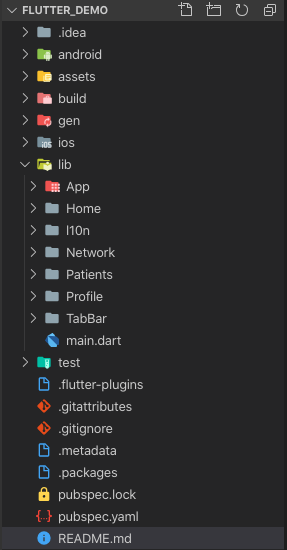
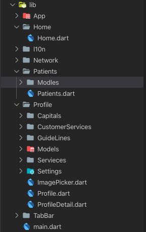
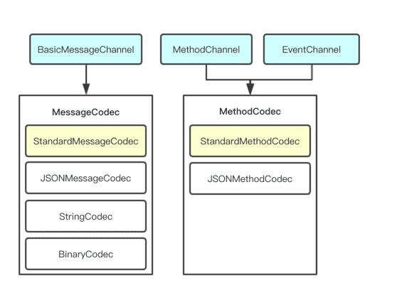
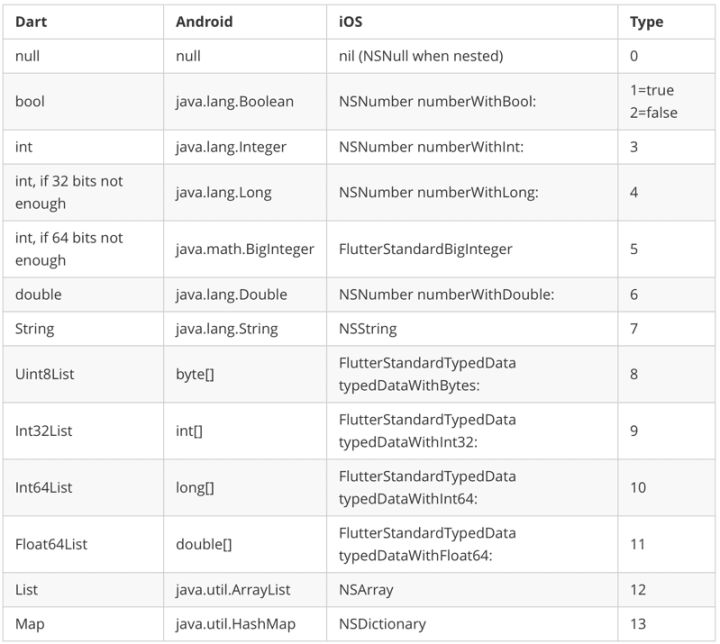
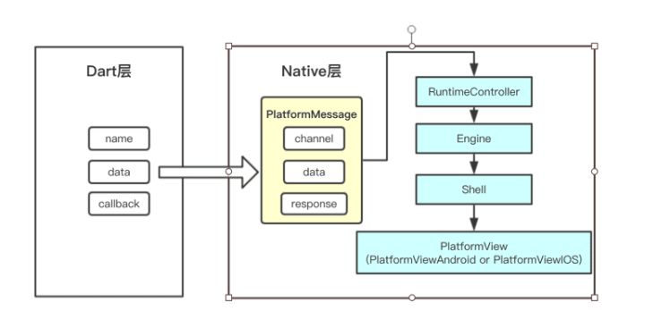
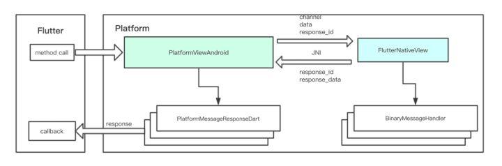

## 1、项目构建

### 1.1 [环境配置](https://flutter-io.cn/docs/get-started/install)

#### 1. 编辑器

  1. Android Studio[Intelij]
  2. Visual Studio Code

#### 2. SDK

1. Dart
2. Flutter

### 1.2 创建并运行项目

#### 1. 终端

```shell
  flutter create my_app
  cd my_app
  flutter run
```

#### 2. Android Studio

#### 3. Visual Studio Code

## 2、项目工程结构

### 2.1 项目文件组织结构



### 2.2 源码文件组织、使用

1 项目库管理、第三方库

```yml
dependencies:
  flutter:
    sdk: flutter
  flutter_localizations:
    sdk: flutter

  cupertino_icons: ^0.1.2
  english_words: ^3.1.0
  video_player: ^0.10.1+6
  dio: ^2.1.16
  path_provider: ^1.1.0
  image_picker: ^0.6.1+4
  webview_flutter: ^0.3.13
  intl: ^0.15.8
  url_launcher: ^5.1.2
  package_info: ^0.4.0+6
  fluwx: ^1.0.4
  json_annotation: ^3.0.0
  device_info: ^0.4.0+2

dev_dependencies:
  flutter_test:
    sdk: flutter
  intl_translation: ^0.17.2
  json_serializable: ^3.2.2
  build_runner: ^1.6.7
```

2 核心库、源码文件

```dart
import 'dart:io';

import 'package:flutter/material.dart';
import 'package:flutter/services.dart';
import 'package:image_picker/image_picker.dart';

import '../Profile/Models/ProfileInfo.dart';
```

3 功能模块、组件功能划分，独立管理，以及自定义组件化工作管理



### 2.3、资源文件

#### 1 引用

```yaml
flutter:
  assets:
    - assets/my_icon.png
    - assets/background.png
```

#### 2 加载

##### 2.1. Bundel

```dart
AssetBundle;
rootBundle;
DefaultAssetBundle;
资源变体：根据分辨率加载图片等资源；
AssetImage;
```

##### 2. 依赖包中的资源

```dart
AssetImage('icons/heart.png', package: 'my_icons')
```

#### 3 打包资源进asset

```yaml
flutter:
  assets:
    - packages/fancy_backgrounds/backgrounds/background1.png
```

#### 4 资源平台共享

* Android

```Java
AssetManager assetManager = registrar.context().getAssets();
String key = registrar.lookupKeyForAsset("icons/heart.png");
AssetFileDescriptor fd = assetManager.openFd(key);
```

* iOS

```Objective-C
NSString* key = [registrar lookupKeyForAsset:@"icons/heart.png"];
NSString* path = [[NSBundle mainBundle] pathForResource:key ofType:nil];
   ```

#### 5 平台资源

>Android 与 iOS 的icon 、启动图配置；

### 2.4、项目源码简单解析

```dart
class MyApp extends StatelessWidget {
  @override
  Widget build(BuildContext context) {
    return MaterialApp(
      title: 'Flutter SuMian',
      onGenerateTitle: (BuildContext context) =>
          RyLocalizations.of(context).title,
      home: RyTabBar(),
      theme: ThemeData(
        primaryColor: Colors.white,
      ),
      debugShowCheckedModeBanner: false,
      showSemanticsDebugger: false,
      localizationsDelegates: [
        const RyLocalizationsDelegate(),
        GlobalMaterialLocalizations.delegate,
        GlobalWidgetsLocalizations.delegate,
        GlobalCupertinoLocalizations.delegate,
      ],
      supportedLocales: [
        const Locale('en'),
        const Locale('zh'),
      ],
    );
  }
}
```

## 3、界面

### 3.1 [布局介绍](https://flutter-io.cn/docs/development/ui/widgets/layout)

```dart
Widget listHead() {
    _avatarImg = Image.network(
      ProfileInfo.getInstance().avatar,
      fit: BoxFit.cover,
    );

    Container avatar = Container(
      margin: const EdgeInsets.fromLTRB(15, 10, 10, 10),
      child: Container(
        width: 60,
        height: 60,
        decoration: BoxDecoration(
          borderRadius: BorderRadius.circular(30),
          boxShadow: [
            BoxShadow(
                color: Colors.black,
                offset: Offset(0, 0),
                blurRadius: 1,
                spreadRadius: 2)
          ],
          image: DecorationImage(
            image: NetworkImage(ProfileInfo.getInstance().avatar),
            fit: BoxFit.cover,
          ),
        ),
      ),
    );

    Container nameTxt = Container(
      margin: EdgeInsets.fromLTRB(5, 0, 0, 5),
      child: Text(ProfileInfo.getInstance().mobile),
    );
    Container department = Container(
      margin: EdgeInsets.fromLTRB(5, 5, 0, 0),
      child: Text(ProfileInfo.getInstance().department),
    );
    Container txtView = Container(
      margin: EdgeInsets.fromLTRB(10, 25, 0, 25),
      child: Column(
        children: <Widget>[nameTxt, department],
        crossAxisAlignment: CrossAxisAlignment.start,
      ),
    );
    return Row(
      children: <Widget>[
        avatar,
        Expanded(
          child: txtView,
        )
      ],
    );
  }
```

### 3.2 交互事件

1 Button 事件点击

```dart
@override
  Widget build(BuildContext context) {
    return Scaffold(
      body: Container(
        decoration: BoxDecoration(color: Colors.grey[200]),
        padding: EdgeInsets.all(0),
        child: Container(
          color: Colors.white,
          child: Center(child: OutlineButton(child: Text('个人信息'),onPressed: getProfile,),),
        ), 
     ),
    );
  }
```

2 下拉刷新、上拉加载

```dart
Widget setPannel() {
    return RefreshIndicator(
      child: ListView.builder(
        itemBuilder: _renderRow,
        itemCount: list.length + 1,
        controller: _scrollController,
      ),
      onRefresh: _onRefresh,
    );
  }
```

## 4、业务

### 4.1 网络模块

```dart
class NetworkTools {
  static Future get(String url, [Map<String, dynamic> params]) async {
    var response;
    Directory documentsDir = await getApplicationDocumentsDirectory();
    String documentsPath = documentsDir.path;
    var dir = new Directory("$documentsPath/cookies");
    await dir.create();
    dio.interceptors.add(CookieManager(PersistCookieJar(dir: dir.path)));
    dio.interceptors.add(TokenInterceptor());
    if (params != null) {
      response = await dio.get(url, queryParameters: params);
    } else {
      response = await dio.get(url);
    }
    return response.data;
  }

  static Future post(String url, Map<String, dynamic> params) async {
    var response = await dio.post(url, data: params);
    return response.data;
  }

  static Future delete(String url, Map<String, dynamic> params) async {
    dio.interceptors.add(TokenInterceptor());
    var response = await dio.delete(url, data: params);
    return response.statusCode;
  }
}
```

### 4.2 数据

1 序列化

```dart

class Token {
  String token;

  int expired;

  int refreshTime;

  Token({this.token,this.expired,this.refreshTime}){_instance = this;}

  Token._();

  static Token _instance;

  static Token getInstance() {
    if (_instance == null) {
      _instance = Token._();
    }
    return _instance;
  }

  factory Token.fromJson(Map<String, dynamic> json){
    return Token(
      token: json['token'],
      expired: json['expired_at'],
      refreshTime: json['refresh_expired_at']
    );
  }
}

Map<String, dynamic> toJson() =>
    {
      'token': token,
      'expired_at': expired,
      'refresh_expired_at':refreshTime
    };
```

2 自动序列化

配置：

```yaml
dependencies:
  # Your other regular dependencies here
  json_annotation: ^2.0.0

dev_dependencies:
  # Your other dev_dependencies here
  build_runner: ^1.0.0
  json_serializable: ^2.0.0
```

代码：

```dart
import 'package:json_annotation/json_annotation.dart';

part 'RelaxtionsLog.g.dart';

@JsonSerializable()
class RelaxtionsLog {
  int id;

  @JsonKey(name: 'watch_times')
  int times;

  @JsonKey(name: 'total_watch_length')
  int length;

  String name;

  RelaxtionsLog({
    this.id,
    this.times,
    this.length,
    this.name
  });

  factory RelaxtionsLog.fromJson(Map<String,dynamic> json) => _$RelaxtionsLogFromJson(json);

  Map<String,dynamic> toJson() => _$RelaxtionsLogToJson(this);

}
```

3 持久化：数据库、归档、UserDefault等

1. [FireBase](https://pub.dev/packages/firebase_database#-readme-tab-)
2. [sqflite](https://pub.dev/packages/sqflite)
3. SharedPreferences => UserDefault

## 5、包[组件化]

### 5.1 创建Dart package库

```shell
 flutter create --org com.example --template=plugin hello --创建项目
 flutter pub pub publish --dry-run  --检查配置
 flutter pub pub publish   --发布package
```

### 5.2 提交package

```shell
flutter pub pub publish --dry-run
flutter pub pub publish
```

* package 依赖

```yaml
dependencies:
  url_launcher: ^0.4.2
```

* 原生平台依赖

```ruby
Pod::Spec.new do |s|
  # lines skipped
  s.dependency 'url_launcher'
```

* [自建私有 package 仓库](./Resources/)

## 6、平台通道

### 6.1 简单通道

1. 获取相册图片

```swift
let controller:FlutterViewController = window?.rootViewController as! FlutterViewController
let batteryChannel =  FlutterMethodChannel(name: RyImagePicker.channel, binaryMessenger: controller.binaryMessenger)
batteryChannel.setMethodCallHandler { (call, result) in
    if call.method == "pickerImage" {
        RyImagePicker(controller).showImagePicker { (image) in
            result(image)
        }
    } else {
        result(FlutterMethodNotImplemented);
    }
}
```

### 6.2 Flutter编解码器

1 Flutter定义了三种不同类型的Channel，它们分别是：

* BasicMessageChannel：用于传递字符串和半结构化的信息。
* BMethodChannel：用于传递方法调用（method invocation）。
* BEventChannel: 用于数据流（event streams）的通信。

三种Channel之间互相独立，各有用途，但它们在设计上却非常相近。每种Channel均有三个重要成员变量：

* name: String类型，代表Channel的名字，也是其唯一标识符。
* messager：BinaryMessenger类型，代表消息信使，是消息的发送与接收的工具。
* codec: MessageCodec类型或MethodCodec类型，代表消息的编解码器。

消息通道结构图6-2-1：


编解码器结构图6-2-2:


2 消息解码

支持的平台数据类型参考：```StandardMessageCodec```


3.1 消息传递：Dart -> Native



3.2 消息传递：Native -> Dart


