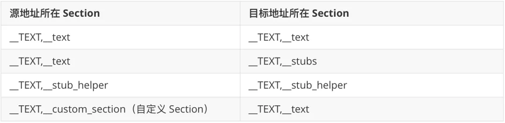

## 1. 资源

### 1.1 合适的资源配置

* pod iOS 8.0 --> iOS 9.0， 影响因素：actool 编码压缩算法；

* 使用 RGB with palette 压缩图片：--number-of-colors 16 --quality 40-80

* Assets.car（BOM 文件） 合并， 多个库中 Asset Catalog 中的图片合并到一个 Asset Catalog 中，再经 actool 构建成 Assets.car 产物

* 文本文件压缩：
  1、压缩阶段：在 Build Phase 中添加脚本，构建期间对白名单内的文本文件做 zip 压缩；

  2、解压阶段：在 App 启动阶段，在异步线程中进行解压操作，将解压产物存放到沙盒中；

  3、读取阶段：在 App 运行时，hook 读取这些文件的方法，将读取路径从 Bundle 改为沙盒中的对应路径；

## 2. Mac-O 文件优化

### 2.1 使用 -Oz 编译参数

原理： 对重复的连续机器指令外联成函数进行复用，和“内联函数”的原理正好相反。

指标： 4.5%

### 2.2 使用链接时优化 LTO

Incremental LTO

### 2.3 修正 Exported Symbols 配置

Xcode Build Settings 中的 EXPORTED_SYMBOLS_FILE 配置，控制着 Mach-O 中 __LINKEDIT 段中 Export Info 的信息。动态链接器 dyld 在做符号绑定时，会读取被绑定的动态库或可执行文件的 Export Info 信息，得到一个符号对应的实际调用地址。如果正在被绑定的符号，在目标动态库的 Export Info 中缺失，dyld 则会抛出异常，表现为 App 崩溃。

### 2.4 属性动态化

@dynamic --> 关联属性

### 2.5 __TEXT 段迁移

* xcconfig

```shell
APP_THIN_LINK_FLAGS = -Wl,-rename_section,__TEXT,__cstring,__RODATA,__cstring,-rename_section,__TEXT,__objc_methname,__RODATA,__objc_methname,-rename_section,__TEXT,__objc_classname,__RODATA,__objc_classname,-rename_section,__TEXT,__objc_methtype,__RODATA,__objc_methtype,-rename_section,__TEXT,__gcc_except_tab,__RODATA,__gcc_except_tab,-rename_section,__TEXT,__const,__RODATA,__const,-rename_section,__TEXT,__text,__BD_TEXT,__text,-rename_section,__TEXT,__textcoal_nt,__BD_TEXT,__text,-rename_section,__TEXT,__StaticInit,__BD_TEXT,__text,-rename_section,__TEXT,__stubs,__BD_TEXT,__stubs,-rename_section,__TEXT,__picsymbolstub4,__BD_TEXT,__picsymbolstub4,-segprot,__BD_TEXT,rx,rx
```

* Other Linker Flags

```shell
-Wl,-rename_section,__TEXT,__cstring,__RODATA,__cstring
-Wl,-rename_section,__TEXT,__objc_methname,__RODATA,__objc_methname
-Wl,-rename_section,__TEXT,__objc_classname,__RODATA,__objc_classname
-Wl,-rename_section,__TEXT,__objc_methtype,__RODATA,__objc_methtype
-Wl,-rename_section,__TEXT,__gcc_except_tab,__RODATA,__gcc_except_tab
-Wl,-rename_section,__TEXT,__const,__RODATA,__const
-Wl,-rename_section,__TEXT,__text,__BD_TEXT,__text
-Wl,-rename_section,__TEXT,__textcoal_nt,__BD_TEXT,__text
-Wl,-rename_section,__TEXT,__StaticInit,__BD_TEXT,__text
-Wl,-rename_section,__TEXT,__stubs,__BD_TEXT,__stubs
-Wl,-rename_section,__TEXT,__picsymbolstub4,__BD_TEXT,__picsymbolstub4,
-Wl,-segprot,__BD_TEXT,rx,rx
```

#### 2.5.1 不能移动的段

首先，dyld 在启动阶段会检查 __unwind_info 和 __eh_frame 这两个 Section。如果移动这两个 Section，在启动后程序就会 Crash。

第二，Swift 相关的 Section 不能移动，否则会引起 Crash。

第三，自己在代码中指明要读取的 Section。

#### 2.5.2



**每个 Section 都属于其中一种类型。Branch Island 算法会对类型是 typeCode 的 Section 中的跳转指令做检查，如果跳转的距离超出限制，则会在它们之间插入 "branch islands"，跳转指令会先跳到一个 branch island ，再从这个 branch island 跳到目标地址，以此来保证其跳转距离不超过限制。
__TEXT,__text 的类型是 typeCode，因此，__TEXT,__text 中超出范围跳转指令都会被保护，在最后 Output 检查时，就不会出现 branch out of range 的异常。所以，正常构建的 App，即使很大也不会出现链接失败的问题，这都是归功于 Branch Island 算法**

移动```__TEXT,__text```需考虑两个问题：

1. Branch Island 算法的检查逻辑没有适配到 Section 被移动的情况。
2. Branch Island 算法不会保护自定义 Section。

* __TEXT,__text 移不干净导致链接失败。

* 不移动 __stubs 导致链接失败。

* 自定义 Section 的问题。

### 2.6 二进制段压缩

Mach-O 文件占据了 Install Size 中很大一部分比例，但并不是文件中的每个段/节在程序启动的第一时间都要被用到。可以在构建过程中将 Mach-O 文件中的这部分段/节压缩，然后只要在这些段被使用到之前将其解压到内存中，就能达到了减少包大小的效果，同时也能保证程序正常运行。由于苹果的一些限制，我们目前只压缩了```__TEXT,__gcc_except_tab``` 与 ```__TEXT,__objc_methtype```两个节，然后在 ```_dyld_register_func_for_add_image``` 的回调中对它进行解压。该方案累计优化了 3.5 MB Install Size。

## 编译项

* [今日头条 iOS 安装包大小优化—— 新阶段、新实践](https://www.infoq.cn/article/iowjwhbirqeobzf5m2o8)
* [今日头条优化实践： iOS 包大小二进制优化，一行代码减少 60 MB 下载大小](https://www.infoq.cn/article/XUJL32hTDKYqAKz0hkMM)
