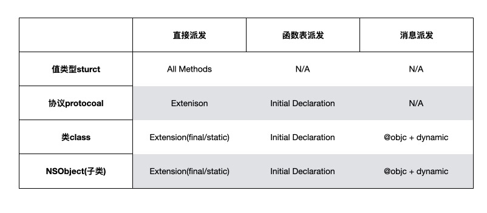

# 消息转发

## Objective-C

1、[Objective-C Runtime Programming Guide](https://developer.apple.com/library/archive/documentation/Cocoa/Conceptual/ObjCRuntimeGuide/Introduction/Introduction.html#//apple_ref/doc/uid/TP40008048-CH1-SW1)

2、[OC消息转发之动态解析](https://juejin.cn/post/6844903645226500103)

3、[Objective-C 运行时和 Swift 动态性](https://juejin.cn/post/6844904114673958925)

4、[iOS开发·runtime原理与实践: 消息转发篇(Message Forwarding) (消息机制，方法未实现+API不兼容奔溃，模拟多继承)](https://juejin.cn/post/6844903600968171533)

## Swift

1、[Swift 消息派发机制](https://blog.bombox.org/2020-05-23/swift-method-dispatch/)

2、[Swift函数派发机制](https://juejin.cn/post/6847009771845845006)

3、[Swift 函数派发机制（译）](https://rimson.top/2019/05/07/swift-method-dispatch/)

4、Swift 消息派发总结

