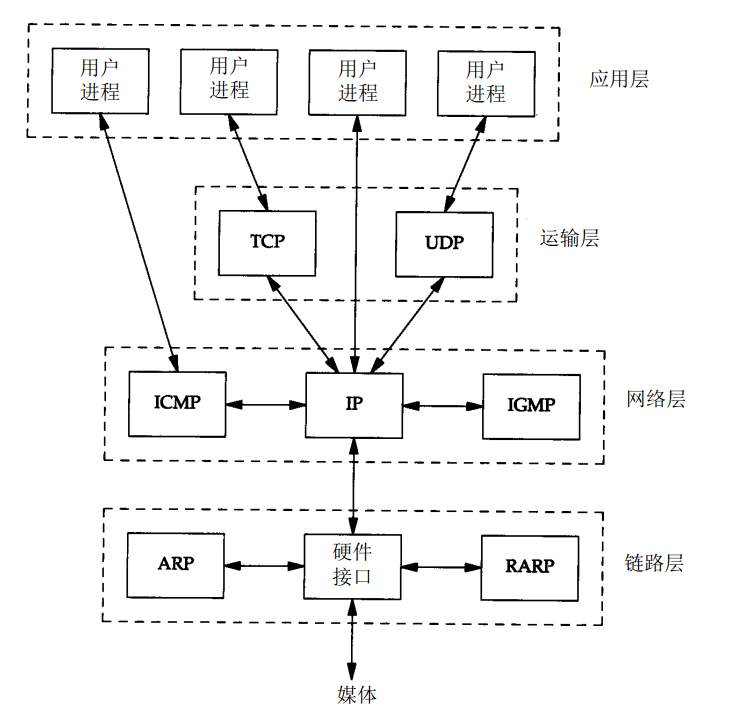
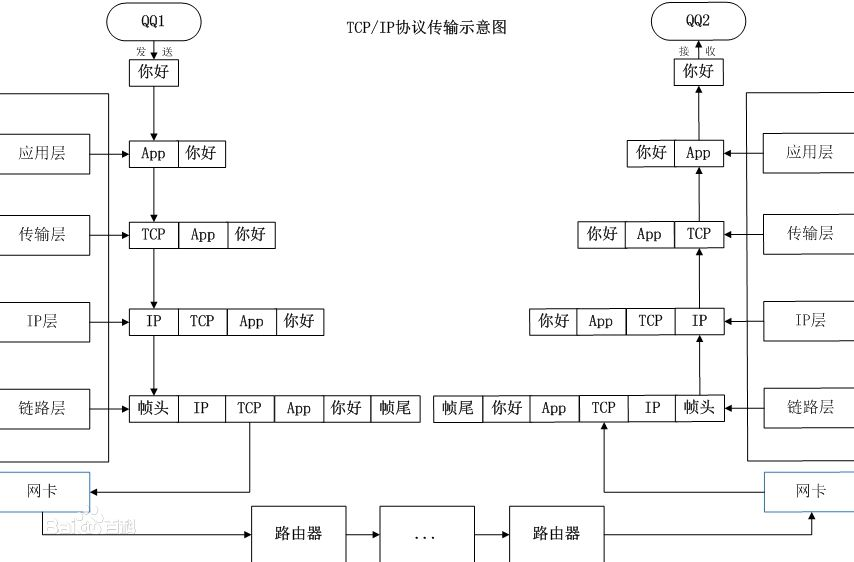
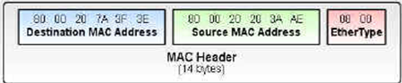
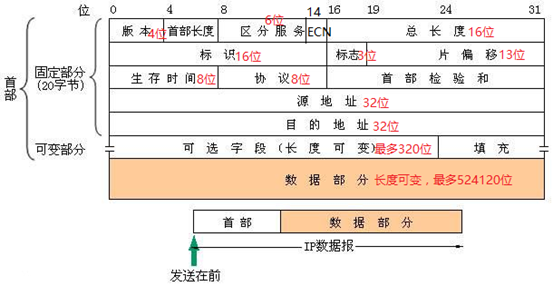
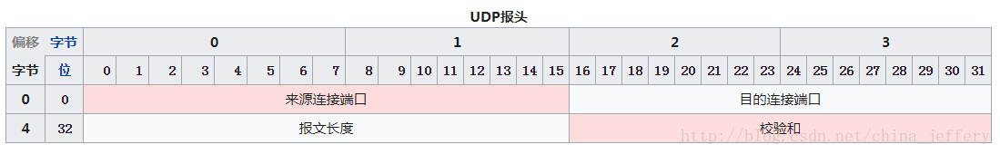

* 协议簇、协议栈



网络协议工作流程图：



链路层 协议：


IP协议：


* 版本: 占4位,指IP协议的版本.通信双方使用的IP协议版本必须一致.日前广泛使用的 IP协议版本号为 4 (即 IPv4).IPv6 目前还处于起步阶段.

* 首部长度:占 4 位,可表示的最大十进制数值是15.请注意,这个字段所表示数的单位是32位字 (1个32位字长是4 字节),因此,当 IP 的首部长度为 1111 时 (即十进制的 15),首部长度就达到 60字节.当 IP 分组的首部长度不是4字节的整数倍时,必须利用最后的填充字段加以填充.因此数据部分永远在 4字节的整数倍开始,这样在实现 IP协议时较为方便.首部长度限制为 60字节的缺点是有时可能不够用.这样做的目的是希望用户尽量减少开销.最常用的首部长度就是 20 字节 (即首部长度为 0101),这时不使用任何选项.

* 服务:占 8 位,用来获得更好的服务.这个字段在旧标准中叫做服务类型,但实际上一直没有被使用过.1998年IETF把这个字段改名为区分服务 DS(Differentiated Services).只有在使用区分服务时,这个字段才起作用.

* 总长度:总长度指首都及数据之和的长度,单位为字节.因为总长度字段为 16位,所以数据报的最大长度为 216-1=65 535字节.在IP层下面的每一种数据链路层都有自己的帧格式,其中包括帧格式中的数据字段的最大长度,即最大传送单元 MTU (Maximum Transfer Unit).当一个数据报封装成链路层的帧时,此数据报的总长度 (即首部加上数据部分)一定不能超过下面的数据链路层的MTU值,否则要分片.

* 标识 (Identification):占 16位.IP软件在存储器中维持一个计数器,每产生一个数据报,计数器就加 1,并将此值赋给标识字段.但这个"标识"并不是序号,因为 IP是无连接的服务,数据报不存在按序接收的问题.当数据报由于长度超过网络的 MTU 而必须分片时,这个标识字段的值就被复制到所有的数据报的标识字段中.相同的标识字段的值使分片后的各数据报片最后能正确地重装成为原来的数据报.

* 标志 (Flag):占3 位,但目前只有2位有意义. 标志字段中的最低位记为 MF(More Fragment).MF=1即表示后面"还有分片"的数据报.MF=0表示这已是若干数据报片中的最后一个.标志字段中间的一位记为DF(Don't Fragment),意思是"不能分片",只有当 DF=0时才允许分片.

* 片偏移:占 13位.较长的分组在分片后,某片在原分组中的相对位置.也就是说,相对用户数据字段的起点,该片从何处开始.片偏移以 8个字节为偏移单位,这就是说,每个分片的长度一定是 8字节(64位)的整数倍.

* 生存时间:占 8位,生存时间字段常用的英文缩写是TTL(Time To Live),其表明数据报在网络中的寿命.由发出数据报的源点设置这个字段.其目的是防止无法交付的数据报无限制地在因特网中兜圈子,因而白白消耗网络资源.最初的设计是以秒作为 TTL的单位.每经过一个路由器时,就把TTL减去数据报在路由器消耗掉的一段时间.若数据报在路由器消耗的时间小于 1 秒,就把TTL值减 1.当 TTL值为 0时,就丢弃这个数据报.

* 协议:占 8 位.协议字段指出此数据报携带的数据是使用何种协议,以便使目的主机的IP层知道应将数据部分上交给哪个处理过程.详细资料请看文章最后附录一[^附录一].
* 首部检验和:占 16位.这个字段只检验数据报的首部,但不包括数据部分.这是因为数据报每经过一个路由器,都要重新计算一下首都检验和 (一些字段,如生存时间,标志,片偏移等都可能发生变化),不检验数据部分可减少计算的工作量.

* 源地址:占32位.

* 目的地址:占 32位.

* IP数据报首部的可变部分

> IP首部的可变部分就是一个可选字段.选项字段用来支持排错,测量以及安全等措施,内容很丰富.此字段的长度可变,从1个字节到40个字节不等,取决于所选择的项目.某些选项项目只需要1个字节,它只包括1个字节的选项代码.但还有些选项需要多个字节,这些选项一个个拼接起来,中间不需要有分隔符,最后用全0的填充字段补齐成为4字节的整数倍. 

> 增加首部的可变部分是为了增加IP数据报的功能,但这同时也使得IP数据报的首部长度成为可变的.这就增加了每一个路由器处理数据报的开销,实际上这些选项很少被使用.新的IP版本IPv6就将IP数据报的首部长度做成固定的.
	
目前,这些任选项定义如下:
1. 安全和处理限制(用于军事领域);
2. 记录路径(让每个路由器都记下它的IP地址);
3. 时间戳(Time Stamp)(让每个路由器都记下IP数据报经过每一个路由器的IP地址和当地时间);
4. 宽松的源站路由(Loose Source Route)(为数据报指定一系列必须经过的IP地址);
5. 严格的源站路由(Strict Source Route)(与宽松的源站路由类似,但是要求只能经过指定的这些地址,不能经过其他的地址).
这些选项很少被使用,并非所有主机和路由器都支持这些选项.

TCP 协议：


1、端口号：用来标识同一台计算机的不同的应用进程。

1）源端口：源端口和IP地址的作用是标识报文的返回地址。

2）目的端口：端口指明接收方计算机上的应用程序接口。

TCP报头中的源端口号和目的端口号同IP数据报中的源IP与目的IP唯一确定一条TCP连接。

2、序号和确认号：是TCP可靠传输的关键部分。序号是本报文段发送的数据组的第一个字节的序号。在TCP传送的流中，每一个字节一个序号。e.g.一个报文段的序号为300，此报文段数据部分共有100字节，则下一个报文段的序号为400。所以序号确保了TCP传输的有序性。确认号，即ACK，指明下一个期待收到的字节序号，表明该序号之前的所有数据已经正确无误的收到。确认号只有当ACK标志为1时才有效。比如建立连接时，SYN报文的ACK标志位为0。

3、数据偏移／首部长度：4bits。由于首部可能含有可选项内容，因此TCP报头的长度是不确定的，报头不包含任何任选字段则长度为20字节，4位首部长度字段所能表示的最大值为1111，转化为10进制为15，15*32/8 = 60，故报头最大长度为60字节。首部长度也叫数据偏移，是因为首部长度实际上指示了数据区在报文段中的起始偏移值。

4、保留：为将来定义新的用途保留，现在一般置0。

5、控制位：URG  ACK  PSH  RST  SYN  FIN，共6个，每一个标志位表示一个控制功能。

1）URG：紧急指针标志，为1时表示紧急指针有效，为0则忽略紧急指针。

2）ACK：确认序号标志，为1时表示确认号有效，为0表示报文中不含确认信息，忽略确认号字段。

3）PSH：push标志，为1表示是带有push标志的数据，指示接收方在接收到该报文段以后，应尽快将这个报文段交给应用程序，而不是在缓冲区排队。

4）RST：重置连接标志，用于重置由于主机崩溃或其他原因而出现错误的连接。或者用于拒绝非法的报文段和拒绝连接请求。

5）SYN：同步序号，用于建立连接过程，在连接请求中，SYN=1和ACK=0表示该数据段没有使用捎带的确认域，而连接应答捎带一个确认，即SYN=1和ACK=1。

6）FIN：finish标志，用于释放连接，为1时表示发送方已经没有数据发送了，即关闭本方数据流。

6、窗口：滑动窗口大小，用来告知发送端接受端的缓存大小，以此控制发送端发送数据的速率，从而达到流量控制。窗口大小时一个16bit字段，因而窗口大小最大为65535。

7、校验和：奇偶校验，此校验和是对整个的 TCP 报文段，包括 TCP 头部和 TCP 数据，以 16 位字进行计算所得。由发送端计算和存储，并由接收端进行验证。

8、紧急指针：只有当 URG 标志置 1 时紧急指针才有效。紧急指针是一个正的偏移量，和顺序号字段中的值相加表示紧急数据最后一个字节的序号。 TCP 的紧急方式是发送端向另一端发送紧急数据的一种方式。

9、选项和填充：最常见的可选字段是最长报文大小，又称为MSS（Maximum Segment Size），每个连接方通常都在通信的第一个报文段（为建立连接而设置SYN标志为1的那个段）中指明这个选项，它表示本端所能接受的最大报文段的长度。选项长度不一定是32位的整数倍，所以要加填充位，即在这个字段中加入额外的零，以保证TCP头是32的整数倍。

10、数据部分： TCP 报文段中的数据部分是可选的。在一个连接建立和一个连接终止时，双方交换的报文段仅有 TCP 首部。如果一方没有数据要发送，也使用没有任何数据的首部来确认收到的数据。在处理超时的许多情况中，也会发送不带任何数据的报文段

```
struct tcphdr {
    __be16 source;//  16位源端口号
    __be16 dest; //16位目的端口号
    __be32 seq; //序列号
    __be32 ack_seq; //确认号
#if defined(__LITTLE_ENDIAN_BITFIELD)
    __u16   res1:4,//保留位
            doff:4, //tcp报头长度
            fin:1,
            syn:1,
            rst:1,
            psh:1,
            ack:1,
            urg:1,
            ece:1,//ECN回显（发送方接受到了一个更早的拥塞通告)
            cwr:1;//拥塞窗口减（发送方降低它的发送速率)
#elif defined(__BIG_ENDIAN_BITFIELD)
    __u16   doff:4,
            res1:4,
            cwr:1,
            ece:1,
            urg:1,
            ack:1,
            psh:1,
            rst:1,
            syn:1,
            fin:1;
#else
#error "Adjust your <asm/byteorder.h> defines"
#endif
    __be16 window;//窗口大小
    __be16 check;//效验和
    __be16 urg_ptr;//紧急指针
};
```


UDP 协议：
UDP协议是提供与IP一样的不可靠，无连接的交付服务，UDP报文可能出现丢失，重复或者乱序到达等现象。

UDP协议在IP协议上增加了复用、分用和差错检测功能。UDP的特点：

1. 是无连接的。相比于TCP协议，UDP协议在传送数据前不需要建立连接，当然也就没有释放连接。
2. 是尽最大努力交付的。也就是说UDP协议无法保证数据能够准确的交付到目的主机。也不需要对接收到的UDP报文进行确认。
3. 是面向报文的。也就是说UDP协议将应用层传输下来的数据封装在一个UDP包中，不进行拆分或合并。因此，运输层在收到对方的UDP包后，会去掉首部后，将数据原封不动的交给应用进程。
4. 没有拥塞控制。因此UDP协议的发送速率不送网络的拥塞度影响。
5. UDP支持一对一、一对多、多对一和多对多的交互通信。
6. UDP的头部占用较小，只占用8个字节。



* 源端口：源端口号。在需要对方回信时选用。不需要时可用全0。
* 目的端口：目的端口号。这在终点交付报文时必须要使用到。
* 长度： UDP用户数据报的长度，其最小值是8（仅有首部）。
* 校验和：检测UDP用户数据报在传输中是否有错。有错就丢弃。

```
typedef struct udphdr
{
    u_short uh_sport;//源端口地址
    u_short uh_dport;//目的端口地址
    u_short uh_ulen;//UD报文长度
    u_short uh_sum;//16位校验和
}UDP_HEADER;
```


KCP——可靠的UDP

HTTP 协议：


**TCP/IP、UDP(KCP)、HTTPS、HTTP2.0**

[HTTPS 升级指南](http://www.ruanyifeng.com/blog/2016/08/migrate-from-http-to-https.html)

[SSL/TLS协议运行机制的概述](http://www.ruanyifeng.com/blog/2014/02/ssl_tls.html)

[HTTP 协议入门](http://www.ruanyifeng.com/blog/2016/08/http.html)

[阮一峰网络日志](http://www.ruanyifeng.com/blog/)

Socket(Web socket)、XMPP

RTMP

FRP、UPnP、VPN、WoL

DNS、(N)ARP、令牌网络、ICMP
	
	
	
附录一：

[^附录一]:IP数据包的协议字段中，数值和所对应的协议

```
数值		值描述 
0 		保留字段，用于IPv6(跳跃点到跳跃点选项) 
1 		Internet控制消息 
2		Internet组管理 
3 		网关到网关 
4 		IP中的IP(封装) 
5 		流 
6 		传输控制 
7 		CBT 
8 		外部网关协议 
9 		任何私有内部网关(Cisco在它的IGRP实现中使用) 
10 		BBNRCC监视 
11 		网络语音协议 
12 		PUP 
13 		ARGUS 
14 		EMCON 
15 		网络诊断工具 
16 		混乱(Chaos) 
17 		用户数据报文 
18 		复用 
19 		DCN测量子系统 
20 		主机监视 
21 		包无线测量 
22 		XEROXNSIDP 
23 		Trunk-1 
24 		Trunk-2 
25 		leaf-1 
26 		leaf-2 
27 		可靠的数据协议 
28 		Internet可靠交易 
29 		ISO传输协议第四类 
30 		大块数据传输协议 
31 		MFE网络服务协议 
32 		MERIT节点之间协议 
33 		序列交换协议 
34 		第三方连接协议 
35 		域之间策略路由协议 
36 		XTP 
37 		数据报文传递协议 
38 		IDPR控制消息传输协议 
39 		TP+ +传输协议 
40 		IL传输协议 
41 		IPv6 
42 		资源命令路由协议 
43 		IPv6的路由报头 
44 		IPv6的片报头 
45 		域之间路由协议 
46 		保留协议 
47 		通用路由封装 
48 		可移动主机路由协议 
49 		BNA 
50 		IPv6封装安全有效负载 
51 		IPv6验证报头 
52 		集成的网络层安全TUBA 
53 		带加密的IP 
54 		NBMA地址解析协议 
55 		IP可移动性 
56 		使用Kryptonet钥匙管理的传输层安全协议 
57 		SKIP 
58 		IPv6的ICMP 
59 		IPv6的无下一个报头 
60 		IPv6的信宿选项 
61 		任何主机内部协议 
62 		CFTP 
63 		任何本地网络 
64 		SATNET和BackroomEXPAK 
65 		Kryptolan 
66 		MIT远程虚拟磁盘协议 
67 		Internet Pluribus包核心 
68 		任何分布式文件系统 
69 		SATNET监视 
70 		VISA协议 
71 		Internet包核心工具 
72 		计算机协议Network Executive 
73 		计算机协议Heart Beat 
74 		Wang Span网络 
75 		包视频协议 
76 		Backroom SATNET监视 
77 		SUN ND PROTOCOL—临时 
78 		WIDEBAND监视 
79 		WIDEBAND EXPAK 
80 		ISO Internet协议 
81 		VMTP 
82 		SECURE—VMTP(安全的VMTP) 
83 		VINES 
84 		TTP 
85 		NSFNET—IGP 
86 		不同网关协议 
87 		TCF 
88 		EIGRP 
89 		OSPFIGP 
90 		Sprite RPC协议 
91 		Locus地址解析协议 
92 		多播传输协议 
93 		AX.25帧 
94 		IP内部的IP封装协议 
95 		可移动网络互连控制协议 
96 		旗语通讯安全协议 
97 		IP中的以太封装 
98 		封装报头 
99 		任何私有加密方案 
100		GMTP 
101 	Ipsilon流量管理协议 
102 	PNNI over IP 
103 	协议独立多播 
104 		ARIS 
105 		SCPS 
106 		QNX 
107 		活动网络 
108 		IP有效负载压缩协议 
109 		Sitara网络协议 
110 		Compaq对等协议 
111 		IP中的IPX 
112 		虚拟路由器冗余协议 
113 		PGM可靠传输协议 
114 		任何0跳跃协议 
115 		第二层隧道协议 
116 		D-II数据交换(DDX) 
117 		交互式代理传输协议 
118 		日程计划传输协议 
119 		SpectraLink无线协议 
120 		UTI 
121 		简单消息协议 
122 		SM 
123 		性能透明性协议 
124 		ISIS over IPv4 
125 		FIRE 
126 		Combat无线传输协议 
127 		Combat无线用户数据报文 
128 		SSCOPMCE 
129 		IPLT 
130 		安全包防护 
131 		IP中的私有IP封装 
132 		流控制传输协议 
133～254	未分配 

255 		保留 
```