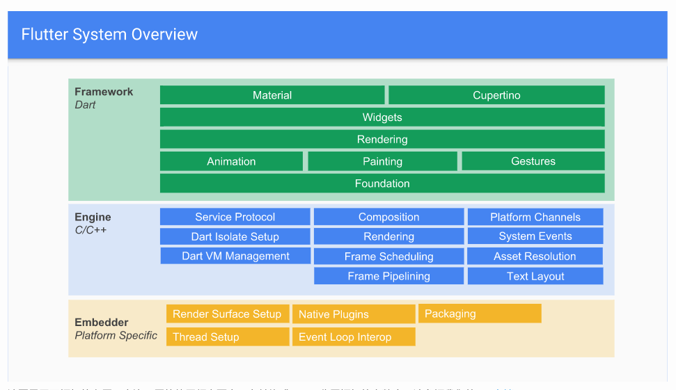
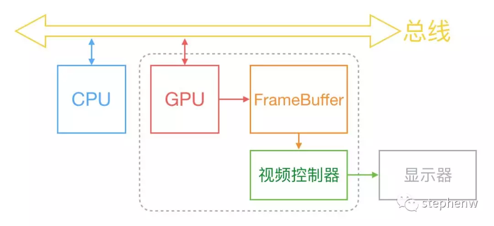
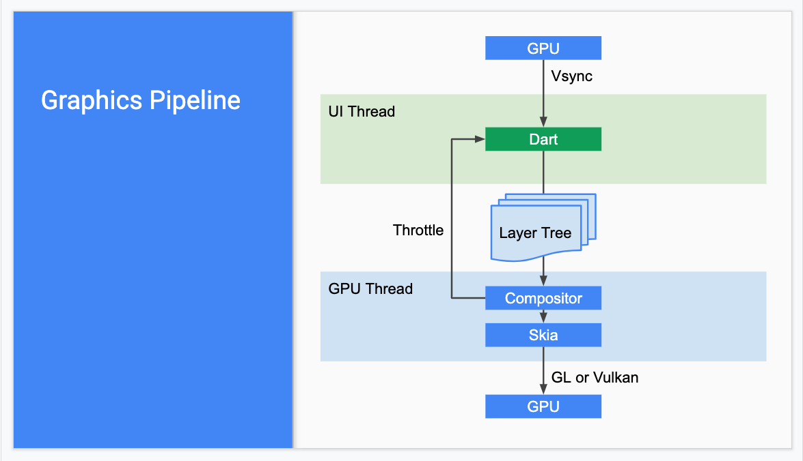
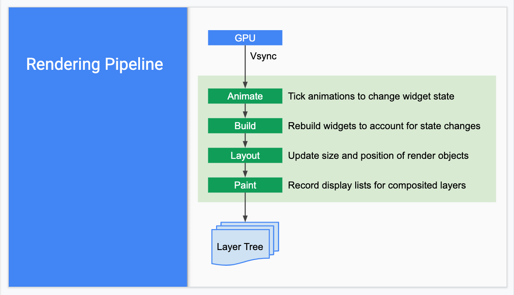

# Flutter

## 1、入门

### 1.1、语言

1.1.1 Dart：[学习路线](https://dart.dev/tools/sdk)

1.1.2 Dart [概述](http://dart.goodev.org/guides/language)

1.1.3 Dart [库预览](http://dart.goodev.org/guides/libraries)

### 1.2、工具集

2.1 通用工具

2.1.1 [DartPad](https://dartpad.dartlang.org/)

    DartPad is a great, no-download-required way to learn Dart syntax and to experiment with Dart language features. It supports Dart’s core libraries, except for VM libraries such as dart:io.

2.1.2 IDEs 与 编辑器

2.1.2.1 IDE： [Android Studio](https://dart.dev/tools/jetbrains-plugin)、[IntelliJ IDEA](https://dart.dev/tools/jetbrains-plugin)、[Visual Studio Code](https://code.visualstudio.com/)

2.1.2.2 IDEDart 社区维护的编辑器：[Emacs](https://github.com/bradyt/dart-mode)、[Atom](https://github.com/dart-atom/dart)、[Vim](https://github.com/dart-lang/dart-vim-plugin)

2.1.3 命令行工具

    dartanalyzer
        A static analyzer that evaluates and reports any errors or warnings in your code. The Dart plugin for your IDE should make use of Dart’s analysis engine, but you can also run the analyzer from the command line.

    dartdoc
        Generates API reference documentation.

    dartfmt
        Formats your code, following the recommendations of the Dart style guide. IDEs that support Dart generally allow you to format the code within the IDE. Or you can run the formatter from the command line.

    pub
        Manages Dart packages, making it easy for you to install, use, and share Dart libraries, command-line tools, and other assets. Some Dart technologies, such as Flutter, may not support all of the pub commands. IDEs that support Dart generally have special support for pub, but you can also use it from the command line.

        Some additional tools are available in packages. To install these tools, use the pub command, as described in each tool’s installation instructions. Here are the general-purpose tools you might want to install:

    build_runner
        A code generator.

    dartfix
        A tool for migrating Dart source code and fixing common issues.

2.2 Web工具集

    webdev
        A command line interface (CLI) for Dart web app development, including building and serving web apps.

    dart2js
        The original Dart-to-JavaScript compiler, with tree shaking. IDEs and the webdev CLI use dart2js when building web apps for deployment.

    dartdevc
        The Dart dev compiler, a modular Dart-to-JavaScript compiler. IDEs and the webdev CLI use dartdevc when running a development server.

    build_runner
        A build package that’s used by the webdev CLI. You can use it directly for testing or if you need more configurability than webdev provides.

2.3 命令行工具集与服务器工具集

    Standalone Dart VM: dart
        Executes Dart code. IDEs that support Dart, and some of the pub commands, use this command behind-the-scenes to execute Dart scripts. Note that you must configure your IDE with the location of the dart binary.

    AOT compiler and runtime: dart2aot, dartaotruntime
        Support ahead-of-time compilation of Dart code to native x64 machine code.

    Pub package manager: pub
        Simplifies downloading and running scripts, with commands such as pub get, pub global activate, pub global run, and pub run.

### 1.3、Flutter

1.3.1、Flutter是什么?

    Flutter是一款移动应用程序SDK，一份代码可以同时生成iOS和Android两个高性能、高保真的应用程序。

    Flutter目标是使开发人员能够交付在不同平台上都感觉自然流畅的高性能应用程序。我们兼容滚动行为、排版、图标等方面的差异。

1.3.2、核心原则

Flutter包括一个现代的响应式框架、一个2D渲染引擎、现成的widget和开发工具。这些组件可以帮助您快速地设计、构建、测试和调试应用程序。

一切皆为widget，Widget是Flutter应用程序用户界面的基本构建块。每个Widget都是用户界面一部分的不可变声明。 与其他将视图、控制器、布局和其他属性分离的框架不同，Flutter具有一致的统一对象模型：widget。

1.3.3 Widget所谓何物:

* Widget实际上就是Element的配置数据，Widget树实际上是一个配置树，而真正的UI渲染树是由Element构成；不过，由于Element是通过Widget生成，所以它们之间有对应关系，所以在大多数场景，我们可以宽泛地认为Widget树就是指UI控件树或UI渲染树。

* 一个Widget对象可以对应多个Element对象。这很好理解，根据同一份配置（Widget），可以创建多个实例（Element）。

1.3.4 框架

1.3.5 跨端实质

1.3.5.1. iOS

> Flutter 的代码并不直接在平台之下运行，相反，Dart 代码构建的 Flutter 应用在设备上以原生的方式运行，却“侧步躲开了”平台提供的 SDK。这意味着，例如，你在 Dart 中发起一个网络请求，它就直接在 Dart 的上下文中运行。你并不会用上平常在 iOS 或 Android 上使用的原生 API。你的 Flutter 程序仍然被原生平台的 ViewController 管理作一个 view，但是你并不会直接访问 ViewController 自身，或是原生框架。
>
> 但这并不意味着 Flutter 不能和原生 API，或任何你编写的原生代码交互。Flutter 提供了 platform channels ，来和管理你的 Flutter view 的 ViewController 通信和交互数据。平台管道本质上是一个异步通信机制，桥接了 Dart 代码和宿主 ViewController，以及它运行于的 iOS 框架。你可以用平台管道来执行一个原生的函数，或者是从设备的传感器中获取数据。

1.3.5.2. Android

1.3.5.3. 界面渲染

1.3.5.3.1 Flutter 如何渲染界面

在介绍Flutter渲染流程之前，看下原生（iOS）的渲染流程：

CPU、GPU和显示器以一种特定的方式协作：

> CPU将计算好的显示内容提交给 GPU，GPU渲染后放入帧缓冲区，然后视频控制器按照 VSync信号从帧缓冲区取帧数据传递给显示器显示。

> GPU的 VSync信号同步到 UI线程，UI线程使用 Dart来构建抽象的视图结构，这份数据结构在 GPU线程进行图层合成，视图数据提供给 Skia引擎渲染为 GPU数据，这些数据通过 OpenGL或者 Vulkan提供给 GPU。

* Skia是一个 2D的绘图引擎库，其前身是一个向量绘图软件，Chrome和 Android均采用 Skia作为绘图引擎。Skia提供了非常友好的 API，并且在图形转换、文字渲染、位图渲染方面都提供了友好、高效的表现。Skia是跨平台的，所以可以被嵌入到 Flutter的 iOS SDK中，而不用去研究 iOS闭源的 Core Graphics / Core Animation。

* Android自带了 Skia，所以 Flutter Android SDK要比 iOS SDK小很多。

渲染树生成：

1.3.5.3.2、Flutter 如何更新界面（Diff）

当widget的状态发生变化时，widget会重新构建UI，Flutter会对比前后变化的不同， 以确定底层渲染树从一个状态转换到下一个状态所需的最小更改。

> 当element父Widget的配置数据改变时，为了进行Element复用，Framework在决定重新创建Element前会先尝试复用相同位置旧的element：调用Element对应Widget的canUpdate()方法，如果返回true，则复用旧Element，旧的Element会使用新的Widget配置数据更新，反之则会创建一个新的Element，不会复用。
>
> Widget.canUpdate()主要是判断newWidget与oldWidget的runtimeType和key是否同时相等，如果同时相等就返回true，否则就会返回false。根据这个原理，当我们需要强制更新一个Widget时，可以通过指定不同的Key来禁止复用。

## 2、Flutter & 原生

### 2.1 Flutter本质

2.1.1 如何做到跨平台、与原生平台通讯

Flutter平台特定的API支持不依赖于代码生成，而是依赖于灵活的消息传递的方式：

* 应用的Flutter部分通过平台通道（platform channel）将消息发送到其应用程序的所在的宿主（iOS或Android）。

* 宿主监听的平台通道，并接收该消息。然后它会调用特定于该平台的API（使用原生编程语言） - 并将响应发送回客户端，即应用程序的Flutter部分。

e.g：获取iOS电量

2.1.2 本质

Flutter 有自己的一套UI界面方式，通过Dart UI 构建界面，跟原生界面组件没有关系。
Dart API，底层通过OpenGL这种跨平台的绘制库（内部会调用操作系统API）实现了一套代码跨多端。由于Dart API也是调用操作系统API，所以它的性能接近原生。

### 2.2、相同点

1. 界面
   解决移动端信息展示的目的；
   都基于声明式、响应式的方式、热重载的方式；

### 2.3、异同点

### 2.4、性能

### 2.5、体验

1. 体积

2. 帧率

3. 技术生态圈

4. 硬件交互、推送等服务

## 3、未来

## 4、憧憬

当下的移动端、前端开发技术越来越多样化，复杂化。

就移动端iOS来说，开发语言就有Objective-C、Swift，UI框架cocoa Foundation的UIkit、苹果新出的SwiftUI；
Android的开发语言Java、Kotlin，UI框架有Android原生的、腾讯的QMUI等，比iOS还要多一些。

大前端，这几年，还掺杂了的React-Native/Weex等一批大前端技术，现如今Google扶持的的Flutter又加入进来。

前端情况也类似，像React，Vue、Angular、Bootstrap等，层出不穷。

前不久Facebook 又推出了新的[Hermes](https://juejin.im/entry/5d2e6d1ce51d4510664d178e)，用于在React Native应用提高性能的。

个人觉得，前端用统一的方式处理，是一个趋势。同时，一个良好的生态建设也很重要。比如界面构建语言、方式、布局设计，当然这个语言不能局限于静态语言，同时也支持动态特性。比如Dart、Swift。

统一的生态包括系统、语言、协议、工具等，说白了就是得有比较正规化的一种方式去工作。

据不完全统计，编程语言大概有500~600种，很多语言都有自己的生态体系、特性、工具，甚至编译器，解释器，连接器等，想这么多样化的氛围，还没有一种主流的语言【当然二进制语言不能算，偏底层的人为处理起来还是比较麻烦】生态能够前后端都统一负责得了的。所以，希望有这一天的到来，有生之年也能看到！
